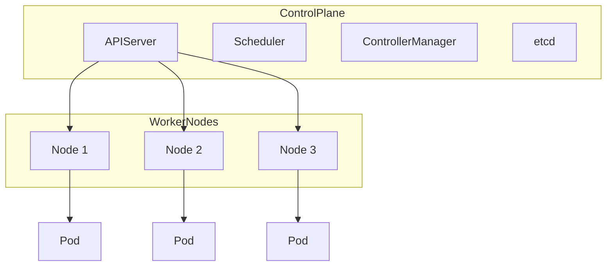

# Kubernetes

Kubernetes (K8s) is an open-source container orchestration system for automating deployment, scaling, and management of containerized applications.

## Core Concepts
- **Cluster:** Set of worker nodes managed by a control plane
- **Pod:** Smallest deployable unit (1+ containers with shared network/storage)
- **Deployment / ReplicaSet:** Declarative state management; scaling and rollouts
- **Service:** Stable network abstraction; load balances Pods
- **ConfigMap / Secret:** Externalized configuration and sensitive values
- **Namespaces:** Resource and policy isolation within a cluster
- **Scheduler:** Places Pods on nodes based on resource requests, affinity/anti-affinity, taints/tolerations, and priorities

## High-Level Architecture

## Trade-offs
- Declarative management and self-healing
- Complexity in setup and operations
- Extensible via CRDs and Operators
