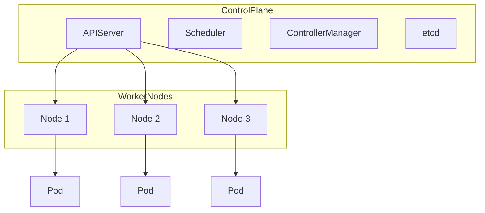

# Kubernetes

Kubernetes (K8s) is an open-source container orchestration system for automating deployment, scaling, and management of containerized applications.

## Core Concepts
- **Cluster:** Set of worker nodes managed by a control plane
- **Pod:** Smallest deployable unit (1+ containers with shared network/storage)
- **Deployment / ReplicaSet:** Declarative state management; scaling and rollouts
- **Service:** Stable network abstraction; load balances Pods
- **ConfigMap / Secret:** Externalized configuration and sensitive values
- **Namespaces:** Resource and policy isolation within a cluster
- **Scheduler:** Places Pods on nodes based on resource requests, affinity/anti-affinity, taints/tolerations, and priorities

## High-Level Architecture

```mermaid
graph TD
    subgraph ControlPlane
        APIServer
        Scheduler
        ControllerManager
        etcd
    end
    subgraph WorkerNodes
        Node1[Node 1]
        Node2[Node 2]
        Node3[Node 3]
    end
    APIServer --> Node1
    APIServer --> Node2
    APIServer --> Node3
    Node1 --> Pod1[Pod]
    Node2 --> Pod2[Pod]
    Node3 --> Pod3[Pod]
```

## Trade-offs
- Declarative management and self-healing
- Complexity in setup and operations
- Extensible via CRDs and Operators

---

## Ingress Controllers

**NGINX Ingress:** Most common, robust Layer 7 routing (path/host-based), SSL termination

**Traefik:** Auto-discovery (watches K8s API), built-in Let's Encrypt/ACME, dashboard, middleware (auth, rate limiting, circuit breakers)

**AWS ALB Ingress:** Native AWS integration (ALB target groups, WAF)

**Istio Gateway:** Service mesh ingress with mTLS, advanced traffic management

### North-South vs East-West Traffic

| Aspect | North-South (External → Cluster) | East-West (Service ↔ Service) |
|--------|----------------------------------|-------------------------------|
| **Auth Method** | OIDC/JWT (user identity) | mTLS (service identity) |
| **Components** | Traefik, NGINX Ingress, AWS ALB, Istio Gateway | Istio + Envoy, Linkerd, Consul Connect |
| **RBAC Binding** | No (handled by services, not ingress) | Yes (via ServiceAccount + AuthorizationPolicy) |
| **Cert Manager** | Yes (ingress TLS certificates) | Optional (Istio auto-issues certs) |
| **OPA Enforcement** | Yes (validate requests at ingress) | Yes (validate service-to-service calls) |
| **Use Case** | External users accessing APIs/dashboards | Microservices calling each other |

**Key Insight:** OIDC/JWT for user authentication (north-south), mTLS for service authentication (east-west). User identity from JWT can be propagated via headers through mTLS connections.

---

## Security Components

### Service Mesh (Istio + Envoy)
**mTLS:** Automatic encryption + auth between services via Envoy sidecars. Istio issues X.509 certs (24hr TTL, auto-rotated).  
**PeerAuthentication:** Enforce mTLS STRICT mode (reject plaintext)  
**AuthorizationPolicy:** Fine-grained access control (deny-all + explicit allow), JWT validation from external OIDC

### Certificate Management (cert-manager)
**Purpose:** Automates X.509 cert provisioning/renewal  
**Use cases:** Ingress TLS (Let's Encrypt), mTLS, webhook TLS  
**Integrations:** Let's Encrypt, HashiCorp Vault, AWS ACM, Azure Key Vault

### Policy Enforcement (OPA Gatekeeper)
**Purpose:** Admission control for security/compliance policies  
**How:** OPA webhook evaluates Rego policies → allow/deny pod creation  
**Use cases:** Block root containers, require resource limits, enforce labels, restrict registries  
**OPA vs RBAC:** RBAC = identity-based, OPA = attribute-based (labels, context, time)

### External Secrets Operator
**Purpose:** Sync secrets from external secret stores into K8s Secrets (never commit secrets to Git)

**How it works:**
1. Define `ExternalSecret` CRD pointing to external store (Vault path, AWS Secrets Manager ARN)
2. Operator authenticates to external store (IAM role, service token)
3. Operator fetches secret value from external store
4. Operator creates/updates K8s Secret with fetched data
5. Auto-syncs on interval (e.g., every 5 minutes) or on-demand

**Example:**
```yaml
apiVersion: external-secrets.io/v1beta1
kind: ExternalSecret
metadata:
  name: db-credentials
spec:
  refreshInterval: 5m
  secretStoreRef:
    name: vault-backend
    kind: SecretStore
  target:
    name: db-secret  # K8s Secret to create
  data:
  - secretKey: password
    remoteRef:
      key: database/prod/password  # Path in Vault
```

**Supported backends:** HashiCorp Vault, AWS Secrets Manager, Azure Key Vault, GCP Secret Manager, 1Password, Doppler

**Benefits:** Centralized secret management, automatic rotation, audit trail, no secrets in Git

### Additional Security
**Pod Security Standards:** Namespace-level enforcement (`pod-security.kubernetes.io/enforce=restricted`)  
**Network Policies:** Layer 3/4 firewall (deny-all by default, allow specific traffic)  
**Runtime Security:** Falco, Sysdig (detect anomalous file access, process execution)

---

## Authentication & Authorization

### Authentication Methods

**ServiceAccount Tokens (Pods):** Auto-mounted JWT at `/var/run/secrets/kubernetes.io/serviceaccount/token`, validated by API server

**OIDC (Users):** External IdP (Dex, Okta, Azure AD) issues JWT → API server validates with `--oidc-issuer-url`

**Client Certificates (mTLS):** X.509 certs signed by cluster CA, extract user/group from cert CN/O fields

**Webhook Auth:** External service validates tokens (custom SSO)

### Authorization (RBAC)

**Role/ClusterRole:** Define permissions (verbs: get, list, create on resources: pods, services)  
**RoleBinding/ClusterRoleBinding:** Bind roles to users/groups/ServiceAccounts

**Example:**
```yaml
kind: Role
metadata:
  name: pod-reader
rules:
- apiGroups: [""]
  resources: ["pods"]
  verbs: ["get", "list"]
---
kind: RoleBinding
subjects:
- kind: ServiceAccount
  name: app-sa
roleRef:
  kind: Role
  name: pod-reader
```

---

## Best Practices

- **Auth:** OIDC for users, ServiceAccounts for pods (least privilege), disable anonymous auth
- **Authz:** Default deny RBAC, namespace-scoped roles, audit unused permissions
- **Service Mesh:** mTLS STRICT mode, AuthorizationPolicy deny-all + allow, monitor cert expiration
- **Certs:** cert-manager for automation, short-lived certs (30-90 days), alert on failures
- **Policy:** OPA Gatekeeper (audit first), Pod Security Standards (Restricted), Network policies (deny-all)
- **Secrets:** External Secrets Operator, encrypt etcd (KMS), rotate regularly

---

## Interview Q&A

**How does K8s authenticate users vs pods?**  
Users: OIDC/client certs. Pods: ServiceAccount JWT.

**What is RBAC?**  
Role-Based Access Control: Role defines permissions, RoleBinding assigns role to user/SA.

**How does Istio implement mTLS?**  
Envoy sidecars handle TLS, Istio control plane issues/rotates certs (24hr TTL). PeerAuthentication enforces STRICT mode.

**Why use cert-manager?**  
Automates cert provisioning/renewal (Let's Encrypt, Vault), prevents manual errors.

**What is OPA Gatekeeper?**  
Admission controller enforcing custom policies (security, compliance) via Rego language.

**How does External Secrets Operator work?**  
Syncs secrets from external stores (Vault, AWS Secrets Manager) into K8s Secrets via CRD, auto-refreshes on interval.

**What's the difference between north-south and east-west traffic?**  
North-south: External → cluster (OIDC/JWT via Ingress). East-west: Service ↔ service (mTLS via Service Mesh).

**How to enforce zero-trust in K8s?**  
mTLS (Istio), AuthorizationPolicy (deny-all + allow), Network Policies, RBAC least privilege.

**What replaced PodSecurityPolicy?**  
Pod Security Standards (PSS) with namespace enforcement labels.
