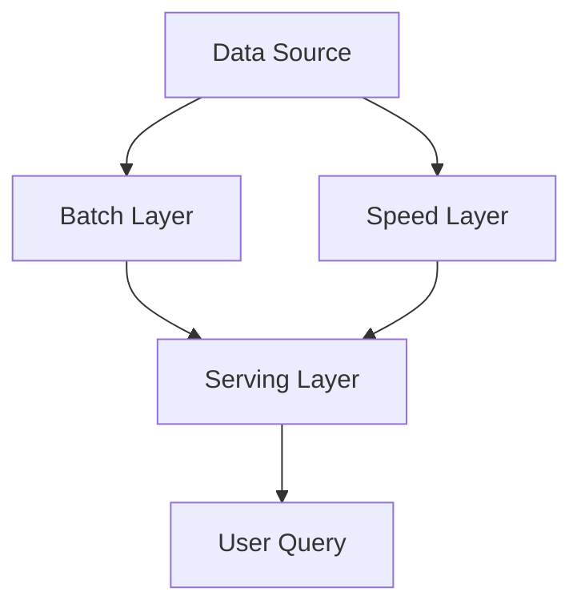

# Lambda Architecture

Lambda architecture combines batch and stream processing to balance throughput, latency, and fault tolerance in large-scale data systems.

## Layers
- **Batch Layer:** Comprehensive processing for accuracy and completeness
- **Speed Layer:** Real-time processing for immediate results
- **Serving Layer:** Merges results from both layers for queries

## Benefits
- Balances latency and throughput
- Fault tolerance
- Comprehensive data coverage

## Trade-offs
- Increased system complexity
- Data duplication and reconciliation challenges

## Interview Q&A
- When would you use Lambda architecture?
- How do you reconcile results from batch and speed layers?
- What are the operational challenges of maintaining Lambda architecture?

## How Lambda Architecture Differs from Other Pipelines

- Lambda architecture explicitly separates batch and speed (real-time) layers, merging their results for queries. This dual-path approach is designed to balance accuracy (batch) and low latency (speed).
- Other data pipelines may use only batch (for periodic ETL/reporting) or only stream (for real-time analytics), or alternative hybrid patterns (e.g., Kappa architecture, which uses only stream processing).
- Lambda is chosen when you need both real-time insights and comprehensive, accurate historical data.

## Example Use Cases
- Real-time analytics dashboards that show both up-to-the-second and historical trends
- Fraud detection systems that must react instantly but also run deep analysis on all transactions
- Recommendation engines that update user suggestions in real time but periodically reprocess all data for accuracy

## Example Technologies
- **Batch Layer:** Hadoop, Apache Spark, Google Dataflow (batch mode)
- **Speed Layer:** Apache Storm, Apache Flink, Kafka Streams, Google Dataflow (stream mode)
- **Serving Layer:** HBase, Cassandra, Elasticsearch, Druid

## Related Patterns
- See [data-pipelines.md](./data-pipelines.md) for general pipeline concepts
- See Kappa architecture for a stream-only alternative

## Architecture Diagram

## See Also
- [MapReduce](./mapreduce.md)
- [Batch Processing](./batch-processing.md)
- [Stream Processing](./stream-processing.md)
- [Data Pipelines](./data-pipelines.md)
