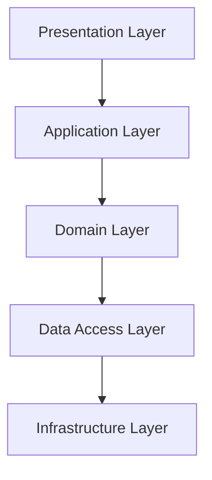

# Layered Architecture

Layered architecture organizes a system into horizontal layers, each with a specific responsibility. Each layer only interacts with the layer directly below or above it.

## Key Layers
- **Presentation Layer:** User interface, handles user input/output
- **Application Layer:** Business logic, application workflows
- **Domain Layer:** Core business rules and logic (sometimes merged with application layer)
- **Data Access Layer:** Database access, persistence
- **Infrastructure Layer:** External systems, frameworks, and services

## Benefits
- Separation of concerns
- Easier to test and maintain
- Clear structure for large teams

## Trade-offs
- Can introduce performance overhead
- Risk of "leaky abstractions" between layers
- May become rigid or over-engineered for small projects

## Use Cases
- Enterprise applications
- Web applications with clear UI/business/data separation

## Interview Q&A
- How do you enforce boundaries between layers?
- When is a layered architecture overkill?
- How do you handle cross-cutting concerns (logging, auth)?

## Architecture Diagram

