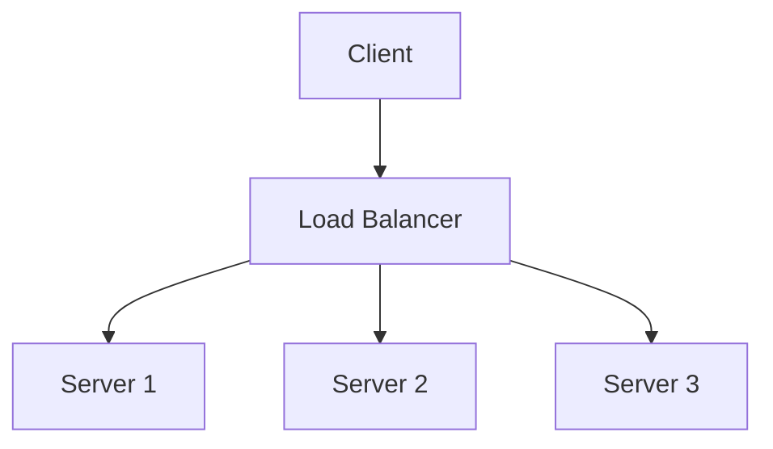

# Load Balancing

Load balancing distributes incoming network traffic across multiple servers to ensure high availability and reliability. It can operate at different layers:

- **Layer 4 (Transport):** Routes based on IP and port
- **Layer 7 (Application):** Routes based on content (HTTP headers, URLs)

---

## Traffic Distribution Patterns

### Unicast
**Definition:** One-to-one communication (single sender → single receiver)

**How it works:** Load balancer selects ONE backend server per request using an algorithm (round robin, least connections, etc.)

**Use case:** Standard load balancing - each client request goes to exactly one server

**Example:**
```
Client → Load Balancer → Server B (selected via algorithm)
```

### Anycast
**Definition:** One-to-nearest communication (single sender → nearest receiver from group)

**How it works:** Multiple servers advertise same IP address; network routes to topologically closest server

**Use case:** DNS, CDN edge servers, DDoS mitigation

**Example:**
```
Client in NYC → Anycast IP 1.1.1.1 → Routes to NYC datacenter
Client in London → Anycast IP 1.1.1.1 → Routes to London datacenter
```

### Multicast
**Definition:** One-to-many communication (single sender → multiple receivers in group)

**How it works:** Single packet replicated by network to all subscribers

**Use case:** Live streaming, stock market feeds, gaming servers

### Broadcast
**Definition:** One-to-all communication (single sender → all nodes on network)

**Use case:** ARP requests, DHCP discovery (rarely used in load balancing)

---

## Load Balancing Algorithms

### 1. Round Robin
**How it works:** Distributes requests sequentially across servers in rotation

**Use case:** Equal-capacity servers with similar request processing times
```
Request 1 → Server A
Request 2 → Server B
Request 3 → Server C
Request 4 → Server A (cycle repeats)
```

**Pros:** Simple, fair distribution  
**Cons:** Doesn't account for server load or capacity differences

---

### 2. Weighted Round Robin
**How it works:** Assigns weight to each server based on capacity; higher weight = more requests

**Use case:** Servers with different capacities (e.g., Server A: 2x CPU of Server B)
```
Server A (weight: 3) receives 3 requests
Server B (weight: 1) receives 1 request
Ratio: 3:1
```

**Pros:** Accounts for capacity differences  
**Cons:** Static weights don't adapt to real-time load

---

### 3. Least Connections
**How it works:** Routes traffic to server with fewest active connections

**Use case:** Long-lived connections (WebSockets, database connections) or variable request processing times

**Pros:** Dynamic load balancing based on real-time state  
**Cons:** Requires tracking connection state (higher overhead)

---

### 4. Weighted Least Connections
**How it works:** Combines least connections with server weights

**Use case:** Different capacity servers with long-lived connections

**Pros:** Adapts to both capacity and real-time load  
**Cons:** More complex to implement

---

### 5. IP Hash (Consistent Hashing)
**How it works:** Hashes client IP to determine server (same client → same server)

**Use case:** Session affinity without sticky sessions, caching scenarios
```
hash(client_ip) % num_servers = server_index
Client 192.168.1.5 → Always routes to Server B
```

**Pros:** Session persistence, cache locality  
**Cons:** Uneven distribution if client IPs are clustered, adding/removing servers disrupts mappings

---

### 6. Least Response Time (Latency-Based)
**How it works:** Routes to server with lowest latency + fewest active connections

**Use case:** Geo-distributed servers, variable network conditions

**Example:**
```
Server A: 50ms latency, 10 connections
Server B: 20ms latency, 15 connections
→ Routes to Server B (lower latency despite more connections)
```

**Pros:** Optimizes for user experience  
**Cons:** Requires health checks and latency monitoring

---

### 7. Geolocation / Geographic Routing (Proximity-Based)
**How it works:** Routes traffic to nearest server based on geographic location

**Use case:** Multi-region deployments, CDNs, reducing network hops

**Example:**
```
User in NYC → Routes to us-east-1 server
User in London → Routes to eu-west-1 server
```

**Pros:** Minimizes latency, reduces cross-region traffic costs  
**Cons:** Requires geo-IP database, doesn't account for server load

**This is the algorithm you're thinking of** - it routes to the closest service with the least network hops.

---

### 8. Random
**How it works:** Selects server randomly

**Use case:** Simple deployments, stateless services

**Pros:** No state tracking needed  
**Cons:** Can lead to uneven distribution

---

### 9. Resource-Based (Adaptive)
**How it works:** Routes based on real-time server resource utilization (CPU, memory, disk I/O)

**Use case:** Compute-intensive workloads, heterogeneous server pools

**Pros:** Prevents overload, optimizes resource usage  
**Cons:** Requires agent on each server to report metrics

---

### 10. Priority / Weighted Priority
**How it works:** Routes to primary servers first; failover to secondary only if primary unavailable

**Use case:** Active-passive failover, cost optimization (premium vs spot instances)

**Example:**
```
Priority 1: Servers A, B (handle all traffic)
Priority 2: Server C (only used if A and B fail)
```

**Pros:** Cost-effective, clear failover hierarchy  
**Cons:** Secondary servers may be cold (slower initial response)

---

## Load Balancer Types

### By Layer

**Layer 4 (Transport Layer):**
- Routes based on IP address and TCP/UDP port
- Faster (no application-level inspection)
- Cannot route based on URL path or headers
- Examples: AWS NLB, HAProxy (L4 mode)

**Layer 7 (Application Layer):**
- Routes based on HTTP headers, URL path, cookies
- Enables content-based routing (e.g., /api → API servers, /static → CDN)
- SSL termination, compression, caching
- Examples: AWS ALB, NGINX, HAProxy (L7 mode)

### By Deployment

**Hardware Load Balancers:**
- Dedicated physical appliances (F5, Citrix NetScaler)
- High throughput, low latency
- Expensive, less flexible

**Software Load Balancers:**
- Run on commodity hardware (NGINX, HAProxy, Envoy)
- Flexible, cost-effective, cloud-native
- Requires tuning for high performance

**Cloud-Managed Load Balancers:**
- Fully managed services (AWS ELB/ALB/NLB, GCP Load Balancer, Azure Load Balancer)
- Auto-scaling, high availability
- Pay-per-use, limited customization

### By Availability Model

**Active-Active:**
- All servers actively handle traffic
- Higher resource utilization
- Requires load balancing algorithm

**Active-Passive:**
- Primary handles traffic, secondary on standby
- Failover only when primary fails
- Lower resource utilization, simpler

## Trade-offs
- Simplicity vs. flexibility
- Performance vs. feature set

## Trade-offs and Comparisons

- Load balancers distribute traffic for availability and performance.
- API gateways provide centralized API management and control.
- Trade-off: Simple traffic distribution vs. comprehensive API management.

**Hybrid Approach:** Use API Gateway for external traffic (client-facing) and load balancers for internal service-to-service communication.

**Questions to Ask:**
- Do you need API management features beyond basic traffic distribution?
- Are you exposing APIs to external clients or just internal services?
- How important is minimizing latency vs. having centralized control?

## Architecture Diagram


