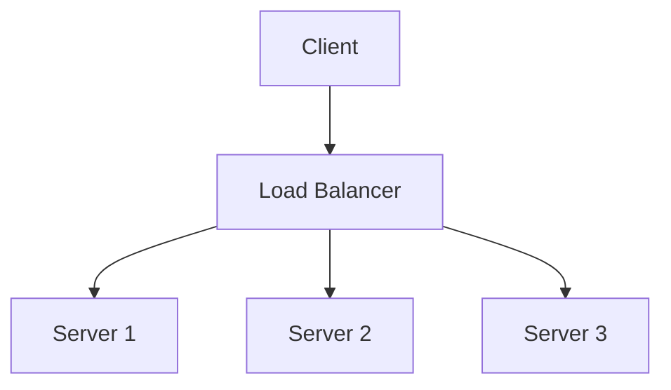

# Load Balancing

Load balancing distributes incoming network traffic across multiple servers to ensure high availability and reliability. It can operate at different layers:

- **Layer 4 (Transport):** Routes based on IP and port
- **Layer 7 (Application):** Routes based on content (HTTP headers, URLs)

## Algorithms
- Round-robin
- Least connections
- Weighted
- IP hash

## Types
- Hardware vs software
- Active-passive vs active-active

## Trade-offs
- Simplicity vs. flexibility
- Performance vs. feature set

## Trade-offs and Comparisons

- Load balancers distribute traffic for availability and performance.
- API gateways provide centralized API management and control.
- Trade-off: Simple traffic distribution vs. comprehensive API management.

**Hybrid Approach:** Use API Gateway for external traffic (client-facing) and load balancers for internal service-to-service communication.

**Questions to Ask:**
- Do you need API management features beyond basic traffic distribution?
- Are you exposing APIs to external clients or just internal services?
- How important is minimizing latency vs. having centralized control?

## Architecture Diagram

