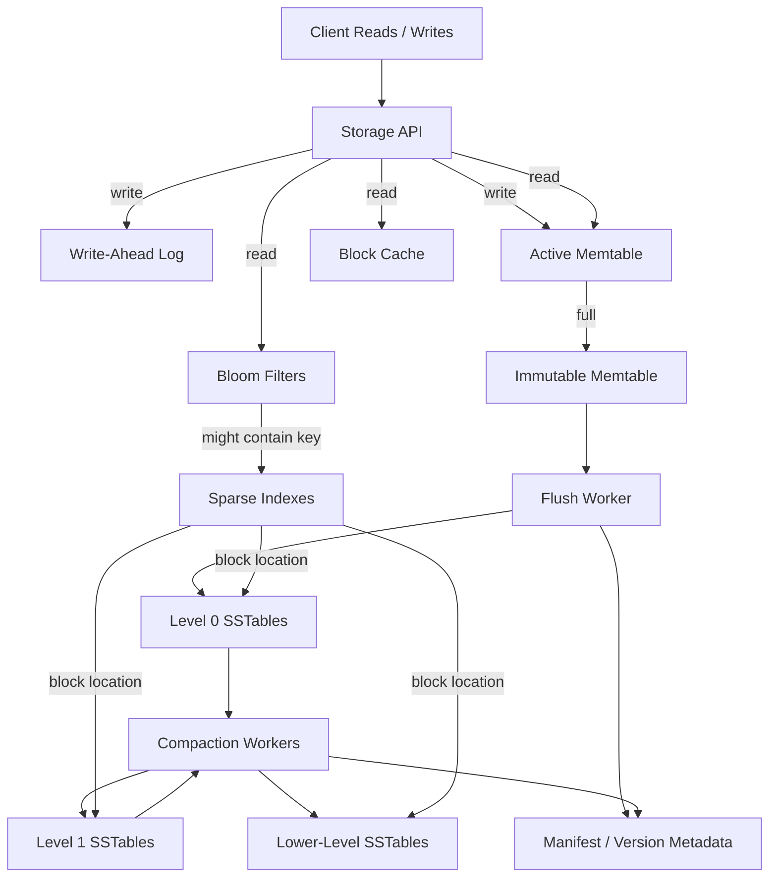

# LSM Tree

An LSM Tree, or Log-Structured Merge Tree, is a write-optimized storage engine design used by systems such as RocksDB, LevelDB, Cassandra, Bigtable, and many time-series databases. It turns random writes into mostly sequential appends, then reorganizes immutable files in the background through compaction.

## When to Use

- Write-heavy key-value stores, time-series stores, event stores, and metadata indexes.
- Workloads with high ingest rate and acceptable background compaction cost.
- Systems that can tolerate read amplification in exchange for faster writes.
- Storage engines that need efficient point lookups plus ordered range scans.

Avoid LSM as the default when the workload is mostly random reads, strict low-tail-latency reads, or the team cannot operate compaction safely.

## High-Level Architecture

## Core Components

| Component | Purpose |
|---|---|
| Write-Ahead Log | Durable append-only record used for crash recovery before writes are acknowledged. |
| Memtable | In-memory sorted structure, often a skip list or tree, holding recent writes. |
| Immutable Memtable | Frozen memtable waiting to be flushed to disk. |
| SSTable | Immutable sorted file containing data blocks, indexes, filters, checksums, and metadata. |
| Manifest | Tracks the current set of SSTables, levels, sequence numbers, and file metadata. |
| Bloom Filter | Skips SSTables that definitely do not contain a key. |
| Sparse Index | Maps key ranges to SSTable block offsets. |
| Block Cache | Keeps hot decompressed or compressed blocks in memory. |
| Compaction Worker | Merges SSTables, removes overwritten values and tombstones, and rewrites levels. |

## Write Path

1. Client sends a write to the storage API.
2. Storage engine appends the operation to the WAL.
3. Storage engine inserts or updates the key in the active memtable.
4. Write is acknowledged after the configured durability condition is met.
5. When the memtable reaches a size threshold, it becomes immutable.
6. Flush worker writes the immutable memtable as a new SSTable, usually in Level 0.
7. Manifest is updated so readers can discover the new SSTable.
8. WAL segments covered by flushed memtables can be truncated or archived.

Writes are fast because they avoid in-place page updates. Most work is append-only until compaction.

## Read Path

1. Check the active memtable.
2. Check immutable memtables.
3. Check SSTables from newest to oldest or by level ordering.
4. Use Bloom filters to skip files that definitely do not contain the key.
5. Use sparse indexes to find candidate data blocks.
6. Use the block cache before reading from disk.
7. Merge versions, tombstones, and duplicate keys to return the visible value.

Point reads rely heavily on Bloom filters and cache hit rate. Range scans merge sorted iterators across memtables and SSTables.

## Compaction

Compaction is the background process that controls long-term read performance and storage efficiency.

- Merges overlapping SSTables into larger sorted SSTables.
- Keeps the newest visible value for each key.
- Drops obsolete overwritten values.
- Removes tombstones after it is safe to do so.
- Moves data from write-heavy upper levels to larger lower levels.
- Updates the manifest atomically when new files replace old files.

Compaction reduces read amplification and space amplification, but increases write amplification because data may be rewritten several times.

## Leveling vs Tiering

| Strategy | Behavior | Tradeoff |
|---|---|---|
| Leveled compaction | Each level has mostly non-overlapping key ranges. | Better reads, higher write amplification. |
| Tiered compaction | Accumulates several similar-sized files, then merges them. | Better writes, higher read and space amplification. |
| Time-window compaction | Groups data by time windows. | Good for time-series data with retention policies. |

## Key Tradeoffs

- **Write amplification:** How many times data is rewritten by compaction.
- **Read amplification:** How many files or blocks must be checked during reads.
- **Space amplification:** Extra disk used by old versions, tombstones, and overlapping files.
- **Compaction debt:** Backlog that builds when ingest exceeds compaction throughput.
- **Tombstone cost:** Deletes are writes first; physical cleanup happens later.

## Tuning Knobs

- Memtable size and flush threshold.
- WAL fsync policy.
- SSTable block size and compression.
- Bloom filter false-positive rate.
- Level size multiplier.
- Compaction strategy and worker count.
- Cache size split between index, filter, and data blocks.

## Interview Q&A

- Q: Why are LSM writes fast?
  - A: Writes append to the WAL and update memory, avoiding random in-place disk updates.
- Q: Why can reads be slower?
  - A: A key may exist in the memtable and several SSTables, so the engine may need filters, indexes, and merges.
- Q: What does compaction solve?
  - A: It reduces file overlap, removes obsolete versions, cleans tombstones, and improves read efficiency.
- Q: Where do Bloom filters fit?
  - A: Each SSTable can have a Bloom filter so point reads skip files that definitely do not contain the key.

## See Also

- [Write-Ahead Logging](./wal.md)
- [Bloom Filter](../algorithms/bloom-filter.md)
- [Bigtable](../case-study/bigtable/bigtable.md)
- [Cassandra](../case-study/cassandra/cassandra.md)
