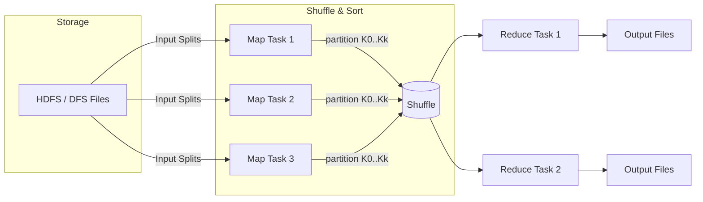

# MapReduce

## Definition
MapReduce is a distributed programming model for large-scale batch processing. It decomposes a job into parallel map tasks that transform input records, followed by a shuffle/sort phase that groups intermediate keys, and reduce tasks that aggregate results into output files.

## Core Phases
- Map: Process input splits record-by-record to emit (key, value) pairs
- Shuffle & Sort: Partition by key, transfer map outputs to reducers, sort by key
- Reduce: Aggregate values per key to produce final results
- Combiner (optional): Local pre-aggregation on mapper output to cut shuffle volume
- Partitioner: Determines reducer assignment for a given key; affects load balance and skew
- Input/Output Formats: Define how to read splits (e.g., text, sequence) and write outputs

## Execution Model
- Storage & Splits: Inputs live in a distributed filesystem (e.g., HDFS); files are split into blocks/splits for parallelism
- Scheduling & Locality: Map tasks are scheduled close to the data to minimize network I/O
- Intermediate Data: Mapper outputs are spilled/sorted to local disk; reducers fetch (shuffle) the relevant partitions via the network
- Fault Tolerance: Failed map/reduce tasks are retried; speculative execution mitigates stragglers; work is deterministic so tasks can be safely re-run

## Trade-offs
- Strengths: High throughput, simple mental model, resilient to failures, good for large batch ETL and index/aggregation jobs
- Limitations: High latency (batch), heavyweight shuffle, less suited to iterative/interactive workloads compared to modern engines (e.g., Spark)

## Interview Q&A
- When do you prefer MapReduce over Spark or Flink? (Very large, simple, one-pass batch transforms; cost/ops simplicity)
- How do combiners and partitioners impact performance and skew?
- How would you handle data skew (salting keys, custom partitioners, two-stage reduces)?

## Architecture Diagram

## See Also
- [Batch Processing](./batch-processing.md)
- [Data Pipelines](./data-pipelines.md)
- [Lambda Architecture](./lambda-architecture.md)
- [Stream Processing](./stream-processing.md)
- Related Designs: [HDFS](../designs/hdfs/hdfs.md), [GFS](../designs/gfs/gfs.md), [Dremel](../designs/dremel/dremel.md)
