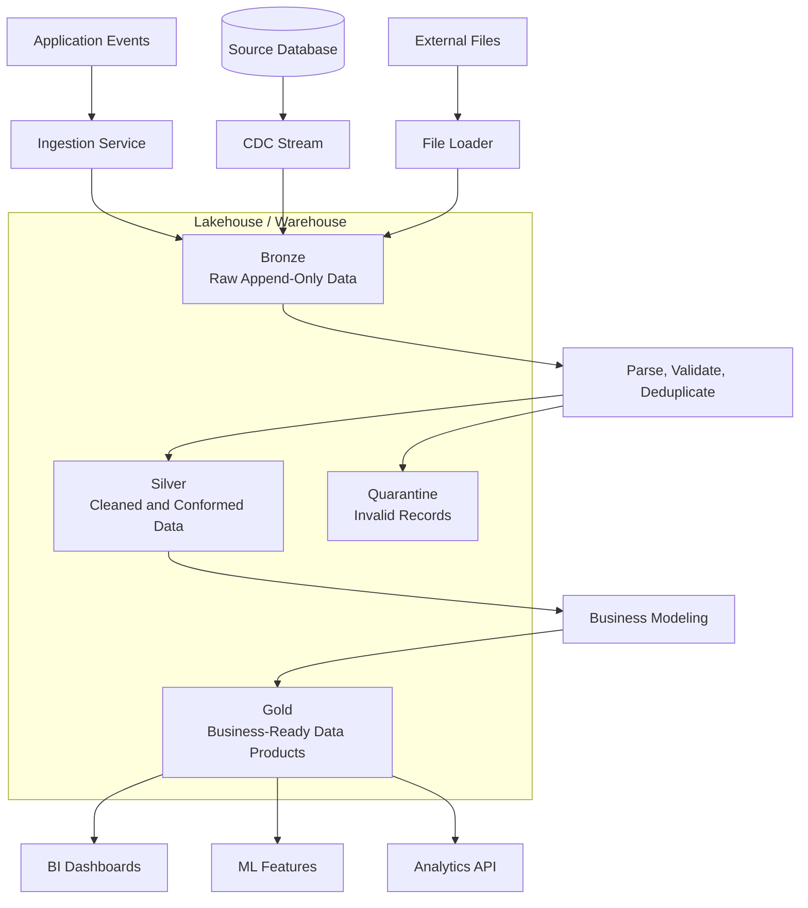

# Medallion Architecture

Medallion architecture organizes analytical data into progressively refined layers: **Bronze**, **Silver**, and **Gold**. It is commonly used in lakehouse and data warehouse systems to separate raw ingestion, cleaned data, and business-ready serving models.

The main goal is to make data pipelines easier to reason about: each layer has a clear contract, quality bar, and set of consumers.

## Layers

| Layer | Purpose | Typical Data Shape | Consumers |
|-------|---------|--------------------|-----------|
| **Bronze** | Preserve raw ingested data | Raw events, CDC records, logs, files | Data engineers, replay jobs |
| **Silver** | Clean, validate, deduplicate, and conform data | Typed, normalized, joined, quality-checked tables | Analytics engineers, ML pipelines |
| **Gold** | Serve business-ready data products | Aggregates, metrics, facts, dimensions, feature tables | BI dashboards, product analytics, ML serving |

---

## Bronze Layer

The Bronze layer is the system of record for ingested data.

### Responsibilities
- Capture data from source systems with minimal transformation
- Preserve source fields, timestamps, metadata, and ingestion lineage
- Support replay and backfill if downstream processing fails
- Store malformed or late records for later inspection

### Common Inputs
- Application events
- Database CDC streams
- API exports
- Object storage files
- Logs and telemetry

### Design Notes
- Prefer append-only writes when possible
- Keep raw source payloads or enough metadata to reconstruct them
- Partition by ingestion time or event time depending on access patterns
- Track schema versions to handle source evolution

## Silver Layer

The Silver layer converts raw data into reliable, queryable datasets.

### Responsibilities
- Parse and type raw fields
- Deduplicate events or CDC records
- Enforce data quality checks
- Normalize names, units, identifiers, and timestamps
- Join or conform related data into reusable entities
- Quarantine invalid records instead of silently dropping them

### Common Transformations
- `json` payload -> typed columns
- duplicate events -> one canonical event
- source-specific customer IDs -> unified customer ID
- raw CDC rows -> latest entity state
- late-arriving records -> corrected historical table versions

### Design Notes
- Make transformation logic idempotent
- Store data quality metrics per job run
- Use deterministic primary keys for merges and upserts
- Separate rejected records into a dead-letter or quarantine table

## Gold Layer

The Gold layer exposes curated data products for business use cases.

### Responsibilities
- Build domain-specific facts, dimensions, aggregates, and metrics
- Optimize tables for read performance and common query patterns
- Apply business definitions consistently
- Provide stable contracts for dashboards, reports, and ML features

### Common Outputs
- Revenue metrics
- Customer 360 tables
- Product funnel analysis
- Daily active user aggregates
- Fraud features
- Recommendation features

### Design Notes
- Gold tables should have explicit owners and definitions
- Avoid embedding one-off dashboard logic directly into shared tables
- Optimize layout, clustering, partitioning, and materialization for consumers
- Version important metric definitions when they change

---

## Data Quality Gates

Medallion architecture works best when each transition has quality gates.

| Transition | Example Checks |
|------------|----------------|
| Bronze -> Silver | Valid schema, parseable timestamps, non-null keys, deduplication, referential checks |
| Silver -> Gold | Metric consistency, freshness SLA, row-count expectations, business rule validation |

Quality failures should be observable and recoverable. A bad batch should not corrupt downstream serving tables.

## Batch and Streaming

Medallion architecture can support both batch and streaming pipelines.

### Batch
- Periodic jobs process files or table partitions
- Easier to backfill and debug
- Higher end-to-end latency

### Streaming
- Continuous jobs process events as they arrive
- Lower latency for dashboards and ML features
- Requires stronger handling of late data, checkpoints, and exactly-once or effectively-once semantics

Many systems use a hybrid approach: streaming into Bronze/Silver for freshness, plus scheduled batch jobs to recompute Gold tables for correctness.

## Storage and Compute Choices

Common storage options:
- Object storage with open table formats: Delta Lake, Apache Iceberg, Apache Hudi
- Cloud warehouses: Snowflake, BigQuery, Redshift
- Real-time OLAP stores: ClickHouse, Druid, Pinot

Common compute options:
- Spark
- Flink
- dbt
- Airflow / Dagster / Prefect
- Cloud-native dataflow services

The pattern is independent of vendor. The important part is the separation of raw, cleaned, and business-ready data contracts.

## Reliability Patterns

- **Idempotent jobs:** Re-running a job should produce the same result for the same input
- **Checkpointing:** Streaming jobs need durable progress tracking
- **Backfills:** Historical recomputation should be planned, not improvised
- **Schema evolution:** Additive changes should flow safely; breaking changes need coordination
- **Lineage:** Consumers should be able to trace Gold data back to Silver and Bronze inputs
- **Observability:** Track freshness, volume, quality failures, job duration, and cost
- **Access control:** Raw Bronze data may contain sensitive fields that should not reach Gold

## Trade-offs

| Benefit | Cost |
|---------|------|
| Clear data contracts between pipeline stages | More tables and orchestration complexity |
| Easier debugging and replay from raw data | Higher storage usage due to duplicated layers |
| Better data quality and lineage | Requires discipline around ownership and schemas |
| Supports both analytics and ML use cases | Gold layer can become fragmented without governance |
| Enables incremental processing and backfills | Late-arriving data and CDC merges can be complex |

## When to Use

Use medallion architecture when:
- Multiple teams consume analytical data
- Raw data needs to be replayable
- Data quality and lineage matter
- You need both exploratory and production-grade datasets
- Batch, streaming, BI, and ML workloads share a common data platform

Avoid or simplify it when:
- The system has only one small data source
- There are few consumers and simple reporting needs
- The added orchestration and storage overhead outweighs the quality benefits

## Example Flow

## Interview Q&A

- **Why not let dashboards query raw data directly?** Raw data often has duplicates, schema drift, inconsistent timestamps, and source-specific semantics. Silver and Gold layers provide stable contracts.
- **What belongs in Bronze vs Silver?** Bronze preserves source truth with minimal transformation. Silver applies correctness, typing, deduplication, and conformance.
- **What belongs in Gold?** Business-facing facts, dimensions, aggregates, and metrics optimized for consumption.
- **How do you handle bad records?** Quarantine them with error metadata, alert on quality thresholds, and keep the pipeline recoverable.
- **How do you support backfills?** Preserve raw Bronze data, make transformations deterministic, and run partitioned or versioned recomputation jobs.
- **How does this relate to lakehouse table formats?** Table formats like Delta Lake, Iceberg, and Hudi provide ACID transactions, schema evolution, time travel, and incremental reads that make medallion pipelines easier to operate.

## See Also

- [Data Pipelines](./data-pipelines.md)
- [Batch Processing](./batch-processing.md)
- [Stream Processing](./stream-processing.md)
- [Lambda Architecture](./lambda-architecture.md)
- [Big Data Storage Platforms](./big-data-storage-platforms.md)
