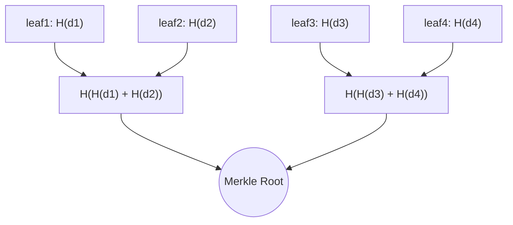

# Merkle Tree (Hash Tree)

A Merkle tree is a binary tree of hashes that lets you verify the integrity and membership of large datasets efficiently. Leaves contain hashes of raw chunks/records, internal nodes hash the concatenation of their children, and the root hash commits to the entire set.

## Why it’s used
- Integrity verification for large objects with small proofs (O(log n) size and verification).
- Fast anti-entropy/repair between replicas by comparing roots and descending only where they differ (used in Dynamo/Cassandra).
- Content-addressed storage and deduplication (e.g., IPFS, CAS systems).
- Blockchain transaction integrity (block header includes Merkle root); Git’s object graph is a Merkle DAG.

## Core ideas
- Leaf hash: h_i = H(chunk_i)
- Internal node: H(left || right)
- Merkle root: single hash committing to all leaves
- Merkle proof: sibling hashes along the path from a leaf to the root + left/right positions; verify by recomputing to the root
- Complexity: build O(n), proof size O(log n), verify O(log n)

## How parent hashes are computed
At every internal node, the hash values of the two child nodes are concatenated (joined together in order: left first, then right), and the resulting byte string is hashed again to produce the parent’s hash. This process repeats level by level until a single Merkle root is generated.

Formally, if left child has hash L and right child has hash R, then the parent hash P is:

P = H(L || R)

Notes:
- Order matters: H(L || R) ≠ H(R || L). Swapping children changes the parent.
- Some implementations use domain separation/prefixes to avoid ambiguity:
  - Leaf: h_i = H(0x00 || chunk_i)
  - Internal: P = H(0x01 || L || R)

### Practical considerations
- Odd number of leaves: duplicate the last leaf, or use an unbalanced final level (define clearly for interoperability).
- Hash choice: prefer collision-resistant functions (SHA-256, BLAKE3). Include domain separators or prefixes (e.g., 0x00 for leaves, 0x01 for internal) to avoid ambiguity.
- Streaming: compute leaf hashes over fixed-size chunks; combine upward incrementally to reduce memory.
- Ordering: proofs are order-sensitive; keep a canonical leaf ordering (e.g., by index or key).

## Mermaid diagram

## Example: Merkle proof for leaf 3
- Proof contains: H(d4) and A (i.e., H(H(d1)+H(d2))) and the positions (sibling on right/left)
- Verify by computing H(H(d3)+H(d4)) = B, then H(A+B) = root

Note: In this document, “+” denotes byte-string concatenation (i.e., L || R) when shown inside diagrams or examples.

## Interview Q&A
- Q: What is a Merkle proof and its complexity?
  - A: A list of sibling hashes along the path to the root, with left/right positions. Size and verification time are O(log n).
- Q: How do Merkle trees enable anti-entropy in key–value stores?
  - A: Replicas compare roots; if unequal, they recursively compare child hashes to localize differences to specific subranges, transferring only missing keys.
- Q: Why not just hash the whole dataset?
  - A: A single hash proves integrity but not membership. With a Merkle tree you can prove or disprove inclusion of an item with a small proof without rehashing everything.
- Q: How do you handle an odd number of leaves?
  - A: Either duplicate the last leaf or carry the orphan up; the scheme must be defined consistently across peers.
- Q: Security considerations?
  - A: Use a strong hash, add domain separation for leaves/internal nodes, and authenticate the root (e.g., via signature or trusted header).

## See Also
- [consistency.md](./consistency.md)
- [replication.md](./replication.md)
- [backup.md](./backup.md)
- [indexes.md](./indexes.md)
