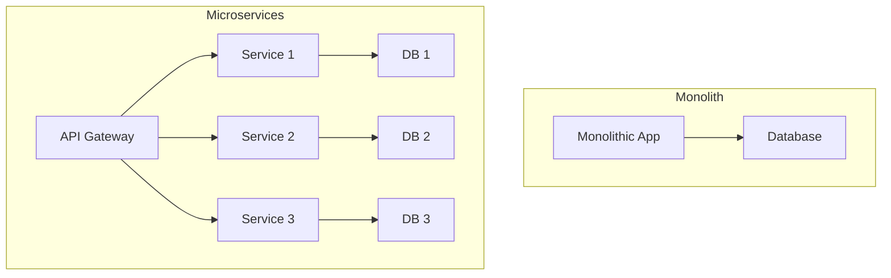

# Monolith vs Microservices

This topic compares the monolithic and microservices architecture patterns, highlighting their trade-offs, use cases, and design considerations.

## Monolithic Architecture
- All functionality in a single codebase and deployable unit
- Simple to develop, test, and deploy initially
- Tight coupling between components
- Scaling is at the application level

## Microservices Architecture
- Functionality split into independent, loosely coupled services
- Each service can be developed, deployed, and scaled independently
- Enables technology diversity and team autonomy
- Requires service discovery, API contracts, and distributed data management

## Trade-offs
- **Monolith:**
  - + Simple to start, easy local development
  - - Harder to scale and maintain as system grows
  - - Risk of tight coupling and deployment bottlenecks
- **Microservices:**
  - + Scalability, resilience, independent deployments
  - - Operational complexity, distributed system challenges
  - - Requires robust DevOps, monitoring, and communication

## When to Use
- Start with a monolith for small teams and simple domains
- Move to microservices as scale, complexity, and team size grow

## Interview Q&A
- When should you split a monolith into microservices?
- What are the biggest challenges in microservices migrations?
- How do you handle data consistency and transactions across services?

## Architecture Diagram

