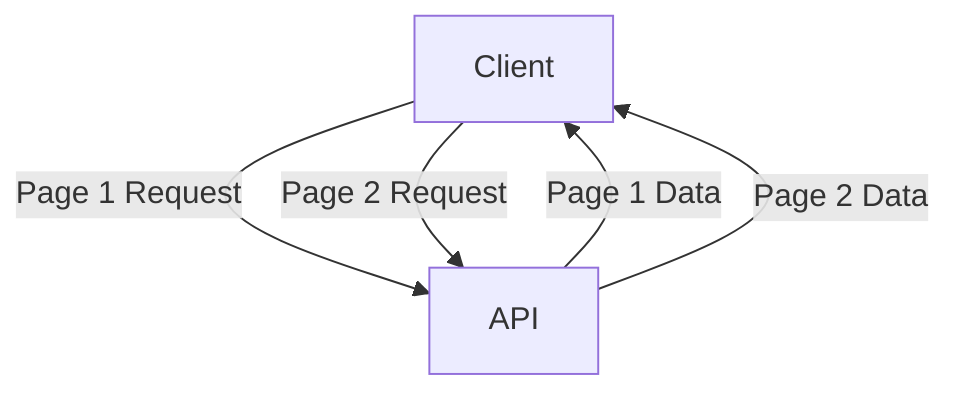

# Pagination in API Design

Pagination is the process of dividing large datasets into discrete pages to improve performance, reduce payload size, and provide a better user experience in APIs.

## Key Concepts
- Offset-based pagination (e.g., `?offset=0&limit=20`)
- Cursor-based pagination (e.g., `?cursor=abc123&limit=20`)
- Page-based pagination (e.g., `?page=2&pageSize=20`)
- Keyset pagination for stable ordering
- Metadata: total count, next/prev links

## Trade-offs
- **Pros:**
  - Reduces response size and latency
  - Improves scalability and user experience
  - Enables efficient navigation through large datasets
- **Cons:**
  - Offset-based can be inconsistent with changing data
  - Cursor-based is more complex to implement
  - May require additional client logic for navigation

## Interview Q&A
- **Q:** Why is pagination important in APIs?
  - **A:** It prevents large payloads, improves performance, and enables efficient data browsing.
- **Q:** What are the differences between offset and cursor pagination?
  - **A:** Offset is simple but can skip/duplicate items if data changes; cursor is stable but more complex.
- **Q:** How do you provide pagination metadata?
  - **A:** Include total count, next/prev links, and current page info in the response.

## Mermaid Diagram

## See Also
- [rest-api.md](./rest-api.md)
- [graphql-api.md](./graphql-api.md)
