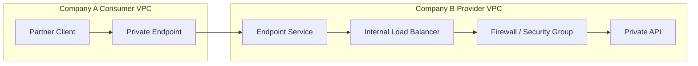
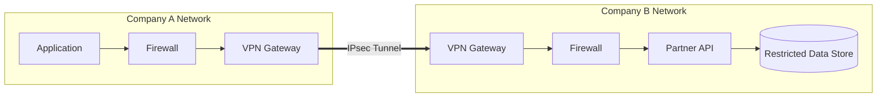

# Private Connectivity

Private connectivity is how systems communicate without exposing every service directly to the public internet. It is usually combined with TLS, mTLS, authentication, authorization, firewalls, and logging. A private network path reduces exposure; it does not remove the need for application-layer security.

Use this component when two companies, cloud accounts, VPCs/VNets, data centers, or internal services need a controlled communication path.

## Core Idea

Secure communication has several layers:

| Layer | What It Solves | Examples |
|-------|----------------|----------|
| Private routing | Keep traffic off public service exposure paths | VPN, PrivateLink, VPC peering, Direct Connect |
| Encryption in transit | Protect data on the wire | TLS, mTLS, IPsec, WireGuard |
| Identity | Prove who is connecting | mTLS certificates, IAM, OIDC/JWT, API keys |
| Policy enforcement | Restrict what can talk to what | Firewalls, security groups, ACLs, NetworkPolicies |
| Application authorization | Decide what the caller can do | RBAC, ABAC, scopes, signed requests |
| Observability | Prove and debug behavior | Flow logs, firewall logs, audit logs, metrics |

**Key distinction:** TLS/mTLS secures a connection, but it does not by itself make the network path private. VPNs, private endpoints, peering, and dedicated links control how traffic is routed and exposed. In high-trust or regulated systems, use both private connectivity and TLS/mTLS.

## Common Options

| Option | Best For | Pros | Cons |
|--------|----------|------|------|
| Public API over TLS | Low-risk partner APIs, broad internet clients | Simple, cheap, easy to operate | Publicly reachable endpoint, depends heavily on app security |
| Public API with mTLS | B2B APIs needing strong client identity | Strong caller authentication, no private network dependency | Certificate lifecycle overhead, endpoint still publicly reachable |
| Site-to-site VPN | Company-to-company or data-center-to-cloud networks | Encrypted tunnel, broad network access, common pattern | Routing complexity, overlapping CIDRs, tunnel availability |
| Private service endpoint | Exposing one service privately to another network | Narrow blast radius, consumer does not need full network access | Cloud/provider-specific, service-oriented rather than network-wide |
| VPC/VNet peering | Private connectivity between trusted cloud networks | Low latency, simple for same-provider networks | Weak isolation if overused, CIDR conflicts, transitive routing limits |
| Transit gateway / hub network | Many networks connected through a central router | Centralized routing and inspection | Cost, operational complexity, central failure domain |
| Dedicated private link | Predictable high-throughput hybrid connectivity | Stable latency, high bandwidth, private physical path | Expensive, slow provisioning, still needs encryption for sensitive data |
| SD-WAN / MPLS | Enterprise branch and legacy WAN connectivity | Mature enterprise operations, traffic steering | Cost, vendor dependency, slower cloud-native integration |

## VPNs

VPNs create encrypted tunnels between networks or users and private resources.

### Site-to-Site VPN

A site-to-site VPN connects two networks, such as Company A's VPC to Company B's data center.

**Typical stack:**
- IPsec tunnels for encryption and integrity
- IKE/IKEv2 for key exchange
- BGP for dynamic route exchange
- Redundant tunnels across multiple gateways or availability zones
- Firewall rules on both sides to allow only required ports and CIDRs

**Use cases:**
- Partner system integration
- Cloud-to-data-center connectivity
- Temporary private connectivity while a dedicated link is being provisioned
- Replication or file transfer between organizations

**Design concerns:**
- **CIDR overlap:** Two companies may both use `10.0.0.0/8` or `172.16.0.0/12`. NAT or re-addressing may be required.
- **Route control:** Avoid advertising more routes than necessary. Prefer least-privilege route tables.
- **Availability:** Use multiple tunnels, multiple customer gateways, and health checks.
- **Throughput:** VPN throughput is bounded by gateway limits and encryption overhead.
- **Ownership:** Both sides must coordinate keys, routing, firewall rules, failover tests, and change windows.

### Remote Access VPN

Remote access VPNs connect individual users or devices into a private network.

**Examples:** OpenVPN, WireGuard, commercial ZTNA clients

**Use cases:**
- Admin access to internal systems
- Developer access to private services
- Emergency access when zero-trust access tools are unavailable

**Trade-off:** Convenient broad network access can become risky. Prefer least-privilege access paths, device posture checks, MFA, short sessions, and detailed logs.

### VPN Protocols

| Protocol | Notes |
|----------|-------|
| IPsec | Common for site-to-site VPNs; strong, widely supported, operationally mature |
| WireGuard | Simple, fast, modern; often used for remote access or controlled private mesh networks |
| OpenVPN | Mature remote-access VPN; flexible, but more operational overhead than WireGuard |
| SSL VPN | Browser/client-based remote access; common in enterprise appliances |

## Private Service Endpoints

Private service endpoints expose a specific service privately instead of connecting entire networks.

**Examples:**
- AWS PrivateLink
- Azure Private Link
- Google Private Service Connect

**How it works:** The service producer publishes an endpoint service. The consumer creates a private endpoint in their own network. Traffic reaches the producer service over provider-managed private connectivity without exposing the producer service publicly.

**Use cases:**
- SaaS vendor exposing a private API to enterprise customers
- One company consuming another company's data service
- Private access to managed cloud services
- Reducing blast radius versus full VPC peering

**Benefits:**
- Narrow service-level exposure
- No broad routing between company networks
- Usually avoids overlapping CIDR problems
- Cleaner security model for B2B service integrations

**Trade-offs:**
- Provider-specific setup and naming
- Usually one-way consumer-to-provider initiation
- Requires endpoint policies, DNS configuration, and service acceptance workflows
- Not a replacement for API authentication and authorization

## Peering and Shared Private Networks

### VPC/VNet Peering

Peering connects two private cloud networks so resources can communicate using private IPs.

**Use cases:**
- Same-company multi-account architecture
- Shared services VPC
- Low-latency communication between trusted environments

**Trade-offs:**
- Simple for a small number of networks
- Can become hard to reason about at scale
- CIDR ranges must not overlap
- Transitive routing is often limited or unsupported
- Overly broad peering can erase useful security boundaries

### Transit Gateway / Hub-and-Spoke

A transit gateway or hub network connects many networks through a central routing layer.

**Use cases:**
- Many VPCs/VNets
- Centralized inspection
- Shared egress
- Cloud-to-data-center routing

**Benefits:**
- Centralized route control
- Easier scaling than full mesh peering
- Natural place for firewalls, IDS/IPS, NAT, and logging

**Trade-offs:**
- More expensive than simple peering
- More moving parts
- Route table mistakes can have broad impact
- The hub can become a critical dependency

## Dedicated Private Links

Dedicated links provide private physical or provider-managed connectivity between networks.

**Examples:**
- AWS Direct Connect
- Azure ExpressRoute
- Google Cloud Interconnect
- Colocation cross-connects
- Leased lines
- MPLS circuits

**Use cases:**
- High-throughput data replication
- Low-jitter enterprise connectivity
- Hybrid cloud workloads
- Regulated environments where public internet routing is undesirable

**Benefits:**
- Predictable bandwidth and latency
- Better operational control than internet VPN
- Can reduce data transfer cost at high volume

**Trade-offs:**
- Provisioning can take weeks
- Higher fixed cost
- Requires network engineering and provider coordination
- A private circuit is not automatically encrypted; use MACsec, IPsec, TLS, or mTLS where appropriate

## Firewalls and Policy Enforcement

Firewalls enforce traffic policy between networks, hosts, services, or applications. They reduce attack surface by allowing known-good traffic and blocking or inspecting everything else.

### Where Firewalls Fit

- **Network edge:** Between the internet and a private network or VPC
- **Partner boundary:** Between two companies connected by VPN, private endpoint, or dedicated link
- **Subnet boundary:** Between public, private, and restricted subnets
- **Host boundary:** On individual servers or nodes
- **Service boundary:** Between workloads, pods, or microservices
- **Application edge:** In front of HTTP APIs and web applications

### Firewall Types

**Packet-filtering firewall:** Filters traffic using Layer 3/4 attributes such as source IP, destination IP, protocol, and port.

**Stateful firewall:** Tracks active connections and allows return traffic for established sessions. Common at internet edges, VPC boundaries, and enterprise perimeters.

**Stateless firewall:** Evaluates each packet independently. Common for high-throughput filtering and cloud network ACLs, but rules are harder to manage because both directions must be explicit.

**Next-generation firewall (NGFW):** Combines stateful filtering with application awareness, intrusion prevention, threat intelligence, and user identity.

**Web application firewall (WAF):** A Layer 7 firewall that inspects HTTP/S requests for attacks such as SQL injection, cross-site scripting, path traversal, bots, suspicious request rates, and malformed payloads.

**Host-based firewall:** Runs on an individual machine and controls traffic to or from that host. Examples include iptables, nftables, Windows Defender Firewall, and ufw.

**Cloud firewall controls:** Security groups, network ACLs, managed network firewalls, WAFs, private endpoint policies, and VPC/VNet firewall rules.

**Kubernetes NetworkPolicy:** Workload-level Layer 3/4 rules for pod-to-pod and pod-to-external traffic. Support depends on the CNI plugin, such as Calico, Cilium, or Weave Net.

### Firewall Patterns

**Default deny:** Block all traffic by default, then explicitly allow required flows.

**Least-privilege ingress:** Allow only the partner source ranges, private endpoints, service accounts, ports, and protocols required.

**Least-privilege egress:** Restrict outbound traffic so compromised services cannot freely call the internet or partner systems.

**Layered controls:** Combine edge WAFs, load balancer rules, cloud security groups, network firewalls, pod policies, and host firewalls.

**Central inspection:** Route traffic through a hub firewall or inspection VPC/VNet when policy needs to be centralized.

**Private subnets:** Keep databases, queues, and internal services unreachable from the public internet.

**Bastion or zero-trust access:** Avoid exposing SSH/RDP directly. Use controlled admin access paths with MFA, device checks, session recording, and just-in-time permissions.

### Firewall Trade-offs

- Firewalls can create false confidence if application security is weak.
- Overly broad rules reduce their value.
- Overly strict rules can break valid traffic.
- Rule ordering, route tables, and security groups can become difficult to reason about together.
- Encrypted traffic may require TLS termination, metadata-based filtering, or endpoint-based inspection.
- Logging is essential for debugging, auditing, and incident response.

## TLS, mTLS, and Private Connectivity

TLS and mTLS are complementary to private connectivity.

| Pattern | What It Gives You | What It Does Not Give You |
|---------|-------------------|---------------------------|
| TLS | Server authentication and encrypted transport | Client identity by default, private routing |
| mTLS | Server and client authentication plus encrypted transport | Network segmentation or private routing |
| VPN | Encrypted private network tunnel | Application identity or fine-grained authorization |
| Private endpoint | Private service exposure | End-user authorization or payload-level controls |
| Dedicated link | Predictable private path | Encryption by default in every implementation |

**Practical rule:** Use TLS for almost everything. Use mTLS when the caller is a workload, partner, or device that needs strong cryptographic identity. Use private connectivity when public exposure is unacceptable or when routing, compliance, latency, or blast-radius requirements demand it.

## Design Patterns

### B2B Private API

Use a private service endpoint when one company exposes a narrow API to another company.

**Use when:** The provider wants to expose one service without giving the consumer broad network access.

### Site-to-Site Partner Network

Use a site-to-site VPN when two companies need private access to several systems or when private endpoint support is unavailable.

**Use when:** Both sides need private routing, but keep route advertisements and firewall rules as narrow as possible.

### Hybrid Cloud Connectivity

Use a dedicated link plus VPN/TLS/mTLS when high throughput or predictable latency matters.

**Use when:** Data volume, latency, compliance, or operational predictability justifies the cost and setup time.

## Choosing an Approach

Ask these questions:

- Is the endpoint allowed to be publicly reachable if protected by TLS, mTLS, WAF, and authentication?
- Is this a narrow service integration or broad network-to-network connectivity?
- Are the two networks controlled by the same organization or different companies?
- Do CIDR ranges overlap?
- Which side initiates connections?
- Do both sides need routing to each other, or only consumer-to-provider access?
- What bandwidth, latency, and availability are required?
- Who owns routing changes, firewall changes, certificates, keys, and incident response?
- What is the fail-closed behavior if the tunnel, endpoint, firewall, DNS, or certificate validation fails?
- What logs prove which caller accessed which service?

## Private Endpoint vs. VPN

Choose a private endpoint when the integration is service-shaped: one consumer needs to call one provider service, and the provider does not want to expose broad network routes. This is usually the cleaner B2B SaaS pattern because it limits blast radius and avoids many overlapping-CIDR problems.

Choose a VPN when the integration is network-shaped: multiple systems need private IP reachability, the required service cannot be exposed through a private endpoint, or the connection spans cloud and on-prem networks. Scope routes and firewall rules tightly so the VPN does not become a flat shared network.

Use mTLS, API authentication, authorization, and audit logs in both designs.

## Interview Talking Points

- Start with public API over TLS if exposure is acceptable and security controls are strong.
- Use mTLS when the caller identity must be cryptographically bound to a certificate.
- Use private endpoints for narrow B2B service exposure.
- Use site-to-site VPN for broader private network connectivity.
- Use peering for trusted same-organization networks, but avoid turning every network into one flat network.
- Use transit gateways or hub networks when many networks need controlled routing and inspection.
- Use dedicated links for high-throughput, predictable hybrid connectivity.
- Keep firewalls default-deny and scoped to exact CIDRs, ports, protocols, identities, and service endpoints.
- Treat private networking as defense in depth, not as a replacement for authentication and authorization.

## Related Components

- [API Gateway](api-gateway.md): Handles authentication, rate limiting, request validation, and API-level policy.
- [Load Balancing](load-balancing.md): Common placement point for private services, internal load balancers, and health checks.
- [Proxies](proxies.md): Forward and reverse proxies can centralize routing, TLS termination, and inspection.
- [CDN](cdn.md): Public edge protection for internet-facing traffic, often combined with WAF and TLS termination.
- [Kubernetes](kubernetes.md): Uses NetworkPolicies, ingress controls, and service mesh mTLS for workload connectivity.
- [Stateless Architecture](stateless-architecture.md): Covers JWT, OIDC, and mTLS authentication patterns.
