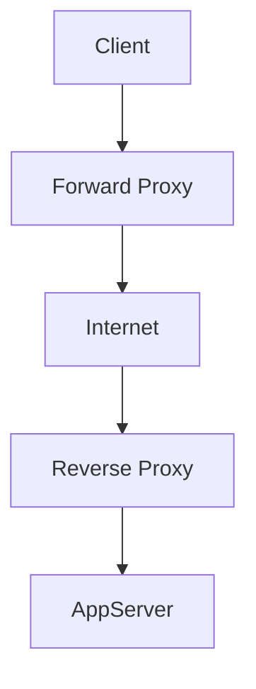

# Proxies

Proxies act as intermediaries between clients and servers, providing anonymity, security, and traffic management.

## Types
- **Forward Proxy:** Client-side, hides client identity from server (e.g., corporate firewalls, caching)
- **Reverse Proxy:** Server-side, hides server identity from client (e.g., load balancing, SSL termination)

## Examples
- Nginx
- HAProxy
- CloudFlare

## Benefits
- Security
- Caching
- Load distribution

## Trade-offs and Comparisons

- API Gateway: API lifecycle management, request transformation, rate limiting
- Reverse Proxy: General traffic routing, SSL termination, caching, security filtering
- Trade-off: Application-specific API management vs. general-purpose traffic/security management

**Hybrid Approach:** Use both together—Reverse Proxy for general traffic management and security, API Gateway for application-specific API orchestration and management.

**Questions to Ask:**
- Are you primarily managing APIs or general web traffic?
- Do you need application-aware features like API versioning and transformation?
- What security requirements exist at the network vs. application layer?

## Architecture Diagram

