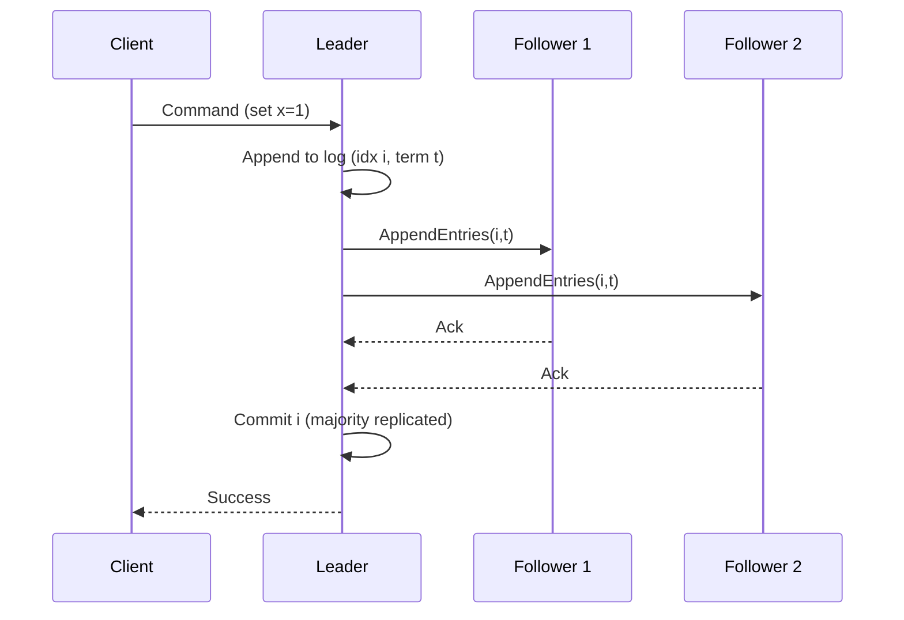

# Raft Consensus Algorithm

## Definition
Raft is a consensus algorithm designed to be understandable and practical, ensuring a cluster of nodes agrees on a sequence of log entries (a replicated state machine). It provides leader election, log replication, and safety guarantees so the system appears as a single, reliable machine despite failures.

## Core Concepts
- Replicated State Machine: All nodes apply the same ordered log of commands to reach the same state.
- Term: Monotonically increasing epoch used during elections and to detect stale leaders.
- Leader, Followers, Candidates: Single leader handles client requests; followers replicate; candidates run elections.
- Log: Ordered sequence of entries; each entry tagged with term and index.
- Commit Index: Highest log index known to be committed on the leader.

## Leader Election
- Heartbeats: Followers expect periodic AppendEntries heartbeats; missing heartbeats trigger election timeout.
- Election: A follower becomes a candidate, increments term, votes for itself, and requests votes.
- Majority Quorum: Candidate becomes leader after receiving votes from a majority of the cluster.
- Safety: Voting rules ensure at most one leader per term.

## Log Replication
- Client requests go to leader; leader appends command to its log and issues AppendEntries RPCs to followers.
- Followers append entries if they match the leader’s prevLogIndex and prevLogTerm.
- Conflicts: On mismatch, followers reject; leader decrements nextIndex and retries until logs realign.
- Commit: Once an entry is replicated on a majority, the leader marks it committed and applies it to the state machine; followers apply when they learn it’s committed.

## Safety Properties
- Leader Completeness: A leader contains all committed entries from previous terms.
- Log Matching: If two logs contain an entry at a given index and term, the logs are identical up to that point.
- State Machine Safety: Committed entries are never lost and are applied in order.

## Membership Changes (Joint Consensus)
- Transition via overlapping configurations (old + new) to maintain safety during reconfiguration.
- Requires majority in both old and new configs before committing new entries.

## Snapshots & Log Compaction
- To bound log size, nodes take snapshots of the state machine and discard old log entries up to a snapshot index.
- InstallSnapshot RPCs bring lagging or fresh nodes up to date.

## Trade-offs and Comparisons
- Raft vs Paxos: Raft is easier to understand and implement; Multi-Paxos and Raft are comparable in performance under a steady leader.
- Latency: Writes require majority replication; reads can be linearizable with leader lease or quorum reads.
- Availability: Loses availability if a majority of nodes are down or partitioned from the leader.

## Mermaid Diagram: Raft Flow

## Interview Q&A
- Q: How does Raft ensure log consistency after a leader change?
  - A: Via prevLogIndex/prevLogTerm checks; the leader backs up nextIndex until follower logs match, then overwrites conflicting entries.
- Q: What happens if two candidates tie?
  - A: No majority; randomized timeouts reduce repeated ties and eventually elect a leader.
- Q: How are linearizable reads implemented?
  - A: Use leader lease, read index protocol, or quorum reads to ensure the leader is still current.
- Q: How does Raft handle reconfiguration safely?
  - A: Joint consensus commits entries only when a majority of both old and new configurations agree.

## Deployment & Sizing
Use an odd number of voters (3, 5, 7…). Production control planes typically use 5 voters across 3 AZs to tolerate two failures during maintenance or correlated outages.

## See Also
- [Consistency](./consistency.md)
- [Replication](./replication.md)
- [Write-Ahead Log (WAL)](./wal.md)
- Related Design: [Distributed Locking System](../designs/distributed-locking-system/distributed-locking-system.md)
