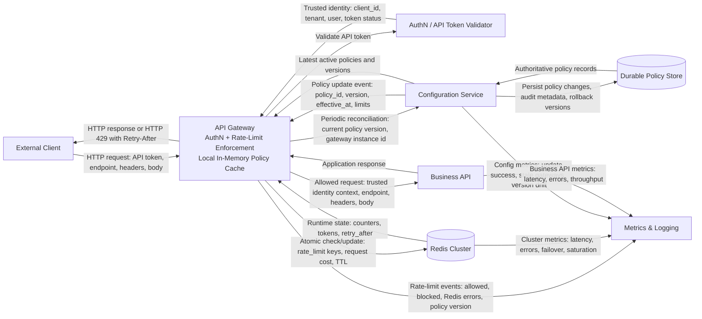

# Rate Limiter — System Design (Fresh Start)

## See Also
- [API Gateway: Concepts & Trade-offs](api-gateway.md)
- [Idempotency: Concepts & Trade-offs](idempotency.md)

## Introduction

A rate limiter is a critical component in modern distributed systems to control the frequency of client requests to APIs or services. It prevents abuse, ensures fair usage, protects backend resources, and improves overall system reliability and user experience.

This document presents a comprehensive design for a scalable, distributed rate limiter system suitable for high-traffic APIs.

---

## Goals and Requirements

### Functional Requirements

- Limit the number of requests per client (user, IP, API key) within a configurable time window.
- Support multiple rate limit tiers (e.g., free, premium).
- Provide immediate feedback (e.g., HTTP 429) when limits are exceeded.
- Allow burst traffic up to a configurable burst size.
- Support both global and per-endpoint rate limits.
- Enable dynamic configuration of limits without downtime.

### Non-Functional Requirements

- Low latency: rate limit checks should add minimal overhead.
- High throughput: support millions of clients and requests per second.
- Scalability: horizontally scalable across regions.
- High availability and fault tolerance.
- Consistency: avoid race conditions and ensure accurate counting.
- Observability: metrics, logs, and alerts for monitoring.

---

## High-Level Architecture

> In this design, the API Gateway is the enforcement point and keeps an in-memory cache of active policies. The Configuration Service is authoritative for policy, Redis Cluster is authoritative only for short-lived runtime enforcement state, and the Business API owns the protected business logic.

### Components

1. **API Gateway**
   - Entry point for all client requests.
   - Authenticates requests using the API token and derives trusted request identity context.
   - Extracts `client_id`, `api_token`, `endpoint`, `tenant`, and `user` for rate-limit evaluation.
   - Looks up matching rate-limit policies from local in-memory configuration.
   - Builds Redis keys for each enforced limit and performs atomic updates against Redis Cluster.
   - Rejects requests exceeding any configured limit with HTTP 429 and `Retry-After` headers.
   - Emits rate-limit logs and metrics for allowed, blocked, and failed checks.

2. **Rate Limiter Cache (Redis)**
   - Stores short-lived runtime counters or token bucket state for each enforced rate-limit key.
   - Uses Redis Cluster for key placement, scalability, and shard-level replication.
   - Uses atomic operations or Lua scripts for concurrency safety across multiple gateway instances.
   - Uses TTL-based key expiration to clean up inactive clients and expired windows.
   - Does not own rate-limit policy; Redis owns only runtime enforcement state.

3. **Business API**
   - Protected downstream API that owns the business logic.
   - Receives only requests that pass authentication and gateway-level rate limiting.
   - Can implement additional domain-specific or operation-specific limits if needed.

4. **Configuration Service**
   - Authoritatively stores and manages rate-limit policies, including window sizes, max requests, burst sizes, global limits, per-endpoint limits, tenant tiers, and overrides.
   - Persists policies in a durable policy store with versioning, audit history, and rollback support.
   - Propagates policy updates to API Gateways using push notifications and periodic reconciliation.
   - Gateways cache the active policy set locally in memory so request-time enforcement does not depend on a configuration service call.

5. **Metrics & Logging**
   - Collects data on rate limiting events, usage patterns, and errors.
   - Enables alerting and capacity planning.

---

## Rate Limiting Algorithms

### 1. Token Bucket (Recommended)

- Tokens are added to a bucket at a fixed rate.
- Each request consumes a token.
- If no tokens are available, the request is rejected.
- Allows bursts up to the bucket size.
- Implemented efficiently using atomic Redis commands or Lua scripts.

### 2. Fixed Window Counter

- Counts requests in fixed intervals (e.g., per minute).
- Simple but can cause bursts at window boundaries.

### 3. Sliding Window Log

- Stores timestamps of each request.
- Accurate but memory-intensive and slower.

### 4. Sliding Window Counter

- Maintains counters for current and previous windows.
- Balances accuracy and efficiency.

### 5. Leaky Bucket

- Requests are added to a queue that leaks at a fixed rate.
- Smooths bursts but can add latency.

---

## Data Model in Redis

- **Global client key:** `rate_limit:{client_id}:global:{window_start}`
- **Endpoint key:** `rate_limit:{client_id}:{endpoint}:{window_start}`
- **API token key:** `rate_limit:{client_id}:{api_token}:{endpoint}:{window_start}`
- **Tenant key:** `rate_limit:{tenant}:global:{window_start}`
- **Value:** current count or token bucket state, such as `tokens_remaining`, `last_refill_timestamp`, or `request_count`.
- **TTL:** set to the policy window size plus a small buffer so expired windows are removed automatically.
- Redis stores runtime enforcement state only. Rate-limit policy is owned by the Configuration Service and cached in memory by the API Gateway.

---

## Request Flow

1. Request arrives at the API Gateway.
2. API Gateway authenticates the request using the API token and rejects invalid tokens before rate-limit evaluation.
3. Gateway extracts trusted request context, including `client_id`, `api_token`, `endpoint`, `tenant`, and `user`.
4. Gateway looks up the matching rate-limit policy from local in-memory configuration.
5. Gateway builds Redis keys for each enforced limit, such as global client limit, endpoint limit, API token limit, tenant limit, or user limit.
6. Gateway atomically checks and updates Redis Cluster using Redis atomic operations or Lua scripts.
7. If any enforced limit is exceeded, Gateway returns HTTP 429 with `Retry-After` headers and emits rate-limit logging and metrics.
8. If all checks pass, Gateway forwards the request to the Business API.
9. Gateway emits allowed-request metrics asynchronously for usage tracking, abuse detection, and capacity planning.

---

## Rate-Limit Configuration Propagation

- The Configuration Service is authoritative for rate-limit policy.
- Policies define window sizes, max requests, burst sizes, global limits, per-endpoint limits, tenant tiers, user limits, and customer-specific overrides.
- Policies are persisted in a durable Policy Store with versioning, auditability, and rollback support.
- API Gateway instances keep an in-memory cache of active policies to avoid calling the Configuration Service on every request.
- Policy updates use a hybrid propagation model:
  - **Push:** Configuration Service publishes policy-change events for fast propagation.
  - **Pull:** Gateways periodically reconcile with the Configuration Service to repair missed events or stale local state.
- Each policy should include a `policy_id`, `version`, and optional `effective_at` timestamp so gateways can apply changes consistently.
- Gateways emit configuration freshness metrics, including active policy version, last refresh age, and policy update failures.
- Redis stores runtime counters and token-bucket state only. Redis is not the source of truth for rate-limit policy.

---

## Scalability & Fault Tolerance

- API Gateway instances extract the rate-limit identity, build the Redis key, and enforce the allow/deny decision before forwarding requests to Business APIs.
- The normal production path is for gateways to use a Redis Cluster-aware client and perform atomic rate-limit updates against Redis Cluster.
- Redis Cluster owns key placement using hash slots; the gateway does not need to maintain a custom consistent-hashing ring.
- Keys should include the rate-limit subject and scope, such as `rate_limit:{client_id}:{api_token}:{endpoint}:{window_start}`, so all updates for the same identity and endpoint are routed to the same authoritative Redis slot.
- Redis atomic operations or Lua scripts protect correctness when multiple gateway instances update the same rate-limit key concurrently.
- Redis replication and automated failover improve availability, but failover can still cause brief errors, retries, or stale reads depending on the Redis deployment and consistency guarantees.
- Gateways should define explicit Redis failure behavior:
  - **Fail open:** preserve API availability but risk allowing abusive traffic.
  - **Fail closed:** protect Business API services but risk rejecting valid customer traffic.
  - **Local fallback:** temporarily enforce approximate per-gateway limits until Redis recovers, then return to authoritative Redis-backed enforcement.
- [Circuit breakers](./circuit-breaker.md), short Redis timeouts, bounded retries, and rate-limiter health metrics prevent Redis issues from cascading into Business API outages.
- *Alternatives*: Custom client-side consistent hashing, Redis proxies, or a dedicated Rate Limiter Service are alternatives, but they add operational complexity and are usually introduced only for specialized policy ownership, multi-region routing, or custom failure handling.

---

## Security Considerations

- Authenticate clients to prevent spoofing.
- Use TLS for all communications.
- Rate limit based on authenticated identifiers, not IP alone.
- Protect Redis with authentication and network isolation.
- Monitor for suspicious activity and potential bypass attempts.

---

## Observability

- Expose metrics such as allowed requests, blocked requests, token refill rates.
- Log rate limit breaches with context.
- Alert on unusual spikes or failures.

---

## Extensions

- User dashboards for usage and quota visualization.
- Integration with billing and quota management.
- Support for distributed tracing to correlate rate limiting with request flows.
- Adaptive rate limiting based on system load or client behavior.

---

## Summary

---

## See Also
- [Sharding: Concepts & Trade-offs](./sharding.md)
- Example: [Consistent Hashing Ring](../../coding/consistent_hashing_ring/consistent_hashing_ring.md)
