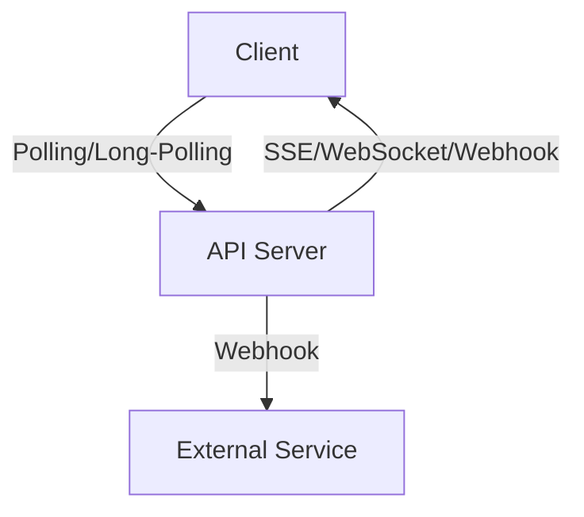

# Real-Time Communication in APIs

Real-time communication enables instant data exchange between clients and servers, supporting use cases like chat, notifications, live updates, and collaborative tools.

## Key Concepts
- Polling: Client repeatedly requests updates at intervals
- Long-polling: Client request held open until new data is available
- Server-Sent Events (SSE): Unidirectional server-to-client push
- WebSockets: Full-duplex, persistent connection for bi-directional messaging
- Webhooks: Server-to-server event notifications

## Trade-offs
- **Polling:** Simple, but inefficient for frequent updates
- **Long-polling:** Reduces unnecessary requests, but still HTTP-based
- **SSE:** Simple server-to-client push, but unidirectional
- **WebSockets:** Low-latency, bi-directional, but more complex and resource-intensive
- **Webhooks:** Good for server-to-server, but requires public endpoints and idempotency

## Interview Q&A
- **Q:** When would you use WebSockets over SSE?
  - **A:** For interactive, bi-directional communication (e.g., chat, games)
- **Q:** What are the challenges with webhooks?
  - **A:** Endpoint security, idempotency, and handling retries
- **Q:** How do you choose a real-time strategy?
  - **A:** Based on update frequency, directionality, client/server capabilities, and resource constraints

## Mermaid Diagram

## See Also
- [rest-api.md](./rest-api.md)
- [idempotency.md](./idempotency.md)
