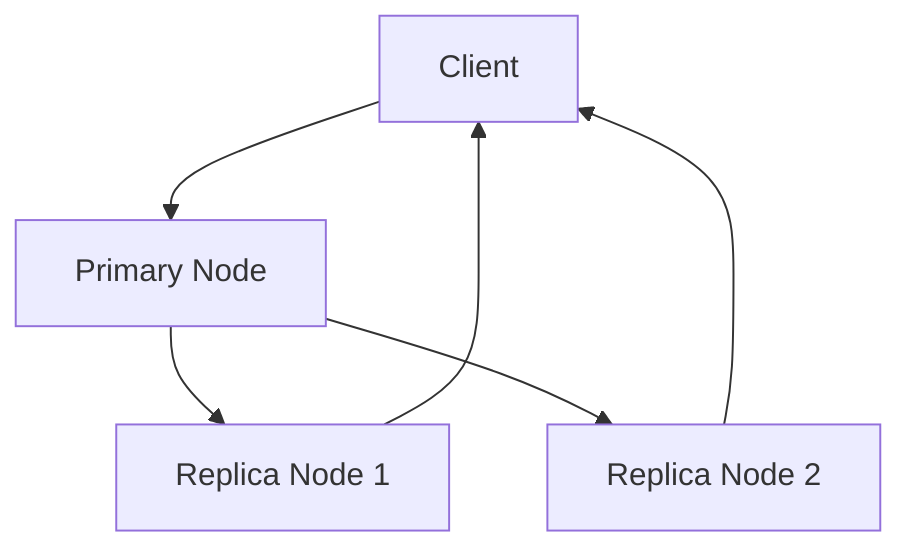

# Replication

Replication is the process of copying data across multiple servers or locations to improve availability, fault tolerance, and read scalability.

## Types
- **Master-Slave (Primary-Replica):** One node handles writes, replicas handle reads
- **Multi-Master:** Multiple nodes accept writes, requiring conflict resolution
- **Synchronous vs Asynchronous:** Synchronous ensures consistency, asynchronous improves performance but risks data loss

## Trade-offs
- Synchronous: Strong consistency, higher latency
- Asynchronous: Lower latency, risk of stale reads or data loss
- Multi-master: High availability, but complex conflict resolution

## Interview Q&A
- When would you use synchronous vs asynchronous replication?
- How do you handle replication lag?
- What are the challenges of multi-master replication?

## Architecture Diagram

## See Also
- [consistency.md](./consistency.md)
- [sharding.md](./sharding.md)
- [backup.md](./backup.md)
- [raft.md](./raft.md)
