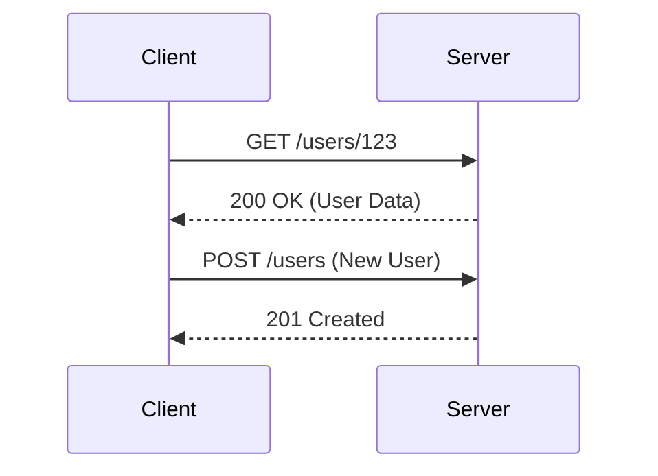

# REST API Design

REST (Representational State Transfer) is an architectural style for designing networked applications. It uses HTTP methods and resource-oriented URLs to enable stateless, cacheable communication between clients and servers.

## Key Concepts
- Resource-based URLs (e.g., `/users/123`)
- Standard HTTP methods: GET, POST, PUT, DELETE
- Stateless communication
- Use of standard HTTP status codes
- Supports caching and layered systems

## Trade-offs
- **Pros:**
  - Simple, widely adopted, and well-understood
  - Leverages HTTP infrastructure (caching, proxies, authentication)
  - Language-agnostic and easy to consume
- **Cons:**
  - Can be verbose for complex operations
  - Multiple round-trips for non-resource-centric workflows
  - Limited to HTTP semantics

## Interview Q&A
- **Q:** What are the main principles of REST?
  - **A:** Statelessness, resource-based URLs, standard HTTP methods, and use of HTTP status codes.
- **Q:** When would you not use REST?
  - **A:** For highly interactive, real-time, or function-oriented APIs where gRPC or WebSockets may be better suited.
- **Q:** How do you handle versioning in REST APIs?
  - **A:** Common strategies include URL versioning (e.g., `/v1/resource`), header versioning, or query parameters.

## Mermaid Diagram

## See Also
- [api-versioning.md](./api-versioning.md)
- [grpc-api.md](./grpc-api.md)
- [graphql-api.md](./graphql-api.md)
