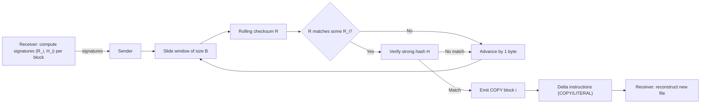

# Rsync-Style Delta Synchronization

Rsync-style delta sync minimizes data transfer by sending only changed blocks between two versions of a file or object. It combines a fast rolling (weak) checksum with a strong hash to quickly locate matching blocks and transmit only the differences.

## Why it’s used
- Reduce egress and time when syncing large files with small edits
- Efficient remote backups and replication over slow or costly links
- Resume/partial updates for large objects (e.g., VM images, database dumps)

## Core algorithm (high level)
1. Signature phase (receiver):
   - Split the target file into fixed-size blocks (size B).
   - For each block i, compute:
     - Weak rolling checksum R_i (fast, updateable when sliding by 1 byte)
     - Strong hash H_i (cryptographic or near-cryptographic)
   - Send the (R_i, H_i) signatures to the sender.
2. Matching phase (sender):
   - Slide a window of size B over the source file.
   - Maintain the rolling checksum R for the current window; on each byte shift, update R in O(1).
   - If R matches some R_i, verify with H(window) == H_i to confirm a true match.
   - Emit “copy block i” for matches; otherwise emit “literal” bytes for unmatched regions.
3. Reconstruction (receiver):
   - Apply the instructions: copy referenced blocks from the existing file and patch in literal bytes to reconstruct the new version.

Notes:
- The classic rsync rolling checksum uses two sums (like Adler-32 family) enabling O(1) updates.
- Strong hashes historically used MD4/MD5; modern systems prefer SHA-256/Blake3 (tunable by implementation).

## Trade-offs and parameters
- Block size B: smaller B finds fine-grained changes but increases signatures and matches; larger B reduces metadata but may miss small edits.
- CPU vs bandwidth: rolling checksums are CPU-light; strong hash verification adds CPU. Choose B and hash to fit your link and CPU budget.
- False matches: mitigated by verifying with the strong hash after a weak checksum hit.
- Compress literals: optionally compress literal chunks for extra savings.

## Mermaid sketch

## Interview Q&A
- Q: Why two checksums?
  - A: The weak rolling checksum allows fast sliding-window matching; the strong hash eliminates collisions.
- Q: How do you pick block size?
  - A: Based on file size and change patterns; common heuristics are 4–128 KB. Smaller for frequent small edits.
- Q: What if data is inserted near the beginning?
  - A: Rolling checksums realign matches after the insertion, so most unchanged blocks still match (saves bandwidth).
- Q: How is this different from content-defined chunking (CDC)?
  - A: Rsync uses fixed-size blocks and rolling search; CDC (e.g., Rabin) uses variable-size chunks based on content boundaries—better for shifting edits across the file but with more complexity.

## See Also
- [backup.md](./backup.md)
- [disaster-recovery.md](./disaster-recovery.md)
- [data-pipelines.md](./data-pipelines.md)
- [merkle-tree.md](./merkle-tree.md)
