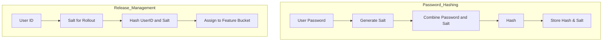

# Salt: Usage in Systems

Salts are random values added to data before hashing or bucketing to prevent predictability and improve security or randomness. They are used in multiple domains:

## 1. Password Hashing
- A unique salt is generated for each password.
- The salt is combined with the password and hashed.
- Both the salt and hash are stored.
- Prevents attackers from using precomputed tables (rainbow tables).

## 2. Release Management (Feature Rollouts)
- A salt is used in hash functions to randomly assign users to feature buckets (e.g., for canary or A/B testing).
- Changing the salt changes the user set, useful for experiments.
- Ensures fair and unpredictable rollout distribution.

---

## Mermaid Diagram: Salt Usage

