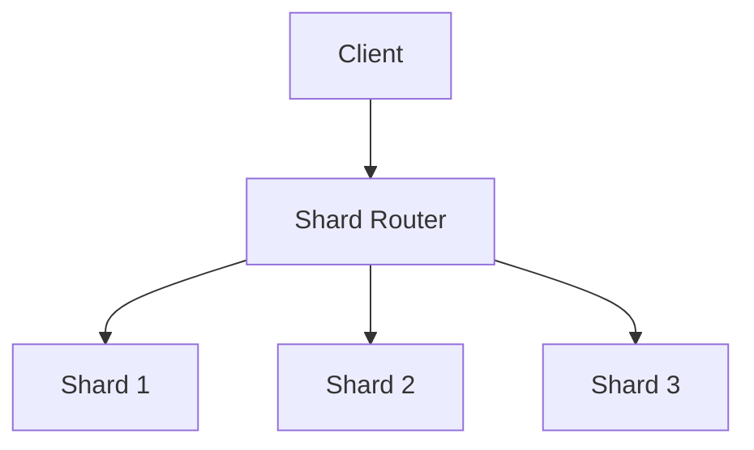

# Sharding

Sharding is the process of splitting data across multiple databases or servers to improve scalability and performance.

## Types
- **Horizontal Sharding:** Split rows across shards (most common)
- **Vertical Sharding:** Split tables/columns across shards
- **Directory-Based Sharding:** Use a lookup service to map keys to shards

## Trade-offs
- Increases scalability and write throughput
- Adds complexity for cross-shard queries and transactions
- Rebalancing shards can be operationally challenging

## Interview Q&A
- How do you choose a sharding key?
- What happens if a shard becomes a hotspot?
- How do you handle rebalancing and resharding?

## Architecture Diagram

