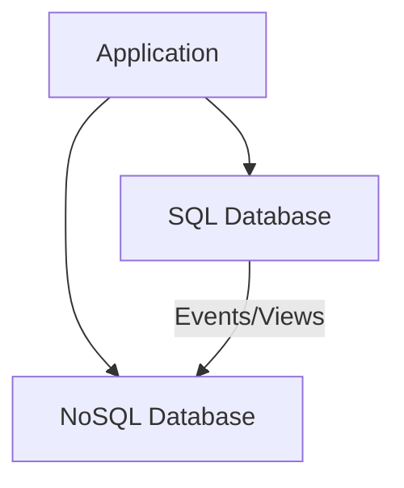

# SQL vs NoSQL Databases

## SQL (Relational)
- ACID transactions, complex joins, strong consistency
- Use for authoritative, financial, inventory, user/account data
- Examples: PostgreSQL, MySQL, Oracle

## NoSQL Families
- **Document:** MongoDB, CouchDB – evolving entity shapes
- **Key-Value:** Redis, DynamoDB – hot path lookups, caching, session/state
- **Column-Family:** Cassandra, HBase – wide sparse/time-series, write-heavy
- **Graph:** Neo4j, Neptune – multi‑hop relationship traversals

| Criterion | Prefer SQL | Prefer NoSQL |
|-----------|------------|--------------|
| Relationships | Many joins / normalized | Simple aggregates / denormalized |
| Transactions | Multi-row ACID | Single-item atomicity |
| Query Flexibility | Ad‑hoc / reporting | Predictable key/path patterns |
| Schema Volatility | Stable/governed | Rapidly evolving |
| Scaling Emphasis | Strong consistency first | Early horizontal scale |
| Analytics | Run directly | Offload / pipelines |

## Heuristics
- Default to SQL; add specialized NoSQL for latency or scale hot spots.
- \>=90% single-ID fetches & rare joins → document or key-value store.
- Large immutable blobs → object storage; keep pointer + metadata in SQL.

## Pitfalls
- Replacing relational integrity in app code → drift & bugs.
- Over-normalizing documents → chatty multi-fetch patterns.
- Ignoring secondary index limits / hot partitions until late load testing.

## Polyglot Patterns
- System of record (SQL) → emit events / build materialized views in NoSQL/search.
- Introduce a cache layer before attempting a full datastore rewrite.

## Interview Checks
- Top N query patterns (shape + frequency + latency goal)?
- Cross-entity transaction requirement?
- Hot partition risk & mitigation?
- Analytics path (direct OLTP vs ETL pipeline)?

## Architecture Diagram

