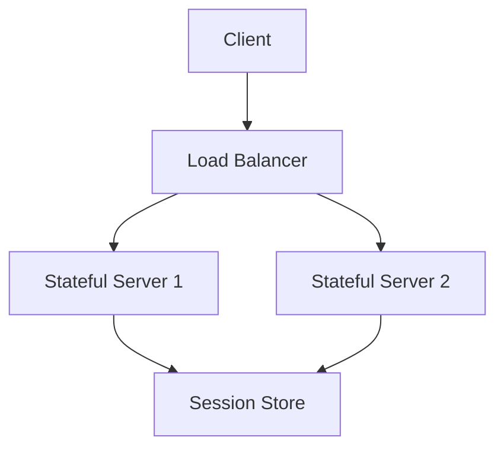

# Stateful Architecture

Stateful architectures maintain client or application state across requests, enabling rich user experiences and complex workflows.

## Characteristics
- Server maintains session or workflow state
- Enables faster interactions (no repeated authentication/context)
- Requires sticky sessions or session replication

## Benefits
- Rich user experience
- Simpler application logic for multi-step workflows
- Faster user interactions

## Challenges
- Harder to scale horizontally
- Session failure points
- Requires session management (in-memory, DB-backed, sticky load balancing)

## Use Cases
- Gaming
- Real-time collaboration
- Complex multi-step workflows

## Trade-offs
- Simplicity for complex workflows vs. scalability and fault tolerance

## Interview Q&A
- How do you scale stateful applications?
- What are the risks of storing session state in memory?
- How do you handle session failover?

## Architecture Diagram

