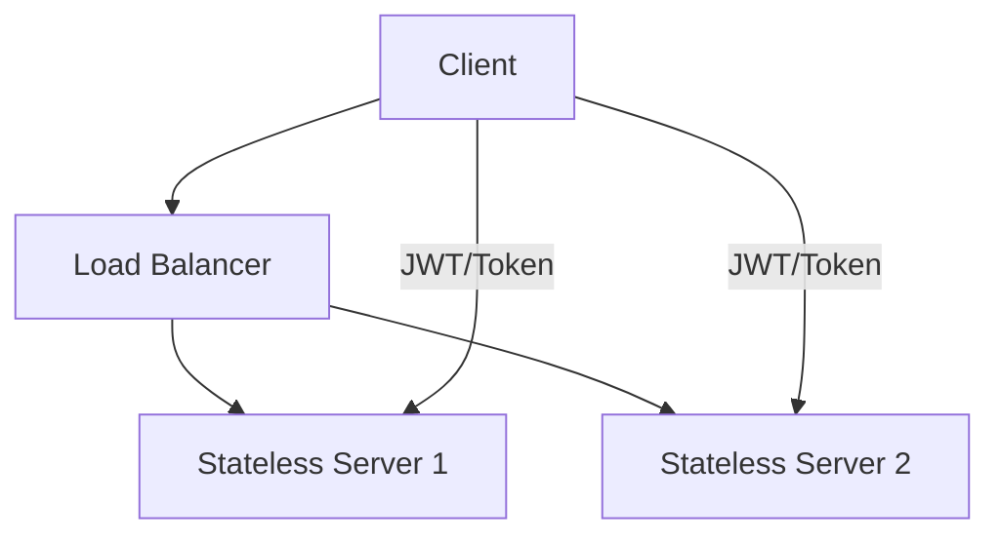

# Stateless Architecture

Stateless architectures do not retain client or application state between requests. Each request contains all necessary information for processing.

## Characteristics
- No server-side session storage
- Any server can handle any request
- Excellent horizontal scalability and fault tolerance

## Benefits
- Easy to scale horizontally
- Fault tolerant (no sticky sessions)
- Simpler infrastructure

## Challenges
- Larger request payloads
- Repeated authentication overhead
- More complex client logic

## Use Cases
- High-scale APIs
- CDN edge authentication
- Event ingestion

## Trade-offs
- Scalability and simplicity vs. repeated work and larger payloads

## Interview Q&A
- How do you implement authentication in stateless systems?
- What are the pros and cons of JWT tokens?
- When would you use external session stores like Redis?

## Architecture Diagram

