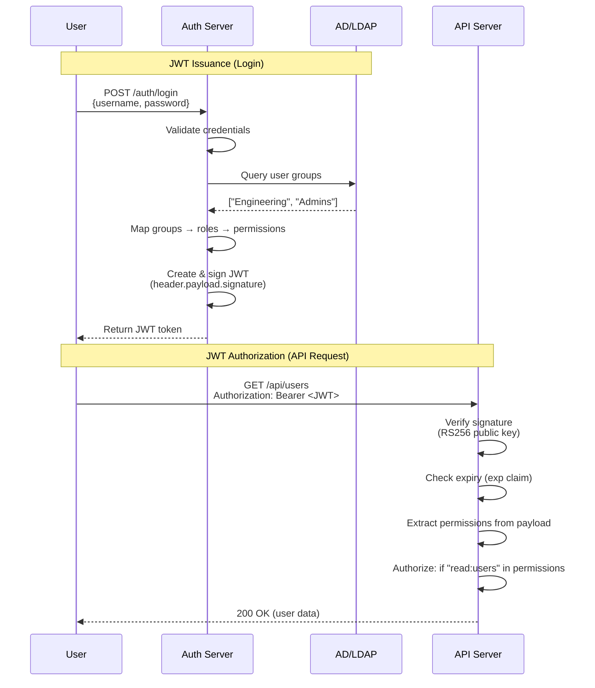
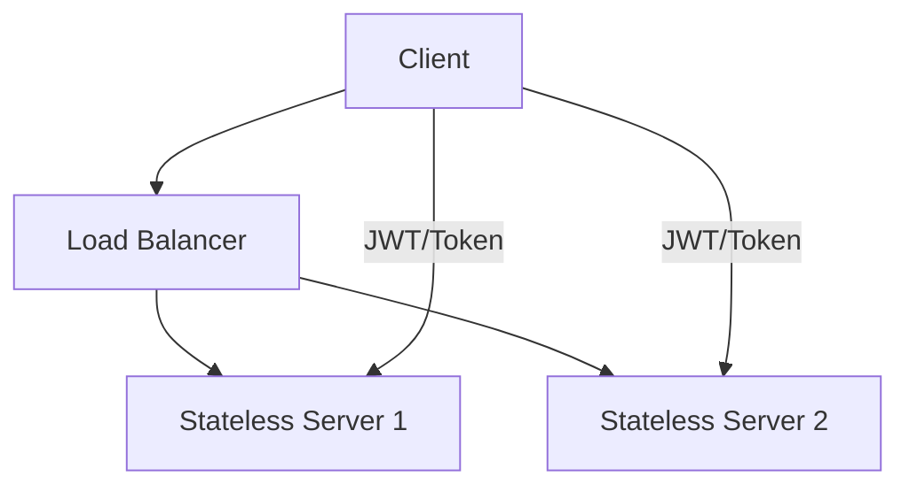

# Stateless Architecture

Stateless architectures do not retain client or application state between requests. Each request contains all necessary information for processing.

## Characteristics
- No server-side session storage
- Any server can handle any request
- Excellent horizontal scalability and fault tolerance

## Benefits
- Easy to scale horizontally
- Fault tolerant (no sticky sessions)
- Simpler infrastructure

## Challenges
- Larger request payloads
- Repeated authentication overhead
- More complex client logic

## Use Cases
- High-scale APIs
- CDN edge authentication
- Event ingestion

## Trade-offs
- Scalability and simplicity vs. repeated work and larger payloads

---

## Authentication Methods

### JWT (JSON Web Tokens)
**Structure:** `header.payload.signature` (Base64-encoded)
- **Header:** Algorithm (HS256, RS256)
- **Payload:** Claims (user_id, exp(Expiration Time), iat(Issued At))
- **Signature:** HMAC or RSA cryptographic algorithms signature for verification

**Example JWT Payload with Authorization:**
```json
{
  "sub": "user@company.com",
  "name": "Jane Doe",
  "email": "jane.doe@company.com",
  "groups": [               // From AD/LDAP
    "Engineering",
    "Payment-Team",
    "Admins"
  ],
  "roles": [                // Mapped from groups: "Engineering" → "developer"
    "developer",
    "payment-admin"
  ],
  "permissions": [          // Derived from roles: "developer" → "read:users", "write:code"
    "read:users",
    "write:code",
    "admin:payments"
  ],
  "iat": 1735599600,
  "exp": 1735603200
}
```

**Authorization Model (Groups → Roles → Permissions):**
- **groups:** From AD/LDAP (organizational structure)
- **roles:** Mapped from groups at auth server (`"Admins" → "admin"`, `"Engineering" → "developer"`)
- **permissions:** Derived from roles (`"admin" → ["read:users", "write:users", "delete:payments"]`)

**Common patterns:**
- **Groups only:** Small token, API maps groups to permissions (flexible but requires lookup)
- **Groups + Roles:** Balanced, roles mapped at auth server, permissions at API
- **All three:** Explicit but larger token (shown above)

**Flow:** Client sends JWT in `Authorization: Bearer <token>` → Server validates signature + expiry → Process request (no DB lookup)

**JWT Issuance & Authorization Flow:**

```mermaid
sequenceDiagram
    participant User
    participant AuthServer as Auth Server
    participant LDAP as AD/LDAP
    participant API as API Server
    
    Note over User,LDAP: JWT Issuance (Login)
    User->>AuthServer: POST /auth/login<br/>{username, password}
    AuthServer->>AuthServer: Validate credentials
    AuthServer->>LDAP: Query user groups
    LDAP-->>AuthServer: ["Engineering", "Admins"]
    AuthServer->>AuthServer: Map groups → roles → permissions
    AuthServer->>AuthServer: Create & sign JWT<br/>(header.payload.signature)
    AuthServer-->>User: Return JWT token
    
    Note over User,API: JWT Authorization (API Request)
    User->>API: GET /api/users<br/>Authorization: Bearer <JWT>
    API->>API: Verify signature<br/>(RS256 public key)
    API->>API: Check expiry (exp claim)
    API->>API: Extract permissions from payload
    API->>API: Authorize: if "read:users" in permissions
    API-->>User: 200 OK (user data)
```

**Pros:** Stateless, self-contained, horizontally scalable  
**Cons:** Cannot revoke (until expiry), larger payload than session ID

### OIDC (OpenID Connect)
**Extension of OAuth 2.0** for authentication (OAuth handles authorization)

**Tokens:**
- **ID Token (JWT):** User identity (name, email) - for authentication
- **Access Token:** API access - for authorization
- **Refresh Token:** Get new access token without re-login

**Flow:** User → Auth Provider (Google/Okta) → Redirect with ID token → App validates token → Session established

**Use Case:** SSO (Single Sign-On), third-party login

### mTLS (Mutual TLS)
**Mutual authentication:** Both client and server present certificates

**Flow:**
1. Client initiates TLS handshake with certificate
2. Server validates client certificate against CA
3. Server presents its certificate
4. Client validates server certificate
5. Encrypted channel established

**Use Case:** Service-to-service auth in microservices, zero-trust networks (Istio, Linkerd)

**Pros:** Strong authentication, encrypted transport  
**Cons:** Certificate management overhead, rotation complexity

---

## Comparison

| Method | Use Case | Validation | Revocation |
|--------|----------|------------|------------|
| **JWT** | API authentication | Signature + expiry check | Not possible (use short TTL) |
| **OIDC** | User login (SSO) | Validate ID token | Refresh token can be revoked |
| **mTLS** | Service-to-service | Certificate chain validation | Certificate revocation list (CRL) |

---

## Interview Q&A
- How do you implement authentication in stateless systems?
- What are the pros and cons of JWT tokens?
- When would you use external session stores like Redis?
- **How does OIDC differ from OAuth 2.0?**
- **When would you use mTLS vs JWT for service authentication?**
- **How do you handle JWT revocation in a stateless system?**

## Architecture Diagram

```mermaid
graph TD
    Client --> LB[Load Balancer]
    LB --> S1[Stateless Server 1]
    LB --> S2[Stateless Server 2]
    Client -- JWT/Token --> S1
    Client -- JWT/Token --> S2
```
