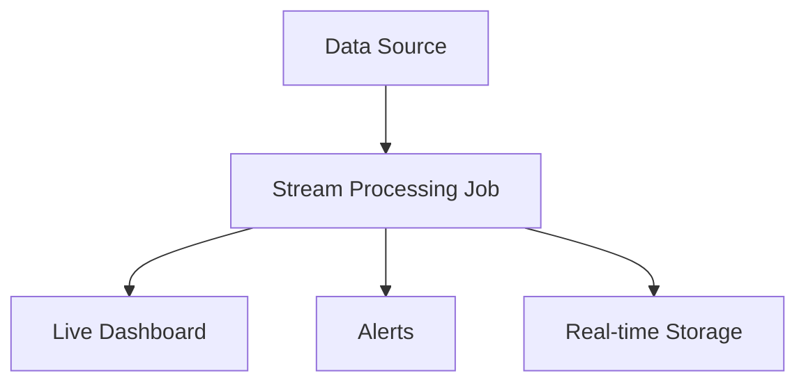

# Stream Processing

Stream processing handles data continuously as it arrives, enabling real-time analytics and immediate responsiveness to events.

## Characteristics
- Low latency
- Real-time insights
- Immediate responsiveness
- Higher complexity and resource requirements

## Technologies
- Apache Kafka Streams
- Apache Storm
- AWS Kinesis
- Google Cloud Dataflow

## Use Cases
- Real-time analytics
- Fraud detection
- IoT data processing
- Live dashboards

## Trade-offs
- Low latency and real-time processing vs. higher complexity and operational overhead

## Interview Q&A
- When is stream processing preferable to batch processing?
- How do you handle late or out-of-order data?
- What are the challenges of scaling stream processing systems?

## Architecture Diagram

