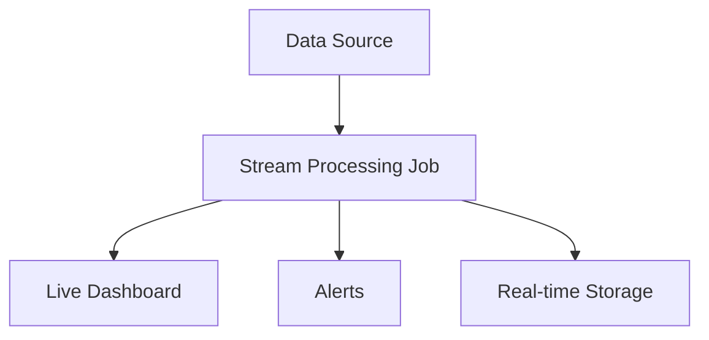

# Stream Processing

Stream processing handles data continuously as it arrives, enabling real-time analytics and immediate responsiveness to events.

## Characteristics
- Low latency
- Real-time insights
- Immediate responsiveness
- Higher complexity and resource requirements

## Technologies
- Apache Kafka Streams
- Apache Storm
- AWS Kinesis
- Google Cloud Dataflow

## Use Cases
- Real-time analytics
- Fraud detection
- IoT data processing
- Live dashboards

## Trade-offs
- Low latency and real-time processing vs. higher complexity and operational overhead

## Interview Q&A
- When is stream processing preferable to batch processing?
- How do you handle late or out-of-order data?
- What are the challenges of scaling stream processing systems?

## Architecture Diagram

```mermaid
graph TD
    Source[Data Source] --> StreamJob[Stream Processing Job]
    StreamJob --> Dashboard[Live Dashboard]
    StreamJob --> Alert[Alerts]
    StreamJob --> Storage[Real-time Storage]
```

## Kafka EOS, Ordering, Authoritative

### Exactly-Once Semantics (Kafka EOS)
Kafka exactly-once semantics (EOS) are scoped to Kafka itself: transactional writes plus offset advancement.
Exactly-once behavior outside Kafka still depends on external systems.
Use Kafka EOS when duplicate derived records are costly:
- Enrichment/fan-out: consume raw events and publish enriched events to multiple topics.
- Materialization pipeline: consume events and publish compacted “head” topic updates.
- Receipt/status topics: consume commands and publish “accepted/processed” receipts while advancing offsets atomically.
- Stream joins/aggregations: publish derived streams where duplicates would break money/accounting/quotas.

### Monotonic Ordering

Two common patterns:
1. Monotonic processing order (serialize per key): solved by single-writer-per-key at the applier (consumer group + partitioning).
2. Monotonic acceptance across competing writers/leaders (fencing): solved by epochs/tokens enforced by an authoritative Kafka-backed registry.

#### Monotonic Fencing/Versioning Patterns

##### A) Single writer per key (consumer)
This is primarily a consumption/processing ownership guarantee, not a producer guarantee.
- Many producers can write commands/events for the same key.
- You still ensure one authoritative applier for that key via:
  - partitioning by key, and
  - ensuring only one consumer instance owns that partition at a time (consumer group semantics).

##### B) Kafka-backed head topic: how do multiple consumers learn the new version?

Two "multiple consumers" cases:

**Case 1: Multiple independent consumer groups (many services need the head)**
- Kafka handles this via pub/sub semantics.
- Each group consumes the head topic.
- Each group maintains its own **eventually consistent(unless you add consistency controls for writes)** local cache/DB projection.

No special coordination is needed.

**Case 2: Multiple instances of the same service (same consumer group) updating head**
- For any key k, at most one authoritative writer may update the head at a time.
- Structure it so:
  - one state-writer consumer group updates head, partitioned by key (single writer at the applier), and
  - everyone else is read-only from head.

##### C) Transactional execution log: does it require state for versions?
Yes, but the key question is where that state lives.

Pattern: an authoritative arbiter stream processor decides whether an update is accepted.

It typically maintains:
- per-key latest version/fencing token,
- per-key last processed command ID,
- possibly per-key lease/epoch.

That state can live in:
1. A stream processor state store (e.g., Kafka Streams RocksDB) with changelog, rebuildable from Kafka.
2. A compacted topic as the state store (head/execution-registry topic) that the arbiter consumes and updates.
3. An external DB (then the DB becomes authoritative unless strictly controlled; not Kafka-native).

You can use Kafka as an authoritative registry system (state head or execution registry), but at least one of these invariants must hold:
1. Single-writer invariant: only one arbiter updates head/registry for a key (via partition ownership), or
2. Atomic publish invariant: when updating multiple topics, publish registry + head in the same Kafka transaction and require downstream readers to use `read_committed`.

### Questions to ask before using a log as the authoritative store

1) Is operational replay part of normal engineering workflow?

Not for audit or compliance.
Ask whether engineers regularly need to re-run pipelines, rebuild projections, or backfill new logic from raw events.

If yes, a log-first model provides strong operational leverage.
If no, a DB + CDC approach is usually simpler.

This question is about system operation, not data retention.

2) Is the bottleneck sequencing at scale, rather than transactional constraints?

After sharding, are you still fighting:
- strict ordering requirements across partitions?
- multi-region concurrent writes with conflict resolution?
- ultra-high write throughput where append-only is materially cheaper?

If yes, a partitioned log may be the right primitive.
If no, a DB is typically simpler.

This question is about write coordination pressure.

3) Is the business truth naturally event-centric rather than state-centric?

This is different from replay.

In a whiteboard model, would you describe the domain as:
- “An account has a balance” (state-centric), or
- “An account receives credits and debits over time” (event-centric)?

If the domain is event-native (ledger, workflow engine, state-machine transitions), log authority matches the mental model.
If the domain is “current state with constraints,” a DB is usually the natural authority and the log is primarily a distribution mechanism.
