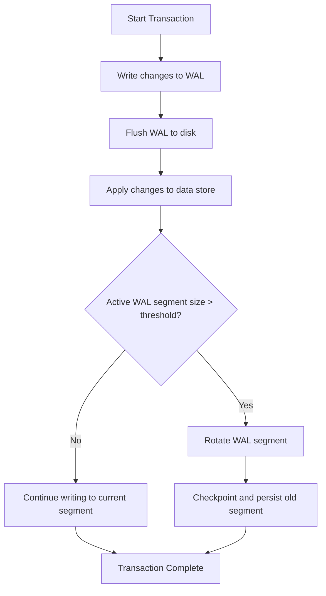

# Write-Ahead Logging (WAL)

## Definition

Write-Ahead Logging (WAL) is a fundamental technique used in database systems and distributed storage to ensure atomicity and durability of transactions. The key idea behind WAL is that before any changes are made to the actual data storage, the intended changes are first recorded sequentially in a log. This log acts as a durable record of all modifications, enabling systems to recover to a consistent state after a crash or failure. WAL guarantees that no committed transaction is lost and that partial or incomplete operations can be detected and rolled back, thus providing atomicity and durability.

## Core Mechanism

The typical workflow of WAL involves the following steps:

1. **Write to WAL:** When a transaction or data modification is initiated, the changes are first appended to the WAL. This write is sequential and optimized for fast disk access.

2. **Flush WAL:** The WAL entries are flushed to persistent storage (e.g., disk) to ensure durability. This flush is usually synchronous to guarantee that the log record is safely stored before the transaction is considered committed.

3. **Apply Changes:** After the WAL record is safely persisted, the actual data pages or state are updated in memory or on disk.

4. **Rotate WAL Segment:** To manage the size and performance of the WAL, the system periodically switches to a new WAL segment or log file. This rotation is triggered when the active WAL segment reaches a predefined size or time threshold.

## Log Rotation / Segment Switching

Log rotation, also known as log segmentation, is a process that involves closing the current active WAL segment and starting a new one. This approach prevents the WAL from growing indefinitely and helps in efficient management of the log files. When the active WAL segment reaches a certain size or age threshold, the system performs the following:

- **Close Active Segment:** The current WAL segment is finalized and made immutable.

- **Persist Segment:** The segment is safely stored on disk and marked as ready for potential recovery use.

- **Checkpointing:** The system may perform a checkpoint operation, which involves applying all changes recorded in the WAL up to the closed segment to the main data store, allowing the WAL segments before this checkpoint to be safely discarded or archived.

This mechanism ensures that recovery after a crash only needs to replay WAL segments from the last checkpoint onward, improving recovery speed and reducing storage overhead.

## Mermaid Diagram

## Common Terms

- **Log Rotation:** The process of closing the current WAL segment and starting a new one to prevent unbounded log growth.

- **Log Segmentation:** Dividing the WAL into discrete segments or files for easier management and recovery.

- **Log Compaction:** A process to reduce the size of the WAL by merging or removing redundant entries, often used in streaming systems.

- **Checkpointing:** Periodically applying all changes recorded in the WAL to the main data store and marking a recovery point, enabling safe truncation of older WAL segments.

## Systems Using WAL

### PostgreSQL

PostgreSQL uses WAL to provide durability and crash recovery. It writes all changes to a write-ahead log called the WAL before applying them to data files. WAL segments are rotated and archived, and checkpoints are used to minimize recovery time.

### Kafka

Kafka uses a commit log, a variant of WAL, to provide durable message storage. Each partition is an append-only log segment, and Kafka rotates log segments based on size or time. Log compaction is used to keep the log size manageable.

### RocksDB / LevelDB

These key-value stores use a write-ahead log to ensure durability of writes before memtable updates. WAL segments are rotated, and compaction processes merge data files to optimize storage and read performance.

### MySQL

MySQL’s InnoDB storage engine uses a redo log, a form of WAL, to record changes before flushing them to data files. Log rotation and checkpointing help manage the redo log size and speed up crash recovery.

### Cassandra

Cassandra uses a commit log (WAL) to record writes before they are applied to memtables. The commit log is segmented and rotated, and checkpoints occur when memtables are flushed to SSTables.

### HDFS NameNode

The HDFS NameNode maintains a journal (WAL) of metadata changes. This journal is segmented and rotated, allowing the NameNode to recover its state after a failure by replaying the journal.

## Summary

Write-Ahead Logging is a critical building block for ensuring data durability and atomicity across many storage and streaming systems. By recording changes before applying them, WAL enables efficient crash recovery, consistent state management, and high performance through sequential writes and log rotation. Its principles underpin the reliability of databases, distributed logs, and file systems alike.
