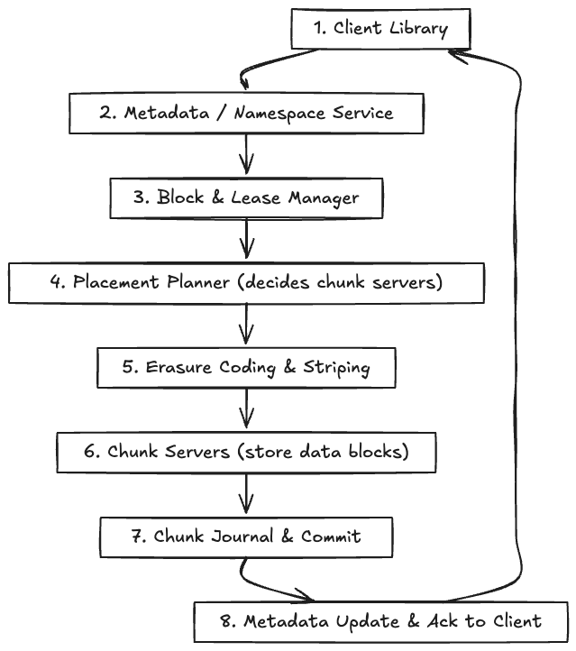
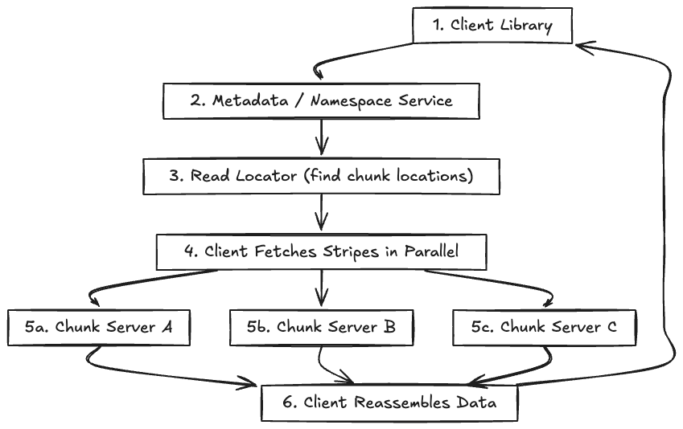
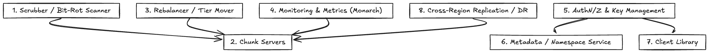

# Colossus: Google’s Distributed File System

Colossus is Google’s successor to the Google File System (GFS), engineered to deliver massive scalability, durability, and efficiency for data storage across global infrastructure. It supports advanced features such as erasure coding for space-efficient durability, replication for high availability, and a suite of background maintenance tasks to ensure data integrity and optimal performance.

## Write Flow

When a client writes data to Colossus, the request traverses several logical layers to ensure data is properly encoded, distributed, and made durable. The write path incorporates metadata management, erasure coding, placement planning, and journaling to provide strong consistency and reliability.

- Client Library: Issues file system requests and handles striping logic on the client side.
- Metadata / Namespace Service: Maintains directory structure, file-to-block mappings, and overall metadata.
- Block & Lease Manager: Tracks block ownership and write leases to prevent conflicts.
- Placement Planner: Decides optimal chunk server placement across racks/zones for durability.
- Erasure Coding & Striping: Splits data into chunks with parity for efficient durability.
- Chunk Servers: Store encoded data and serve it back to clients.
- Chunk Journal & Commit: Write-ahead log ensuring durability before data is marked committed.
- Metadata Update & Ack: Confirms completion of the write and updates namespace state.

## Read Flow

Reads in Colossus are optimized for parallelism and efficiency. The client consults metadata, locates relevant data stripes, and fetches them in parallel from chunk servers. The system can reconstruct data even in the presence of failures, thanks to erasure coding.

- Client Library: Issues read requests, reassembles data stripes.
- Metadata / Namespace Service: Provides stripe locations and mapping.
- Read Locator: Identifies the chunk servers holding the necessary blocks.
- Client Fetches Stripes in Parallel: Requests data simultaneously for speed and resilience.
- Chunk Servers (A, B, C): Return data or parity chunks to the client.
- Client Reassembles Data: Rebuilds original data from stripes or reconstructs missing data.

## Background Services

Colossus relies on a variety of background services to maintain data health and availability. These include scrubbing for bit-rot detection, rebalancing for optimal resource utilization, monitoring for system health, authentication/authorization, and cross-region replication for disaster recovery.

- Scrubber / Bit-Rot Scanner: Periodically scans stored chunks to detect and repair corruption.
- Rebalancer / Tier Mover: Redistributes data across servers or storage tiers for balance and efficiency.
- Monitoring & Metrics (Monarch): Observes health, usage, and system-wide telemetry.
- AuthN/Z & Key Management: Provides security, authentication, authorization, and encryption key management.
- Metadata / Namespace Service: Interfaces with Auth and replication services for secure and consistent metadata handling.
- Client Library: Uses AuthN/Z to securely interact with the system.
- Cross-Region Replication / DR: Ensures data is replicated to other data centers for disaster recovery.
