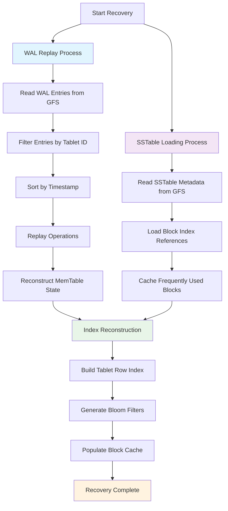

# Google Bigtable System Design

## Overview
Google Bigtable is a distributed, scalable, and high-performance NoSQL database designed to store massive amounts of structured data. It powers many Google services (e.g., Search, Maps, Analytics) and is optimized for low-latency reads/writes, horizontal scalability, and flexible schema.

Bigtable is a sparse, distributed, persistent, multidimensional sorted map designed to manage large volumes of structured data with low latency and high availability. The map is indexed by a unique key made up of a row key, a column key, and a timestamp, supporting flexible, versioned data modeling.

---

## Problem
Design a distributed storage system to efficiently store, retrieve, and manage petabytes of structured data across thousands of servers, supporting high throughput, low latency, and strong consistency within rows.

---

## Requirements
- Store petabytes of structured data
- High throughput and low latency
- Horizontal scalability
- Strong consistency for single-row operations
- Flexible schema (sparse, wide tables)
- Fault tolerance and high availability
- Metadata and data APIs for administrative control and efficient range scans.

---

## High-Level Architecture
- **Tablet**: Basic unit of data distribution; each table is split into tablets (contiguous row ranges).
- **Tablet Server**: Manages tablets, handles read/write requests, and persists data to disk.
- **Master Server**: Assigns tablets to tablet servers, balances load, and handles schema changes.
- **Clients**: Communicate with master for tablet location, then interact directly with tablet servers for data operations.
- **Underlying Storage**: Uses GFS/Colossus for persistent storage of SSTables and logs.
- **Chubby Lock Service**: Bigtable uses the Chubby distributed lock service for master election, metadata storage, and synchronization across servers.
- **Scalability**: Tables start as a single tablet and are split into multiple tablets as they grow. The Bigtable master assigns these tablets to tablet servers and manages their balancing. Tablet servers may split tablets that grow too large and handle new tablet assignments when new servers join.

---

## Control and Data Flow Separation

Bigtable enforces a strict separation between control and data flow:
- Control operations (e.g., tablet assignments, schema changes, and load balancing) are handled by the master.
- Data operations (reads and writes) are handled directly between clients and the appropriate tablet servers.
This design ensures that client access to data continues even if the master becomes temporarily unavailable.

---

## Data Model
- **Table**: 2D map indexed by row key, column family, and timestamp.
- **Row**: Uniquely identified by a row key; all operations on a row are atomic.
- **Column Family**: Group of columns stored together; schema defined at table creation.
- **Cell**: Intersection of row and column; can store multiple timestamped versions.
- **Sparse Schema**: Tables can have millions of columns, but each row typically has only a few populated, making the schema extremely sparse.
- **Wide-Column Design**: Unlike traditional relational tables, Bigtable supports an unbounded number of columns.
- **Column Qualifiers**: Columns are stored as `family:qualifier` pairs. Column families are defined during schema creation, and qualifiers can be added dynamically.
- **Timestamps**: Each cell stores multiple versions of the value indexed by a 64-bit millisecond timestamp, allowing point-in-time reads or version control.

All operations on a single row are atomic, but atomicity across multiple rows is not guaranteed.

---

## Data Flow
1. **Write**: The client sends a mutation to the tablet server. The mutation is first recorded in a commit log (WAL) for durability, then written to an in-memory MemTable. Once the MemTable reaches a size threshold, it is flushed to disk as an immutable SSTable.
2. **Read**: Client queries tablet server; server merges data from memtable, SSTables, and cache to serve the request.
3. **Tablet Splitting**: As tablets grow, they are split into smaller tablets for load balancing.
4. **Tablet Assignment**: Master assigns tablets to tablet servers and reassigns on failure or load changes.
5. **Metadata Operations**: Clients can create/delete tables and column families using administrative APIs, and access data using APIs for mutations, lookups, or scanning ranges.

---

## Fault Tolerance
- **Replication**: Data is replicated via underlying storage (GFS/Colossus).
- **Tablet Server Recovery**: Master detects failed servers and reassigns tablets.
- **Commit Log**: Ensures durability of recent writes.
- **Tablet Server Failure Detection**: The master detects tablet server failures by periodically checking the status of the Chubby lock held by each tablet server.
- **Reassignment**: Upon failure detection, the master reassigns tablets from the dead tablet server to other servers.
- **Durability**: Durability is achieved by persisting data to disk via GFS, which maintains multiple replicas.
- **Single Points of Failure and Recovery**:
  - *Bigtable Master*: Only one master is active at a time, coordinated via Chubby. If the master dies, Google's Cluster Management System starts a new one. Clients do not depend on the master for reads/writes, only for control-plane tasks.
  - *Chubby Master*: Uses Paxos to elect a new master. The new master loads the system state and transaction log before resuming service.
  - *GFS Master*: GFS uses an external monitoring service to detect failure and switch traffic to a backup master. It uses checkpoints and operation logs for fast state recovery.

Bigtable depends on GFS/Colossus replication and Chubby coordination to ensure high availability and fast recovery during failures.

### Tablet Recovery Process

---

## SSTables (Sorted String Tables)
SSTables are immutable, sorted files that store key-value data on disk:
- **Structure**: Contains sorted key-value pairs with block-based organization for efficient access
- **Immutability**: Once written, SSTables are never modified; updates create new SSTables
- **Block Index**: Each SSTable has an index that maps key ranges to data blocks for fast lookups
- **Bloom Filters**: Each SSTable includes bloom filters to quickly determine if a key might exist
- **Compression**: Data blocks are compressed to reduce storage footprint
- **Metadata**: Contains statistics (min/max keys, timestamps, size) for query optimization

## Optimizations
- **Bloom Filters**: Used in SSTables to speed up lookups.
- **Compaction**: Periodically merges SSTables to reduce storage and improve read performance.
- **Caching**: Frequently accessed data is cached in memory.

---

## Monitoring & Metrics
- Tablet server health and load
- Tablet assignment and balancing
- Read/write throughput and latency
- SSTable and memtable sizes
- Compaction and split rates
- Master health and failover coordination (Chubby status, master restarts)

---

## See Also
- [Caching: Concepts & Trade-offs](../../components/caching.md)
- Example: [LRU Cache Implementation](../../../coding/caching_kv_store/lru_cache.md)
- Example: [TTL Cache Implementation](../../../coding/caching_kv_store/ttl_cache.md)
- [Sharding: Concepts & Trade-offs](../../components/sharding.md)
- Example: [Consistent Hashing Ring](../../../coding/consistent_hashing_ring/consistent_hashing_ring.md)
- [Replication: Concepts & Trade-offs](../../components/replication.md)
- [Consistency: Concepts & Trade-offs](../../components/consistency.md)

- [Write-Ahead Log (WAL): Concepts & Trade-offs](../../components/wal.md)
 - [Colossus: Google’s Distributed File System](../colossus/colossus.md)
