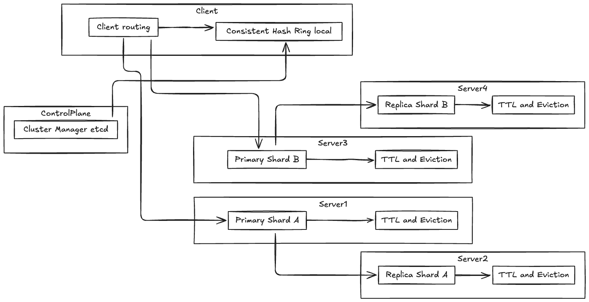

# Cache System Design

## Overview
This document outlines the design of a distributed cache system aimed at improving application performance by reducing latency and database load. The cache system supports client routing, consistent hashing for data distribution, cluster management, data replication, and automatic eviction of stale data.

## Key Components and Flow

### Client Routing
Clients connect to the cache cluster through a routing layer that directs requests to the appropriate cache node based on the key. This helps balance load and ensures efficient data retrieval.

### Consistent Hash Ring Local
The cache nodes are organized in a consistent hash ring to distribute keys evenly across nodes. This approach minimizes data movement when nodes join or leave the cluster.

**Pros:**
- Scalability: Easy to add or remove nodes with minimal rehashing.
- Load Balancing: Distributes keys uniformly across nodes.
- Fault Tolerance: Reduces impact of node failures by redistributing only part of the key space.

**Cons:**
- Complexity: Requires careful implementation to handle virtual nodes and replication.
- Hotspots: Some keys may still cause uneven load if access patterns are skewed.

### Cluster Manager (etcd)
The cluster state and membership are managed using etcd, a distributed key-value store. etcd maintains metadata about nodes, their status, and configuration, enabling dynamic scaling and failover.

### Shards and Replication
The cache is partitioned into shards, each responsible for a subset of the key space. Each shard is replicated across multiple nodes to ensure high availability and data durability.

### TTL and Eviction (GC)
Each cached item has a Time-To-Live (TTL) after which it becomes stale and is eligible for eviction. A garbage collection process runs periodically to remove expired entries, freeing up memory and maintaining cache freshness.

## Data Flow
1. Client sends a request with a key.
2. The routing layer uses consistent hashing to determine the target shard/node.
3. Request is forwarded to the appropriate cache node.
4. Cache node checks for the key locally.
   - If found and valid (not expired), returns the value.
   - If not found return cache miss. If this was a read through then it would fetch from the persisted database. 
5. Replication ensures that updates are propagated to replica nodes.

## Key Metrics
- Cache Hit Ratio: Percentage of requests served from cache.
- Latency: Time taken to serve cache requests.
- Eviction Rate: Number of items evicted per unit time.
- Replication Lag: Delay between primary and replica updates.
- Node Health: Status and availability of cache nodes.

## Architecture Diagram
Refer to the diagram below illustrating the cache system components and interactions:

---

## See Also
- [Caching: Concepts & Trade-offs](../../components/caching.md)
- Example: [LRU Cache Implementation](../../../coding/caching_kv_store/lru_cache.md)
- Example: [TTL Cache Implementation](../../../coding/caching_kv_store/ttl_cache.md)
