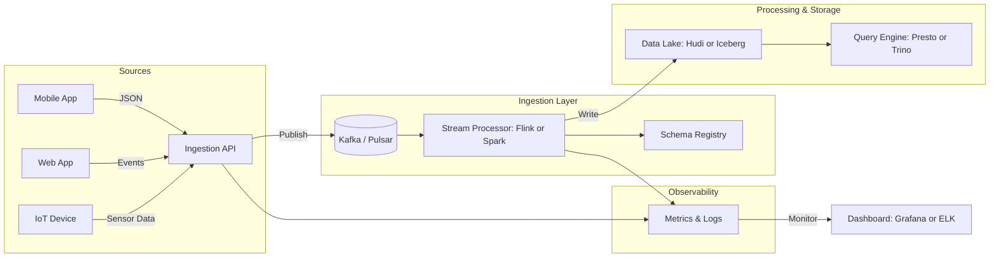

# Design a Real-Time Data Ingestion Pipeline

## Problem
Design a system to ingest data from multiple sources and store it in a queryable backend.

## Requirements
- Stream processors (e.g., Kafka, Flink)
- Idempotent ingestion
- Schema evolution
- High availability

## Architecture Overview

The real-time data ingestion pipeline enables seamless, fault-tolerant ingestion of data from multiple producers (applications, IoT devices, APIs, etc.) into a storage and query layer. The design focuses on scalability, reliability, and idempotent processing to prevent data duplication.

### Key Components
1. **Producers** — Applications, logs, APIs, or sensors that emit data events.
2. **Ingestion Gateway (API Layer)** — Validates, authenticates, and transforms incoming data into a standard schema.
3. **Message Queue / Stream** — A durable, partitioned log system (e.g., Kafka, Pulsar, or AWS Kinesis) that buffers and distributes events to downstream consumers.
4. **Stream Processors** — Frameworks like Apache Flink, Spark Streaming, or Kafka Streams process data in real time (aggregation, enrichment, filtering).
5. **Schema Registry** — Ensures schema evolution with backward and forward compatibility.
6. **Storage Layer** — Optimized for both analytical and operational queries (e.g., Hudi/Iceberg over S3, BigQuery, or Cassandra).
7. **Metadata Store** — Stores offsets, checkpoints, and lineage information for exactly-once guarantees.
8. **Monitoring & Alerts** — Metrics (Prometheus, Grafana), logs (ELK), and tracing (OpenTelemetry) ensure observability.

### Data Flow
1. Producers emit data events to the ingestion API.
2. The API validates the payload, applies enrichment (e.g., timestamps, source IDs), and publishes it to Kafka topics.
3. Stream processors consume events, deduplicate using keys or event IDs, and perform transformations.
4. Processed data is written to a storage backend (e.g., Hudi on S3) for querying.
5. Dashboards or analytics tools read from the query backend.

---

## Mermaid Diagram

---

## Key Design Considerations

### 1. Idempotent Ingestion
- Each event carries a unique ID.
- Stream processors maintain offset checkpoints and deduplicate based on keys.
- Downstream writes are performed in idempotent upsert mode (Hudi/Iceberg).

### 2. Schema Evolution
- Avro schemas managed via Schema Registry.
- Supports backward and forward-compatible changes without breaking older data consumers.

### 3. Fault Tolerance
- Kafka replication factor ≥ 3.
- Flink checkpoints and state snapshots stored in distributed storage.
- Retries and exponential backoff for transient errors.

### 4. Scalability
- Horizontal scaling at ingestion, processing, and storage tiers.
- Topic partitioning aligns with data volume and throughput.

### 5. High Availability
- Multi-broker, multi-node setup with load balancers and leader election mechanisms.
- Health checks and self-healing jobs for consumers and producers.

---

## Example Query Flow
1. Analyst runs a SQL query through Trino.
2. Query fetches data from Hudi tables stored on S3.
3. Results are visualized in Grafana or exported to downstream analytics.

---

## Summary
This architecture supports reliable, scalable, and schema-aware real-time ingestion across heterogeneous data sources, enabling analytics and machine learning use cases with low-latency data availability.

