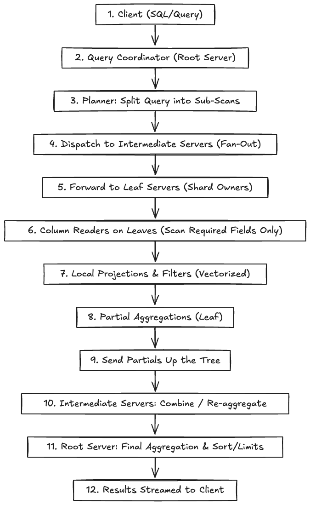
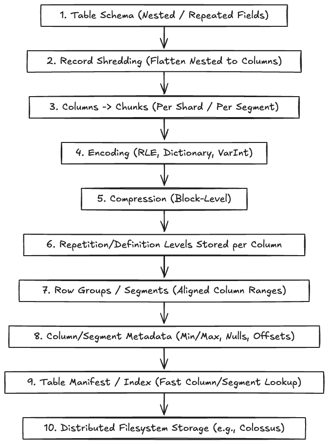
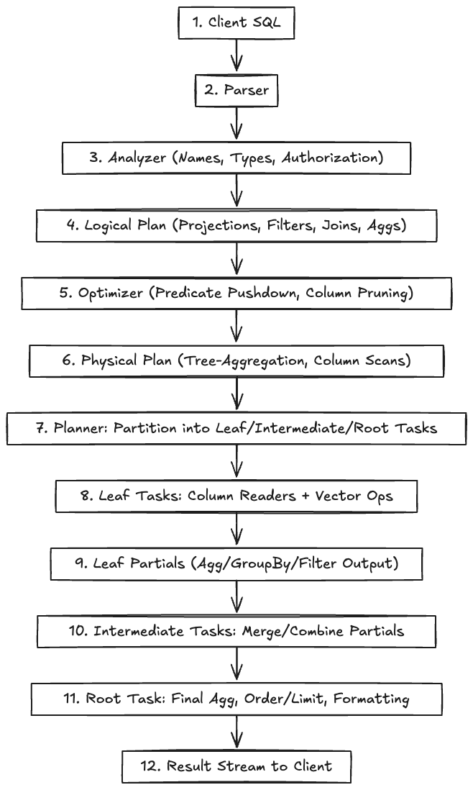

# Google Dremel System Design

## Overview

> This document outlines the architecture and data flow of Google Dremel, a distributed query engine for interactive analysis of large-scale datasets. Dremel powers BigQuery and is known for its tree-based aggregation, columnar storage, and scalable query execution.

---

## Requirements

#### *Functional*
- Support distributed, interactive SQL queries on petabyte-scale datasets
- Enable fast aggregation, filtering, and ad-hoc analysis
- Efficiently scan and process columnar data

#### *Non-Functional*
- Horizontal scalability across thousands of nodes
- High availability and fault tolerance
- Low-latency query response
- Optimized for analytical workloads

---

## 1. Distributed Data Processing

> Dremel uses a multi-level execution tree to parallelize queries across thousands of nodes, enabling fast aggregation and filtering.

#### *Key Flow*
- Client submits SQL query
- Query Coordinator (Root Server) receives and coordinates execution
- Planner splits query into sub-scans
- Intermediate Servers fan out requests and aggregate partial results
- Leaf Servers execute scans on shard data
- Column Readers fetch only required columns
- Local Filters/Aggregations apply filters and partial aggregations
- Partial Aggregations computed at leaf level
- Intermediate Aggregations combine leaf results
- Root Aggregation finalizes results
- Results streamed back to client

#### *Diagram*

---

## 2. Columnar Storage

> Data is stored in a column-oriented format, enabling efficient scanning, compression, and aggregation for analytical queries.

#### *Key Technologies*
- Table schema with nested/repeated fields
- Record shredding: flatten nested records to columns
- Columns segmented into chunks for parallelism
- Encodings: RLE, dictionary, etc. for compact storage
- Block-level compression reduces I/O
- Repetition/Definition levels encode nested/repeated structure
- Row groups align columns into manageable groups
- Metadata (min, max, nulls) for pruning
- Table manifest: index of chunks and metadata
- Distributed filesystem (Colossus) for scalable, reliable storage

#### *Diagram*

---

## 3. Query Engine

> Dremel supports SQL-like queries with fast aggregation, filtering, and ad-hoc analysis using a tree-based execution model.

#### *Key Flow*
- Parser converts SQL to internal representation
- Analyzer resolves schema, types, and permissions
- Logical plan builds high-level operations (joins, filters)
- Optimizer rewrites plan with predicate pushdown and pruning
- Physical plan defines actual execution steps
- Task partitioning divides work into root/intermediate/leaf tasks
- Leaf tasks execute column scans and local filters
- Intermediate tasks merge and aggregate partials
- Root task finalizes aggregations, sorting, and limits
- Result streaming sends results back incrementally to client

#### *Diagram*

---

## Use Cases

- Interactive analytics on large datasets
- Real-time business intelligence
- Log analysis and monitoring

---

## See Also
- [Sharding: Concepts & Trade-offs](../../components/sharding.md)
- Example: [Consistent Hashing Ring](../../../coding/consistent_hashing_ring/consistent_hashing_ring.md)
- [Consistency: Concepts & Trade-offs](../../components/consistency.md)
- [Replication: Concepts & Trade-offs](../../components/replication.md)
- [Caching: Concepts & Trade-offs](../../components/caching.md)
- Example: [LRU Cache Implementation](../../../coding/caching_kv_store/lru_cache.md)
- Example: [TTL Cache Implementation](../../../coding/caching_kv_store/ttl_cache.md)

