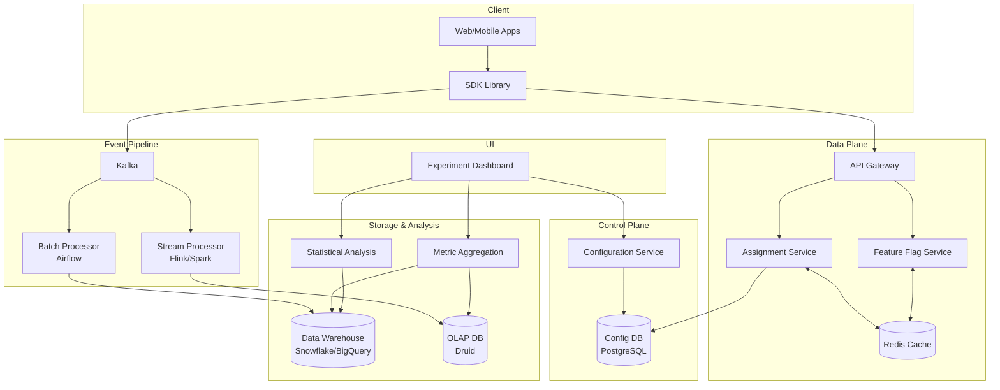

# Experimentation Framework (A/B Testing Platform)

## Overview
A large-scale experimentation framework enables product teams to run controlled experiments, measure impact, and make data-driven decisions. The system supports feature flags, variant assignment, real-time metric collection, and statistical analysis handling 100M+ users, 500+ concurrent experiments, and 10B events/day.

---

## System Architecture



---

## Core Components

### 1. Configuration Service (Control Plane)
**Purpose:** Manages experiment metadata and feature flag definitions
- Experiment setup (variants, traffic allocation, metrics, duration)
- Feature flag rules (targeting, rollout %, kill switches)
- Version control and audit history
- Config bundle publishing for offline evaluation

**Storage:** PostgreSQL with versioning
**API:** REST endpoints for CRUD operations with RBAC

### 2. Assignment Service (Data Plane)
**Purpose:** Determines variant assignment for users

**Assignment Algorithm:**
- Deterministic hashing: `Hash(user_id + experiment_id) % 100`
- Ensures consistency across sessions/devices
- Independent experiments via separate hash spaces
- Sticky assignments (user never switches variants)

**Performance:** <10ms p99 latency via Redis cache
**Deployment:** Multi-region for low latency

**Example:**
```
User: 12345, Experiment: exp_checkout_v2
Hash("12345_exp_checkout_v2") % 100 = 37
Split: Control (0-49), Treatment (50-99) → Control
```

### 3. Feature Flag Service
**Purpose:** Real-time gating and gradual rollouts

**Capabilities:**
- Boolean/multivariate flags
- Gradual rollout (0% → 10% → 50% → 100%)
- Instant rollback (kill switch)
- User targeting (whitelist, segments)
- Offline evaluation via cached bundles

**Tech:** Custom service or LaunchDarkly/Split.io

### 4. Event Pipeline
**Purpose:** Captures exposures and user behavior

**Event Types:**
- Exposure: User saw variant
- Metric: User action (click, purchase, signup)
- Diagnostic: Errors, latency

**Flow:** `Client SDK → API Gateway → Kafka → Flink (real-time) + Spark (batch) → Data Warehouse`

**Schema:**
```json
{
  "event_type": "exposure",
  "user_id": "12345",
  "experiment_id": "exp_checkout_v2",
  "variant": "treatment",
  "timestamp": "2025-12-04T10:30:00Z",
  "context": {"platform": "web", "device": "desktop"}
}
```

**Scale:** 10B events/day (100K/sec peak), Kafka 1000 partitions by user_id

### 5. Metric Aggregation & Statistical Analysis
**Purpose:** Transform events into experiment results

**Aggregation:**
- Pre-aggregate daily user-level metrics (speeds queries by 100x)
- Store in Data Warehouse (Snowflake) and OLAP DB (Druid)
- Real-time dashboards (5min lag) + batch analysis (daily)

**Statistical Methods:**
- Frequentist: t-test, chi-square, confidence intervals
- Bayesian: Posterior distributions (optional view)
- Sequential testing: Early stopping with alpha spending

**Outputs:** P-value, effect size, MDE, power, sample size

### 6. Dashboard
**Purpose:** Experiment creation, monitoring, and decision-making

**Features:**
- Configure experiments (no-code)
- Real-time results with trend charts
- Segmentation (platform, country, cohort)
- Launch controls (ship, iterate, kill)

**Tech:** React + D3.js + REST API

---

## Data Flow Example: Checkout Button Experiment

1. **Setup:** PM creates experiment via dashboard
   - Control: Green button, Treatment: Red button
   - 50% traffic, 7-day duration, metric: conversion rate

2. **Assignment:** User 12345 visits checkout → SDK calls Assignment Service
   - Hash determines variant: Treatment (red button)
   - SDK caches assignment locally

3. **Exposure:** Red button renders → SDK logs exposure event to Kafka

4. **User Action:** User completes purchase → SDK logs conversion event

5. **Analysis:** Spark aggregates daily
   - Control: 1000 users, 15% conversion
   - Treatment: 1000 users, 18% conversion
   - p-value: 0.03 (significant at 95%)

6. **Decision:** PM ships red button to 100%

---

## Design Decisions & Trade-offs

### Consistent Hashing for Assignment
**Why:** Same user always sees same variant (prevents bias)
**Trade-off:** Cannot rebalance traffic mid-experiment

### Fire-and-Forget Event Collection
**Why:** Low latency (<10ms), acceptable <0.1% loss
**Trade-off:** Some events lost; use idempotency keys for retries

### Pre-aggregated Metrics
**Why:** Query time: seconds vs minutes
**Trade-off:** Raw events kept 90 days for ad-hoc analysis

### Multi-Region Data Plane
**Why:** <10ms assignment latency globally
**Approach:** Config propagated via pub/sub every 30s, local Redis cache per region

---

## Scale Considerations

**Throughput:**
- 100M DAU, 500 concurrent experiments
- 10B events/day (100K/sec peak)
- 1M assignment requests/sec

**Performance Targets:**
- Assignment: <10ms p99
- Event ingestion: <100ms end-to-end
- Dashboard queries: <5 seconds

**Scaling:**
- **Assignment:** Redis cluster, consistent hash partitioning, regional deployment
- **Events:** Kafka 1000 partitions, Flink autoscaling, batched warehouse writes (10K rows)
- **Warehouse:** Partition by date + experiment_id, materialized views, rollup tables

---

## Advanced Features

### Mutual Exclusion Groups
**Problem:** Multiple experiments on same surface cause interference
**Solution:** Define exclusion groups (e.g., "checkout_page"); only 1 active per user

### Holdout Groups
**Problem:** Measure long-term cumulative impact
**Solution:** Reserve 5-10% users who never see treatments; compare over 3-6 months

### Multi-Armed Bandits
**Problem:** Traditional A/B tests slow (fixed duration)
**Solution:** Thompson Sampling dynamically allocates traffic to best variant
**Use Case:** Content recommendation, ad optimization

### Heterogeneous Treatment Effects
**Problem:** Treatment works for some segments, not others
**Solution:** Subgroup analysis + CATE models

---

## Common Pitfalls & Mitigations

| Pitfall | Detection | Mitigation |
|---------|-----------|------------|
| **Sample Ratio Mismatch (SRM)** | Chi-square test (alert if p<0.01) | Fix assignment bugs, check client-side filtering |
| **Peeking (multiple testing)** | Track query frequency | Set fixed duration, use sequential testing |
| **Novelty effect** | Monitor metric decay over time | Run 2-4 weeks minimum |
| **Carryover effects** | Historical exposure correlation | Washout period between experiments |

---

## Monitoring & Observability

**Key Metrics:**
- Assignment: Latency, cache hit rate, error rate
- Events: Kafka lag, loss rate, throughput
- Experiments: SRM rate, exposure coverage, guardrail violations

**Alerts:**
- SRM: Control/treatment ratio deviates >5%
- Guardrail: Revenue/errors degrade significantly
- Pipeline lag: Kafka lag >5 minutes

**Dashboards:**
- System health (uptime, latency)
- Experiment health (active count, sample sizes)
- Data quality (schema failures, duplicates)

---

## Security & Privacy

**Access Control:**
- Experiment config: Product/eng teams only
- Raw events: Data team only (audited)
- Aggregate results: All employees (no PII)

**GDPR Compliance:**
- Right to erasure: Anonymize user_id after deletion
- Consent: Only run experiments on consented users
- Retention: Raw events 90 days, aggregates 2 years

**Anonymization:**
- Store SHA256(user_id) in warehouse
- Differential privacy for sensitive metrics (optional)

---

## Identity & Stickiness

**User Types:**
- Logged-in: Use `user_id` (preferred)
- Anonymous: Generate `anonymous_id` in SDK, migrate on login
- Device: Use `device_id` for IoT/edge

**Stickiness:** Same user always sees same variant via deterministic hashing

---

## API Surface

### Client/SDK APIs
- `POST /evaluate` – Get variant for flag + user context
- `GET /config-bundle` – Download config for offline evaluation
- `POST /exposures` – Log exposure events
- `POST /metrics` – Log behavior events

### Admin APIs
- `POST /flags`, `PATCH /flags/{key}` – Manage feature flags
- `POST /experiments`, `PATCH /experiments/{id}` – Manage experiments
- `GET /flags/{key}/history`, `POST /flags/{key}/rollback` – Version control

---

## Failure Modes & Mitigations

| Failure | Impact | Mitigation |
|---------|--------|------------|
| Control plane down | Cannot edit flags | Evaluation continues via cached bundles |
| Redis outage | Assignment latency | Fallback to DB + multi-node cluster |
| Kafka lag | Delayed metrics | Autoscaling consumers, alerts |
| SRM detected | Invalid experiment | Auto-pause experiment |
| Bad rollout | Wrong UI shown | Instant rollback via control plane |

---

## Tech Stack

| Component | Options |
|-----------|---------|
| **Config Storage** | PostgreSQL, MongoDB |
| **Cache** | Redis, Memcached |
| **Event Stream** | Kafka, Pulsar, Kinesis |
| **Stream Processing** | Flink, Spark Streaming, Kafka Streams |
| **Batch Processing** | Spark, Airflow |
| **Data Warehouse** | Snowflake, BigQuery, Redshift |
| **OLAP DB** | Druid, ClickHouse |
| **Feature Flags** | LaunchDarkly, Split.io, Unleash |
| **Stats** | Python (SciPy, statsmodels), R |
| **Dashboard** | React + D3.js, Tableau, Looker |

---

## References

- Kohavi, Ron. "Trustworthy Online Controlled Experiments" (A/B Testing at Scale)
- Netflix TechBlog: Experimentation Platform
- Uber Engineering: XP Platform Architecture
- Facebook Research: Adaptive Experimentation with Thompson Sampling
- Google: ExP Platform Design

---

## Summary

**Key Components:**
1. Assignment Service (consistent hashing, <10ms)
2. Feature Flag Service (instant rollout/rollback)
3. Event Pipeline (Kafka → Flink/Spark → Warehouse)
4. Metric Aggregation (pre-computed stats)
5. Statistical Analysis (t-tests, confidence intervals)
6. Dashboard (no-code experiment creation)

**Critical Success Factors:**
- **Reliability:** Assignment bugs corrupt experiments (invest in testing)
- **Speed:** <10ms assignment, <5min metric lag
- **Accuracy:** Detect SRM, control multiple testing
- **Usability:** Non-technical PMs launch experiments independently

**Scale:** 100M+ users, 500+ concurrent experiments, 10B events/day
