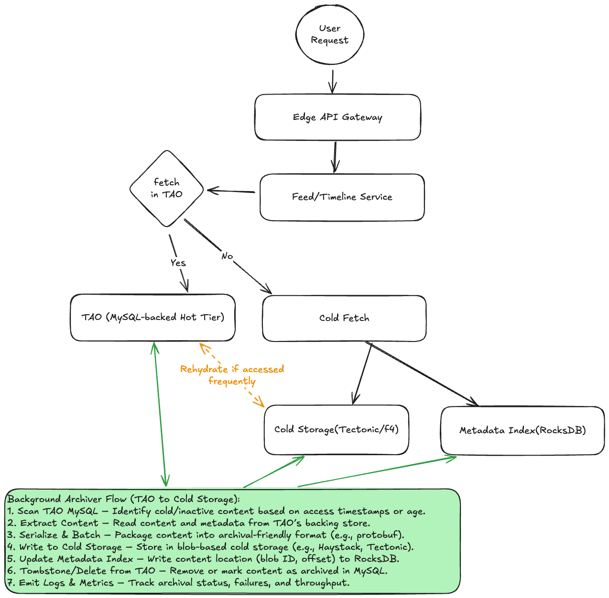

# Facebook Cold Storage System Design

## Overview

> This document describes the architecture and data flow for handling user content retrieval in a tiered storage system that separates **hot** and **cold** data. The system optimizes for performance, scalability, and cost-efficiency by keeping frequently accessed data in a MySQL-backed hot tier (TAO) and moving older data into a lower-cost cold storage system.

---

## Components and Flow

1. **User Request**
   - Entry point initiated by user interactions with a social app or platform.
2. **Edge API Gateway**
   - Handles authentication, routing, and rate-limiting.
3. **Feed/Timeline Service**
   - Assembles the user feed, determines if content is in TAO or needs cold fetch.
4. **TAO (MySQL-backed Hot Tier)**
   - Facebook’s cache-backed graph store for frequently accessed objects.
5. **Cold Fetch Service**
   - Invoked when data is not in TAO; fetches from cold storage using Metadata Index.
6. **Metadata Index (RocksDB)**
   - Maps object IDs to blob locations in cold storage.
7. **Cold Storage (e.g., Tectonic, F4, Haystack)**
   - Stores serialized blobs of cold data (posts, media, etc.).

---

## Archiver Flow (Background Process)

- Scans TAO MySQL for cold/inactive content.
- Extracts content and metadata.
- Serializes and batches for archival.
- Writes to cold storage and updates Metadata Index.
- Tombstones/deletes from TAO.
- Emits logs and metrics for tracking.

---

## Rehydration (Cold → Hot)

- Frequently accessed cold content may be copied back to TAO.
- Triggered by access patterns and policy.
- Improves subsequent access latency.

---

## Benefits

- Latency-optimized for hot data access.
- Storage-optimized for older, infrequently accessed data.
- Scalable with background archiver and tiered lookup.
- Cost-efficient by reducing load on MySQL and warm storage.

---

## Future Considerations

- TTL-based expiry in RocksDB.
- Compression/deduplication of archival blobs.
- Preemptive rehydration during user login.

---

## Architecture Diagram

> 
> You can edit this diagram by uploading the PNG to [Excalidraw](https://excalidraw.com).
