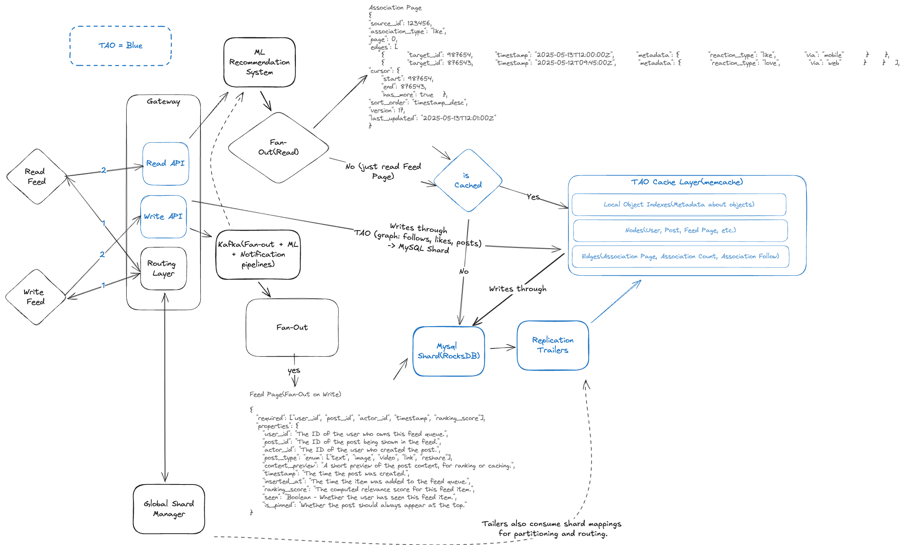

# Facebook News Feed System Design

## Overview

> This document outlines the architecture and data flow of the Facebook News Feed system. The system uses a combination of real-time writes, event-driven fan-out, graph-based caching (TAO), and machine learning to efficiently deliver a personalized and scalable feed experience.

---

## Requirements

#### *Functional*
- Deliver a personalized, ranked feed to each user
- Support real-time post creation, updates, and deletions
- Efficiently handle high fan-out and high fan-in scenarios
- Support ranking, filtering, and hiding of posts based on user preferences and policies

#### *Non-Functional*
- Low latency for feed reads and writes
- High availability and fault tolerance
- Scalable to billions of users and posts
- Platform-agnostic performance and behavioral consistency

---

## 1. Write Path (Post Creation)
> Post submitted via Gateway → Routing Layer → Write API. Write API updates the relational DB (MySQL with RocksDB) for TAO and publishes an event to Kafka for downstream processing. The cache layer (TAO/Memcache) is updated immediately to ensure low-latency reads and strong consistency for recent writes.

#### *Key Technologies*
- API Gateway, Routing Layer
- Write API: Python, Java, or Go
- MySQL (sharded), RocksDB
- TAO (Memcache-based graph cache)
- Kafka (event bus)

#### *Cache Layer Details*
- TAO is a distributed, in-memory graph cache that stores nodes (users, posts, pages), edges (relationships like follows, likes, comments), and secondary indexes for fast lookups.
- On write, TAO updates both the cache and the underlying MySQL, ensuring cache consistency and durability.
- Indexing in TAO allows efficient retrieval of all edges for a node (e.g., all posts by a user, all followers of a page).
- Nodes and edges are versioned to support atomic updates and conflict resolution.

#### *Non-Functional Accuracy*
- Immediate cache update ensures that new posts and actions are visible to users with minimal delay, delivering on low-latency and high-accuracy requirements.
- Consistency between cache and DB is maintained via replication tailers and versioning, reducing the risk of stale or lost data.

---

## 2. Fan-Out on Write

> Kafka topic events are consumed by the Fan-Out service, which pushes post references to followers' feed queues (if applicable).

#### *Sharded Counters*
- Like counts, share counts, and other interaction metrics are stored using sharded counters to avoid write hotspots.
- Each counter is split across N shards (e.g., 100), and a random shard is selected on each write.
- On reads, all shards are aggregated to compute the total count.

#### *Key Technologies*
- Kafka
- Fan-Out Service: Java, Go
- Redis or Memcache (feed queues)
- Notification System (e.g., Thrift or gRPC based microservice)

> The Fan-Out service also triggers events to the Notification System to alert users of relevant interactions (e.g., someone liked their post).

## 3. Fan-In on Read
> For high-fanout users, no feed update occurs on write. Read API invokes the ML Recommendation System to dynamically select and rank posts.

#### *Key Technologies*
- Read API: Python, Go
- ML Recommendation System (see separate design)
- Feature Store, Redis

---

## 4. Graph Store (TAO)
> TAO serves reads from a graph cache (Memcache) and persists updates to sharded MySQL. Replication tailers update cache from MySQL binlogs. TAO models all entities as nodes and all relationships as edges, with secondary indexes for efficient queries.

#### *Key Technologies*
- TAO (Facebook's graph cache)
- Memcache
- MySQL (sharded)
- Replication Tailers

#### *Nodes, Edges, and Indexing in TAO*
- **Nodes:** Represent users, posts, pages, groups, etc. Each node has a unique ID and associated metadata.
- **Edges:** Represent relationships (e.g., user follows page, user likes post, post belongs to group). Edges are directed and can have properties (timestamps, weights).
- **Indexing:** TAO maintains secondary indexes for fast edge lookups (e.g., all posts by a user, all comments on a post). Indexes are updated atomically with node/edge changes.
- **Atomicity & Consistency:** All cache updates are atomic and versioned, and replication tailers ensure cache and DB remain in sync.

---

## 5. Feed Delivery
> Feed items are pulled from user-specific queues or composed dynamically at read time, ranked and returned to the client.

#### *Key Technologies*
- Feed Delivery Service: Python, Go
- Ranking Service (ML)
- API Gateway

---

## Data Flow

- User actions and content updates trigger feed generation.
- Backend services compute and rank feed items.
- Feed is cached and delivered to the client.

---

## Architecture Highlights

- **TAO** handles all graph relationships like follows, likes, and comment edges. It is backed by sharded MySQL and Memcache.
- **Write APIs** update TAO and publish to Kafka, enabling real-time analytics and feed delivery.
- **Kafka** acts as the backbone for fan-out logic and ML signals.
- **Replication Tailers** keep the cache consistent by tailing MySQL binlogs and refreshing Memcache.
- **ML Ranking** operates at read time to determine the best posts to show based on user behavior, content features, and real-time signals.

---

## Architecture Diagram

> 

---

## See Also
- [Replication: Concepts & Trade-offs](../../components/replication.md)
- [Consistency: Concepts & Trade-offs](../../components/consistency.md)

> You can edit this diagram by uploading the PNG to [Excalidraw](https://excalidraw.com).
