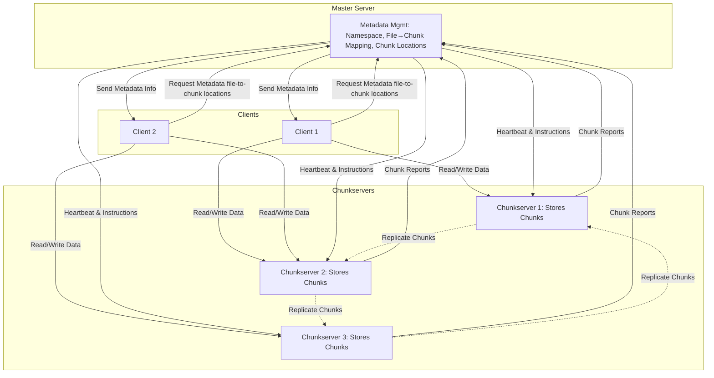
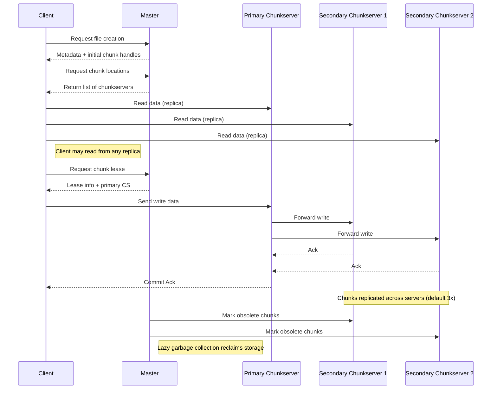

# Google File System (GFS) Design Overview

## Overview
Google File System (GFS) is a scalable, distributed file storage system for large data-intensive applications. It is designed to use commodity hardware and tolerate frequent hardware and system failures. GFS supports large streaming reads, small random reads, and many large, sequential writes (especially appends). It provides APIs for file operations (create, delete, open, close, read, write), as well as snapshot and record append for concurrent client appends with atomicity guarantees.

A GFS cluster consists of a single master, multiple chunkservers, and many clients. Files are split into fixed-size chunks (64MB), each with a unique handle and replicated across chunkservers for reliability. The master manages metadata (namespace, file-to-chunk mapping, chunk locations) in memory, logs changes to disk, and replicates logs remotely. Chunkservers report held chunks to the master at startup or registration. Checkpointing and operation logs enable fast master recovery. Heartbeats from the master to chunkservers issue instructions and collect status. Data integrity is ensured via checksumming. Deleted files are garbage collected lazily. GFS guarantees at-least-once writes using chunk versioning and mutation ordering; readers deduplicate records using checksums and serial numbers. File data is not cached by clients or chunkservers, but clients cache metadata.

---

## Problem
Design a distributed file system to reliably store and manage large files across thousands of commodity servers, supporting high throughput and fault tolerance for data-intensive applications.

## Requirements
- Scalable to petabytes of data and thousands of clients
- High availability and durability
- Fault tolerance (handle server/rack failures)
- Support for large files and high throughput
- Efficient for append-heavy workloads
- Decoupled control and data planes for performance and scalability
- Efficient snapshotting and mutation ordering for consistency

---

## High-Level Architecture
- **Master Server**: Manages metadata (namespace, file-to-chunk mapping, chunk locations), handles client requests for metadata, and coordinates system activities.
- **Chunkservers**: Store file data in fixed-size chunks (e.g., 64MB), serve read/write requests, and periodically report to the master.
- **Clients**: Access files by contacting the master for metadata, then interact directly with chunkservers for data operations.
- **Centralized Master**: The centralized master has a global view of the file system, enabling optimal decisions for chunk placement and replication.
- **Decoupled Control/Data Flow**: Clients interact with the master for metadata and then communicate directly with chunkservers for data transfer. This minimizes master bottlenecks.

---

## Data Flow
1. **File Creation**: Client requests file creation from master; master allocates metadata and initial chunks.
2. **Read**: Client asks master for chunk locations, then reads data directly from chunkservers.
3. **Write/Append**: Client gets chunk lease from master, writes to primary chunkserver, which coordinates replication to secondaries.
4. **Replication**: Each chunk is replicated (default 3x) across different chunkservers for durability.
5. **Garbage Collection**: Master reclaims space from deleted/obsolete chunks.

---

## Fault Tolerance
- **Chunk Replication**: Multiple copies of each chunk on different servers.
- **Master Recovery**: Master state is periodically checkpointed and logged for fast recovery.
- **Heartbeat & Re-replication**: Master monitors chunkservers and re-replicates lost chunks as needed.
- **Master Operation Log & Checkpointing**: For master fault tolerance, all metadata changes are written to an operation log on disk and replicated to remote machines. The master's state is also periodically checkpointed and saved in a format that can be directly mapped into memory for faster recovery.
- **External Failover**: Master failover is triggered by an external monitoring service that detects master failure and redirects traffic to a backup master.

---

## Optimizations
- **Large Chunk Size**: Reduces metadata overhead and improves throughput.
- **Append-Optimized**: Efficient for workloads like log processing.
- **Relaxed Consistency**: Guarantees for atomic record appends, but not strict POSIX semantics.
- **Lazy Space Allocation**: ChunkServers allocate disk space lazily to avoid internal fragmentation. This helps GFS handle small files efficiently.
- **Reference Counting Snapshots**: Snapshots are initially zero-copy, using reference counts. When a chunk with multiple references is modified, GFS triggers copy-on-write.
- **Lease-Based Primary Management**: Leases ensure only one primary chunkserver exists at a time. New primaries are only granted after the previous lease expires.
- **Scaling Limitations**: GFS scales by adding ChunkServers, but the centralized master limits scalability due to its in-memory metadata constraints. As usage grows, the master can become a bottleneck.

---

## Monitoring & Metrics
- Chunkserver health and storage usage
- Master and chunkserver latency
- Replication lag and under-replicated chunks
- Throughput (read/write bandwidth)
- Metadata size and memory usage on the master
- Lease expiration tracking and failover events

## System Design Patterns
- **Write-Ahead Log**: All metadata changes are written to an operation log on disk before being applied to ensure fault tolerance and recoverability.
- **Heartbeat**: The GFS master sends periodic heartbeat messages to ChunkServers to issue commands and monitor health.
- **Checksum**: ChunkServers use checksumming to detect and reject corrupted data during reads and writes.
- **Leases**: Used to manage primary chunkserver election and prevent multiple primaries during network partitions.
- **Reference Counting**: Used in snapshots to defer actual data copying until modification, reducing overhead.

## Consistency Model and Tradeoffs
GFS uses relaxed consistency models to prioritize performance and fault tolerance over strong consistency. It guarantees at-least-once writes and relies on versioning and mutation ordering to maintain consistency. Duplicate records may exist, and it's up to readers to deduplicate using checksums and serial numbers. This model is ideal for batch-processing workloads like MapReduce but is unsuitable for systems requiring strong consistency (e.g., banking systems).
