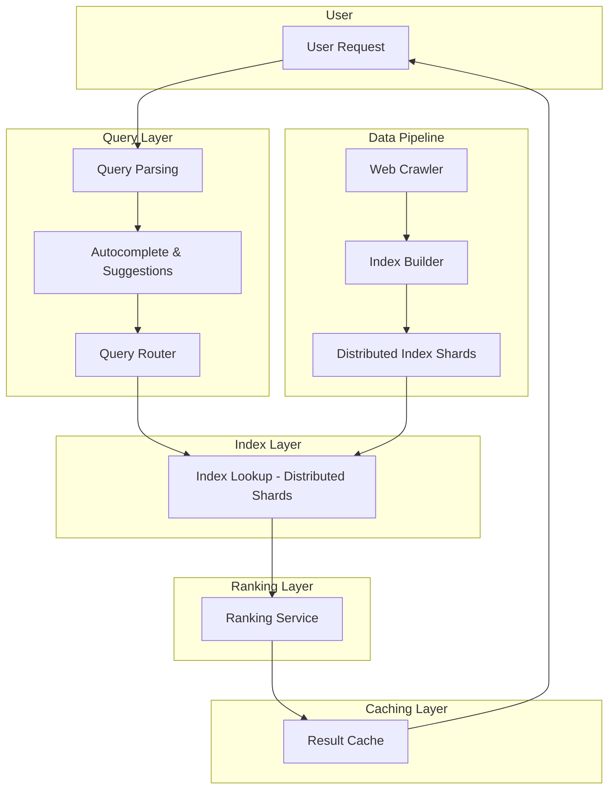

# Design Google Search Engine

## Problem
Design a web search engine like Google that can index and serve billions of web pages with sub-second query response times. Assume the web crawling system is already designed (see [web-crawler](../web-crawler/web-crawler.md)).

## Requirements
- Index billions of crawled web pages efficiently
- Handle millions of search queries per second
- Return relevant results in <200ms
- Support autocomplete and suggestions
- Rank results by relevance and authority
- Handle different query types (text, images, videos)
- Provide personalized results
- Scale globally across multiple data centers by deploying the search infrastructure across multiple geographic regions to reduce latency and improve fault tolerance. This involves multi-region deployment of query servers, index shards, and caching layers. Load balancing distributes user queries to the nearest or least loaded data center. Replication strategies ensure that indexes and data are synchronized across regions with consistency models balancing freshness and availability. Latency optimization techniques like edge caching, CDN integration, and smart routing are used to serve results quickly to users worldwide.

## Architecture Overview
The Google Search Engine architecture consists of several major components working together to provide fast, relevant search results:

- **Query Layer:** Handles incoming user search requests, parses queries, performs autocomplete suggestions, and routes queries to appropriate index shards.
- **Indexing Pipeline:** Processes crawled web pages, extracts content, builds inverted indexes, and partitions them into distributed shards.
- **Ranking Service:** Applies ranking algorithms combining multiple signals such as TF-IDF, PageRank, semantic relevance, personalization, and freshness to order search results.
- **Data Freshness Layer:** Ensures the index is updated with new and changed documents in near-real-time, while also running periodic full reindexing jobs to maintain accuracy.
- **Global Distribution:** Distributes query servers, index shards, and caches across multiple data centers worldwide to reduce latency and increase fault tolerance.

## Index Builder and Distributed Index Shards
The Index Builder is responsible for transforming crawled web documents into a highly efficient, distributed search index. This process enables the Index Layer to support fast, scalable query lookups across billions of documents.

**Key steps in the Index Builder process:**
1. **Document Parsing:** Extracts text, metadata, and relevant fields from each crawled web page.
2. **Tokenization & Normalization:** Breaks text into tokens (words/phrases), applies stemming, lowercasing, and removes stop words to standardize content.
3. **Inverted Index Construction:** For each token, builds a mapping to all documents containing that token, storing positions, frequencies, and metadata for ranking.
4. **Sharding & Partitioning:** Splits the global inverted index into multiple distributed shards, typically by token range, document ID, or hash. Each shard is responsible for a subset of the index, enabling parallelism and scalability.
5. **Replication:** Each shard is replicated across multiple servers/data centers for fault tolerance and high availability.
6. **Index Metadata Management:** Maintains mappings of which shards hold which tokens/documents, supporting efficient query routing and rebalancing.
7. **Incremental Updates:** Supports near-real-time updates by merging new or changed documents into the appropriate shards without full reindexing.

**Result:**
- The Index Layer consists of many distributed, replicated index shards, each optimized for fast lookups and updates.
- The Query Layer can route search requests to the relevant shards, aggregate results, and return them with low latency.

This architecture allows the search engine to scale horizontally, handle massive query volumes, and keep the index fresh as new content is discovered.

## Ranking Algorithm Details
Google's ranking algorithm combines multiple factors to produce relevant search results:

- **TF-IDF (Term Frequency-Inverse Document Frequency):** Measures keyword relevance within a document.
  
  \[
  \text{TF-IDF}(t,d) = \text{TF}(t,d) \times \log \frac{N}{\text{DF}(t)}
  \]

- **PageRank:** Evaluates the authority of a page based on link structure.

  \[
  PR(p_i) = (1 - d) + d \sum_{p_j \in M(p_i)} \frac{PR(p_j)}{L(p_j)}
  \]

- **Semantic Relevance:** Uses NLP models to understand query intent and document context.
- **User Personalization:** Adjusts rankings based on user history, location, and preferences.
- **Freshness Score:** Boosts recently updated or trending content.

The final relevance score is a weighted combination:

\[
Score = w_1 \times TF\text{-}IDF + w_2 \times PageRank + w_3 \times Semantic + w_4 \times Personalization + w_5 \times Freshness
\]

Weights \(w_i\) are tuned based on query type and user behavior.

## Data Freshness and Index Update Architecture
To maintain up-to-date search results, the system employs a multi-layered approach to data freshness:

- **Near-Real-Time Ingestion:** Newly crawled or updated documents are ingested continuously into the indexing pipeline, enabling rapid inclusion in the search index with minimal delay.
- **Daily/Weekly Reindex Jobs:** Periodic full or partial reindexing runs to refresh data, correct errors, and incorporate large-scale changes.
- **Freshness Scoring:** Documents are scored based on recency and update frequency to boost relevant fresh content in rankings.
- **Delta Updates vs Full Reindex:** Incremental (delta) updates apply changes to small index segments, while full reindexing rebuilds large portions of the index when necessary.
- **Incremental Index Merges:** Small index shards are merged incrementally to minimize latency and maintain index consistency without full rebuilds.

This architecture balances the need for fresh, accurate results with system performance and scalability.
