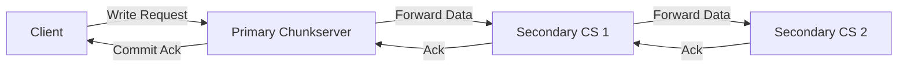
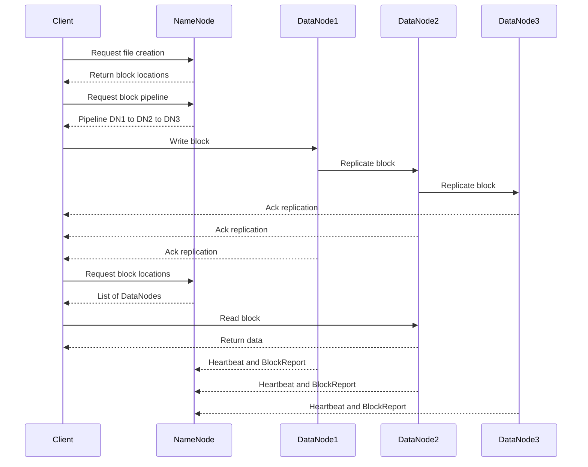

# Summary
HDFS is a scalable distributed file system for large, distributed data-intensive applications. It uses commodity hardware to reduce infrastructure costs. HDFS provides APIs for usual file operations like create, delete, open, close, read, and write. Random writes are not possible; writes are always made at the end of the file in an append-only fashion. HDFS does not support multiple concurrent writers. An HDFS cluster consists of a single NameNode and multiple DataNodes and is accessed by multiple clients.

# Apache HDFS System Design Outline

## Overview
Hadoop Distributed File System (HDFS) is a scalable, fault-tolerant distributed file system designed to run on commodity hardware. It is optimized for high-throughput access to large datasets and is a core component of the Apache Hadoop ecosystem.

---

## Problem
Design a distributed file system to reliably store and process massive datasets across clusters of commodity servers, supporting high throughput, scalability, and fault tolerance.

---

## Requirements
- Store petabytes of data across thousands of nodes
- High availability and durability
- Fault tolerance (handle node/rack failures)
- Support for large, sequential reads/writes
- Efficient for batch processing workloads

---

## High-Level Architecture
- **NameNode**: Manages filesystem namespace, metadata, and regulates access to files by clients.
  The NameNode server is the coordinator of an HDFS cluster and is responsible for keeping track of all filesystem metadata. The NameNode keeps all metadata in memory for faster operations. For fault-tolerance and in the event of a crash, all metadata changes are written to disk onto an EditLog, which is a write-ahead log. The EditLog can also be replicated on a remote filesystem (e.g., NFS) or to a secondary NameNode.
- **DataNodes**: Store actual file data in blocks, serve read/write requests, and report block status to the NameNode.
  DataNodes store blocks on local disk as Linux files and use checksumming to detect corruption of stored data.
- **Clients**: Interact with NameNode for metadata and with DataNodes for data transfer.

Clients interact with the NameNode for metadata, but all data transfers occur directly between the client and DataNodes.

```mermaid
flowchart TD
    subgraph Client
        C[Client Applications]
    end

    subgraph NameNode
        NN[NameNode (Metadata + Namespace)]
        EL[EditLog (Write-Ahead Log)]
        FS[FsImage (Checkpoint Metadata)]
    end

    subgraph DataNodes
        DN1[DataNode 1 Stores Blocks + Checksums]
        DN2[DataNode 2 Stores Blocks + Checksums]
        DN3[DataNode 3 Stores Blocks + Checksums]
    end

    %% Client interactions
    C -->|Metadata Ops (create, open, read, write)| NN
    C -->|Data Ops (read write blocks)| DN1
    C -->|Data Ops (read write blocks)| DN2
    C -->|Data Ops (read write blocks)| DN3

    %% NameNode ↔ DataNodes
    NN <--> |Heartbeats and Block Reports| DN1
    NN <--> |Heartbeats and Block Reports| DN2
    NN <--> |Heartbeats and Block Reports| DN3

    %% Fault tolerance paths
    NN --> EL
    NN --> FS

    %% Replication
    DN1 -->|Replicates Blocks| DN2
    DN2 -->|Replicates Blocks| DN3
```
---

## Data Flow
1. **File Creation**: Client requests file creation from NameNode; NameNode allocates metadata and block locations.
2. **Read**: Client asks NameNode for block locations, then reads data directly from DataNodes.
3. **Write**: Client gets block pipeline from NameNode, writes to a chain of DataNodes for replication.
   HDFS is a strongly consistent file system. Each data block is replicated to multiple nodes, and a write is declared to be successful only after all replicas have been written successfully.

   HDFS is designed to separate control flow from data flow. Clients never read or write data through the NameNode. Instead, a client asks the NameNode which DataNodes to contact for reading a block and then communicates directly with those DataNodes for data transfer. Communication between NameNode and DataNodes (e.g., registration, Heartbeats, BlockReports) is always initiated by the DataNodes.
4. **Replication**: Each block is replicated (default 3x) across different DataNodes for durability.
5. **Block Reports**: DataNodes periodically send block status to NameNode.




---

## Fault Tolerance
- **Block Replication**: Multiple copies of each block on different DataNodes.
- **NameNode Recovery**: Secondary NameNode and checkpointing for metadata backup and recovery.
  FsImage: The NameNode state is periodically serialized to disk and replicated, so that on recovery, a NameNode may load the checkpoint into memory, replay any subsequent operations from the edit log, and become available quickly.

  If the NameNode observes that a DataNode has not sent a heartbeat within a defined timeout, the DataNode is marked as dead. The NameNode then replicates the blocks from the dead DataNode to other available DataNodes to maintain fault tolerance.
- **Heartbeat & Re-replication**: NameNode monitors DataNodes and re-replicates lost blocks as needed.

The NameNode communicates with each DataNode using Heartbeat messages to give instructions and collect state.

---

## Optimizations
- **Large Block Size**: Reduces metadata overhead and improves throughput.
- **Rack Awareness**: Replication policy considers rack topology for fault tolerance.
- **Append Support**: Efficient for log and batch processing workloads.
- **Erasure Coding**: HDFS uses erasure coding to reduce replication overhead while maintaining data reliability.

  HDFS, by default, stores three copies of each block, resulting in a 200% overhead in storage and network resources. Erasure Coding provides equivalent fault-tolerance with less storage space. It breaks data into fragments, encodes it with redundant pieces, and stores them across DataNodes. If data is lost or corrupted, it can be reconstructed using remaining fragments. Though CPU intensive, EC nearly doubles storage efficiency by reducing the overhead from 3x to 1.5x.
- **Cache**: Frequently accessed file blocks may be explicitly cached in the DataNode’s memory using an off-heap block cache.

---

## Monitoring & Metrics
- DataNode health and storage usage
- NameNode and DataNode latency
- Replication lag and under-replicated blocks
- Throughput (read/write bandwidth)
- Data integrity checks through checksums

---

## Scalability and Availability

- **Scaling with DataNodes**: HDFS scales horizontally by adding DataNodes to the cluster. New DataNodes can be added to a running cluster without downtime. Rebalancing tools redistribute data as needed.
- **NameNode Memory Limitation**: Since the NameNode holds all metadata in memory, the number of files/blocks is constrained by available RAM.
- **HDFS Federation**: Introduced in HDFS 2.x, Federation enables multiple independent NameNodes, each managing a portion of the namespace, allowing horizontal scaling at the metadata layer.
- **High Availability (HA)**: HDFS HA allows multiple NameNodes in active-standby mode. Only one NameNode is active at a time; the standby maintains state and can quickly take over on failure.
- **ZooKeeper Failover**: ZooKeeper, via the ZKFailoverController (ZKFC), monitors NameNode health and automatically handles failover between active and standby nodes.
- **Rack Awareness**: HDFS places block replicas on different racks to tolerate rack-level failures and maintain availability.

---

## Small File Challenges

HDFS is optimized for storing large files. A large number of small files causes high metadata overhead, as each file consumes memory in the NameNode. It also increases disk seeks and reduces throughput. Techniques like SequenceFiles (key-value pair containers) are used to combine many small files into larger files for efficient storage and processing.

---

## System Design Patterns
- **Write-Ahead Log**: For fault tolerance and in the event of NameNode crash, all metadata changes are written to the disk onto an EditLog.
- **HeartBeat**: The HDFS NameNode periodically communicates with each DataNode in Heartbeat messages to give it instructions and collect its state.
- **Split-Brain Prevention**: ZooKeeper is used to ensure that only one NameNode is active at any time. Fencing is used to isolate a previously active NameNode so that it cannot access cluster resources and stop serving any read/write requests.
- **Checksum**: Each DataNode uses checksumming to detect corruption of stored data. When a file is written, a checksum is stored in a hidden file. During reads, the client verifies the data against the checksum. If corrupted, the client retries from another replica.
- **Garbage Collection**: Deleted files are renamed to a hidden name and later garbage collected asynchronously.
