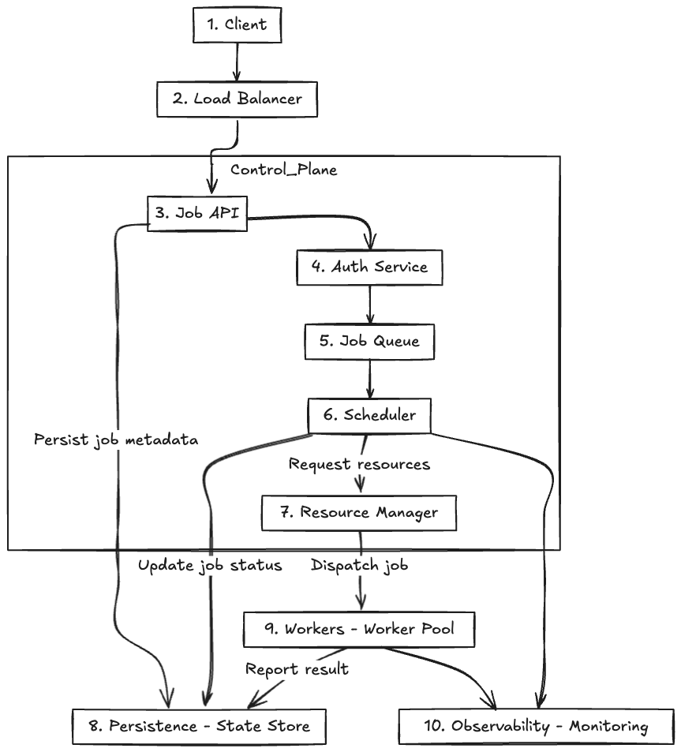
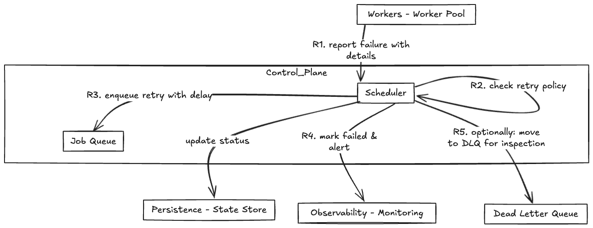

# Job Scheduler Design

## Overview

A Job Scheduler is a system that manages and executes scheduled tasks (jobs) at specified times or intervals. It is widely used in distributed systems to automate repetitive tasks such as data processing, sending notifications, or system maintenance.

This document outlines the design of a scalable and reliable job scheduler system.

## Key Components and Flow

1. **Job Producer**  
   The component or service that creates jobs and submits them to the scheduler with metadata such as execution time, retry policies, and priority.

2. **Job Scheduler Service**  
   The core service responsible for managing job queues, scheduling jobs for execution, and handling retries or failures.

3. **Job Queue**  
   A persistent queue that holds jobs waiting to be executed. It supports delayed scheduling and prioritization.

4. **Worker Nodes**  
   Distributed workers that poll the job queue, execute jobs, and report status back to the scheduler.

5. **Job Metadata Store**  
   A database that stores job details, status, history, and statistics for monitoring and auditing.

6. **Monitoring & Alerting**  
   Components to track system health, job success/failure rates, and trigger alerts on anomalies.

## Key Metrics

- **Job Throughput:** Number of jobs executed per unit time.
- **Job Success Rate:** Percentage of jobs that complete successfully.
- **Job Failure Rate:** Percentage of jobs that fail after all retries.
- **Average Job Latency:** Time from job scheduling to completion.
- **Retry Count:** Average number of retries per job.
- **Queue Length:** Number of jobs waiting to be executed.
- **Worker Utilization:** Percentage of time workers spend executing jobs.

## Architecture Diagrams

1. Job Producers submit jobs to the Job Scheduler Service.
2. The Job Scheduler stores job metadata in the Job Metadata Store.
3. Jobs are enqueued into the Job Queue with the scheduled execution time.
4. Worker Nodes poll the Job Queue to fetch due jobs.
5. Worker Nodes execute the job and update the job status in the Job Metadata Store.
6. On failure, the scheduler decides whether to retry the job based on retry policies.

## Retry/Failure Handling Flow

**Step mapping:**
- **R1**: Worker reports failure to Scheduler with error details.  
- **R2**: Scheduler checks retry count/policy.  
- **R3**: If retries remain, Scheduler re-enqueues the job with delay (exponential/fixed).  
- **R4**: If retries exhausted, mark job failed and trigger alerts.  
- **R5**: Optionally move failed job to Dead Letter Queue for manual inspection.
- **Rule of thumb**: Every state transition (QUEUED → RUNNING → SUCCEEDED/FAILED/RETRIED/FAILED_PERMANENT/ DLQ) must be persisted to the State Store immediately to ensure durability, monitoring accuracy, and recovery after failures.
