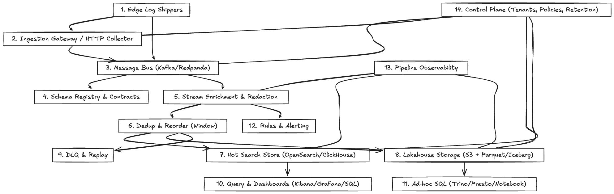

# Log Ingestion Analytics Pipeline

## Overview

The log ingestion analytics pipeline is designed to efficiently collect, process, and analyze large volumes of log data generated by various applications and services. This pipeline enables real-time monitoring, alerting, and insights that help in maintaining the health and performance of systems.

## Components

> 

### 1. Edge Log Shippers  
Edge log shippers are lightweight agents deployed close to the source of logs, typically on application servers or devices. They collect and forward log data efficiently to the ingestion system, ensuring minimal impact on the host. Common technologies include Fluentd, Filebeat, and Logstash.

Average record size is 1KB

### 2. Ingestion Gateway / HTTP Collector  
This component acts as the entry point for log data into the ingestion pipeline, often exposing HTTP endpoints for receiving logs from edge shippers or other clients. It handles authentication, rate limiting, and initial validation. Examples include custom HTTP collectors or services like AWS Kinesis Data Firehose.

### 3. Message Bus (Kafka/Redpanda)  
A durable, scalable message bus buffers incoming log data and decouples producers from consumers. Apache Kafka and Redpanda are popular choices, providing high throughput and fault tolerance to handle burst traffic and ensure data durability.

### 4. Schema Registry & Contracts  
This layer manages the schemas and contracts for log data formats, ensuring data consistency and compatibility across producers and consumers. It supports schema evolution and enforces validation. Technologies often used include Confluent Schema Registry or custom schema management services.

### 5. Stream Enrichment & Redaction  
Stream processing systems enrich logs by adding metadata, performing transformations, or redacting sensitive information in real-time. This step improves data quality and compliance. Common tools include Apache Flink, Spark Streaming, or AWS Lambda functions.

### 6. Dedup & Reorder (Window)  
This component handles deduplication and reordering of log events within a defined time window to ensure accuracy and correctness of the log stream. It mitigates issues caused by network delays or retries during ingestion.

### 7. Hot Search Store (OpenSearch/ClickHouse)  
A fast, query-optimized store for recent or frequently accessed logs that supports low-latency search and analytics. OpenSearch and ClickHouse are typical technologies used to enable interactive querying and visualization.

### 8. Lakehouse Storage (S3 + Parquet/Iceberg)  
Long-term storage for raw and processed logs using scalable object storage combined with table formats like Parquet or Apache Iceberg. This allows efficient batch analytics and data lakehouse capabilities. Amazon S3 is a common storage backend.

### 9. DLQ & Replay  
Dead Letter Queues (DLQ) capture problematic or malformed log events for later inspection and reprocessing. Replay mechanisms enable re-ingestion of logs from DLQ or archival storage to ensure data completeness and recovery.

### 10. Query & Dashboards (Kibana/Grafana/SQL)  
Visualization tools and query interfaces provide dashboards and reports to explore log data and monitor system health. Kibana and Grafana are widely used for real-time visualization, while SQL interfaces enable flexible querying.

### 11. Ad‑hoc SQL (Trino/Presto/Notebook)  
This layer supports interactive, ad-hoc analysis of log data using distributed SQL query engines like Trino or Presto, often integrated with notebook environments for exploratory data analysis.

### 12. Rules & Alerting  
The alerting system monitors log data and metrics against predefined rules or anomaly detection models to notify operators of potential issues. Technologies include Prometheus Alertmanager and PagerDuty for incident management.

### 13. Pipeline Observability  
Observability tools track the health, performance, and data quality of the ingestion pipeline itself, providing metrics, logs, and traces to detect and troubleshoot issues proactively.

### 14. Control Plane (Tenants, Policies, Retention)  
The control plane manages multi-tenancy, access policies, data retention, and configuration of the ingestion pipeline. It ensures governance, security, and compliance across the system.

## Data Flow

1. Logs are generated by various producers and collected by agents running on the same host or network.
2. Collected logs are sent to a message queue to buffer and ensure durability.
3. Stream processing systems consume logs from the queue, performing necessary transformations or filtering.
4. Processed logs are stored in databases or data lakes optimized for query and analysis.
5. Analytics tools query the storage layer to provide dashboards and reports.
6. Alerting systems monitor the data and notify operators of any issues.

## Design Considerations

- **Scalability:** The system should handle increasing log volumes without degradation.
- **Fault Tolerance:** Ensure no data loss during failures.
- **Latency:** Support near real-time processing for timely insights.
- **Data Schema:** Define clear schemas for logs to facilitate parsing and querying.
- **Security:** Encrypt data in transit and at rest; control access.
- **Cost:** Optimize resource usage to balance performance and cost.

## Example Technologies

| Component           | Technology Examples              |
|---------------------|--------------------------------|
| Log Collectors      | Fluentd, Logstash               |
| Message Queue       | Apache Kafka, AWS Kinesis       |
| Stream Processing   | Apache Flink, Spark Streaming   |
| Storage             | Amazon S3, Elasticsearch, HDFS  |
| Visualization       | Kibana, Grafana                 |
| Alerting            | Prometheus Alertmanager, PagerDuty |

## Summary

A robust log ingestion analytics pipeline enables organizations to efficiently manage and analyze vast amounts of log data, providing critical operational insights and improving system reliability.
