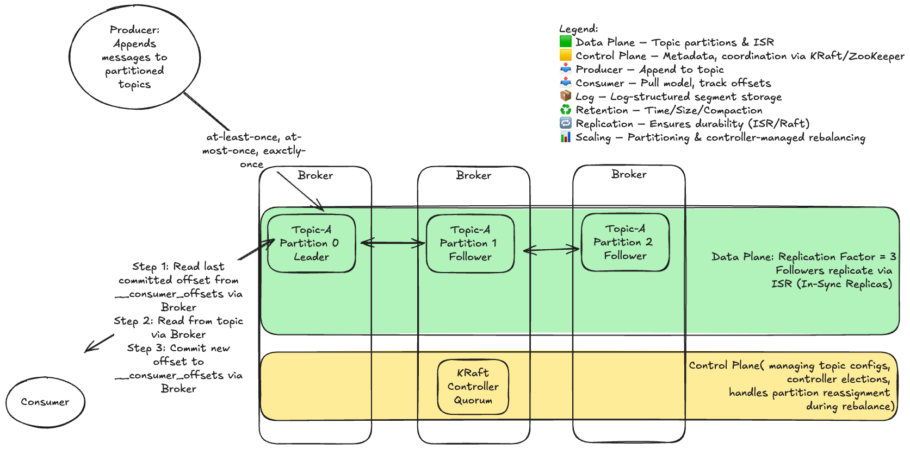

# Kafka Messaging Queue System Design

## Overview

> This document summarizes the architecture and data flow of a modern Apache Kafka deployment, including core components, operational semantics, and system behaviors. The design separates the **Data Plane** (message flow and storage) from the **Control Plane** (cluster coordination and metadata management).

---

## Key Components and Flow

### Data Plane (Topic Partitions & ISR)
- **Producers** append messages to partitioned topics.
- **Partitions** are replicated across brokers using **In-Sync Replicas (ISR)**.
- **Consumers** pull messages and track offsets.
- Delivery guarantees: at-least-once (default), exactly-once (when configured).

### Control Plane (Metadata, Coordination)
- Managed using **KRaft** (Kafka Raft mode) or legacy **ZooKeeper**.
- Handles broker registration, controller election, partition leadership, and metadata.

---

## Storage Model

- Log-structured storage: each partition is an append-only log segmented into files.
- Older segments are sealed and compressed.
- Enables fast sequential writes and efficient disk IO.

---

## Retention & Durability

- **Retention**: time-based, size-based, or log compaction.
- **Durability**: replication across brokers, committed on all ISR.
- **Raft consensus** for metadata in KRaft mode.

---

## Scalability & Partitioning

- Scales horizontally by partitioning topics across brokers.
- Controller dynamically reassigns partitions during broker changes or topic updates.

---

## Flow Summary

1. Producer sends messages to a topic partition.
2. Broker leader appends to log and replicates to ISR followers.
3. Consumer fetches and commits offsets.
4. KRaft controller manages metadata and coordination.

---

## Architecture Diagram

> 

> You can edit this diagram by uploading the PNG to [Excalidraw](https://excalidraw.com).
