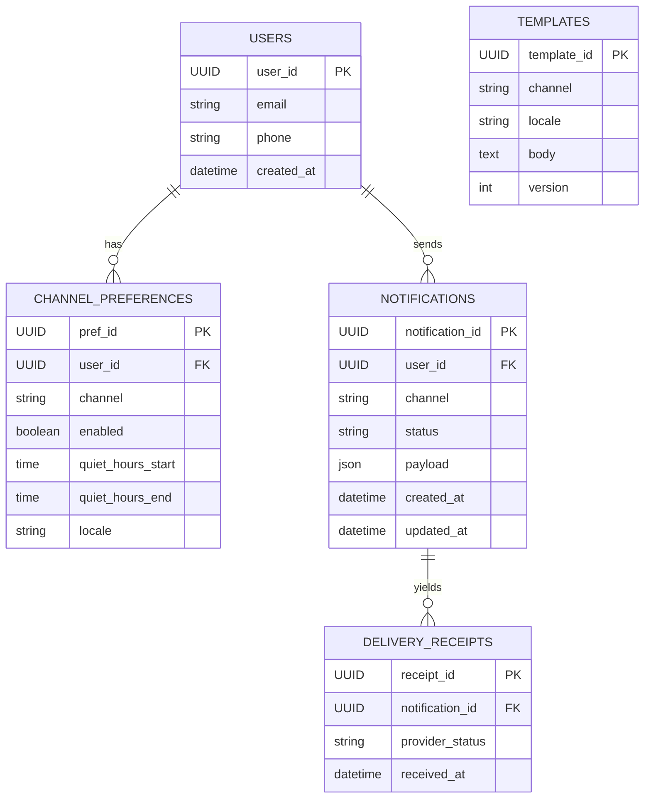
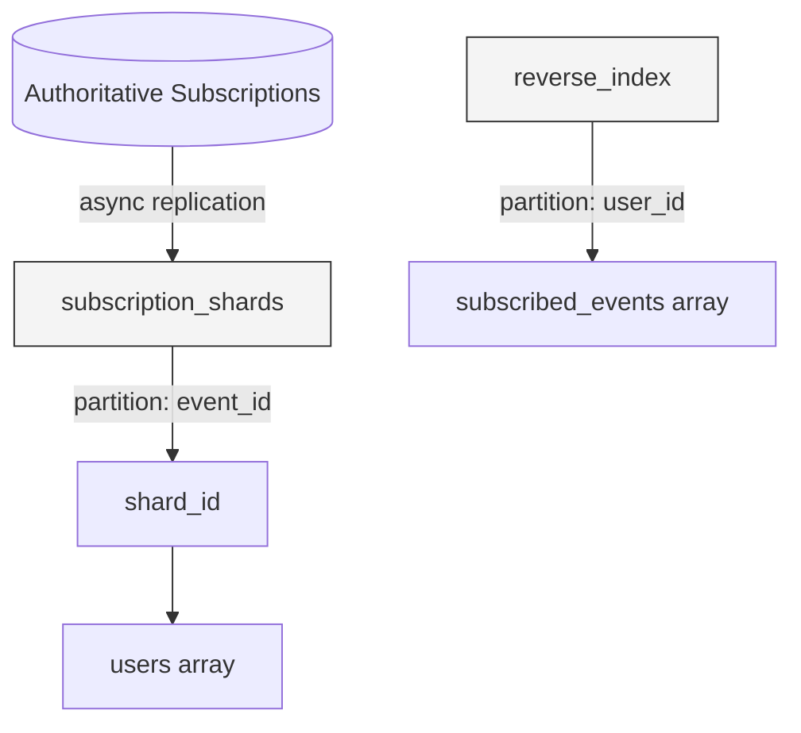
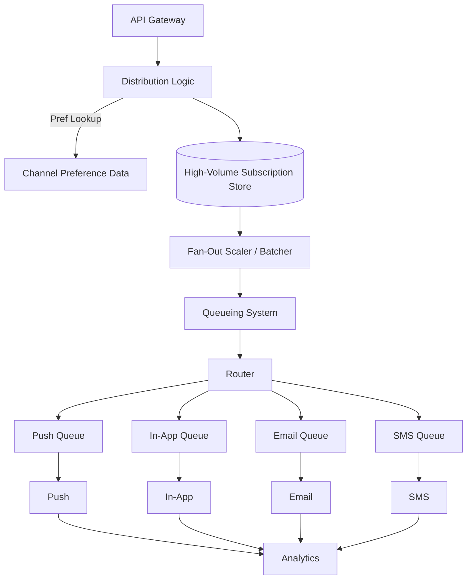
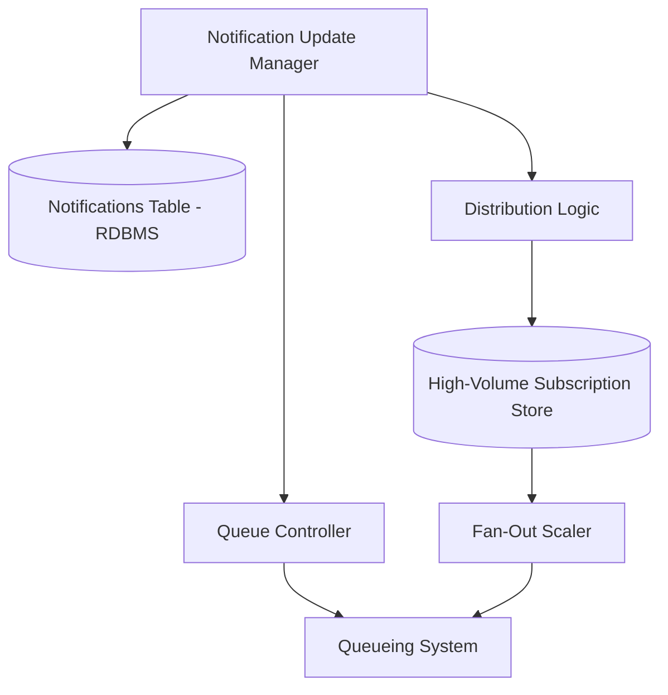
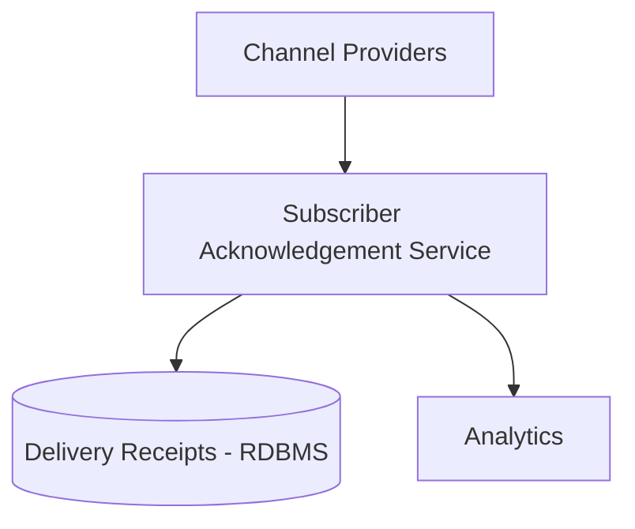

# Notification System Design

## Overview

> This document outlines the architecture and data flow of the Notification System. The system delivers personalized notifications to users through various channels (Push, In-App, Email, SMS) with support for preference management, retry handling, and delivery analytics.

---

## Key Components and Flow

1. **API Gateway**
   - Receives notification requests, provides security, rate limiting, and routing.
2. **Distribution Logic**
   - Validates payloads, enriches messages, and routes based on user preferences.
3. **Channel Preference Data**
   - Stores user delivery settings and opt-in preferences.
4. **Queueing System with DLQ**
   - Handles message buffering, retry, and dead-lettering (Kafka, RabbitMQ, AWS SQS).
5. **Router**
   - Routes messages to the correct delivery channel.
6. **Channels**
   - Sends notifications via Push (APNs/FCM), In-App, Email, or SMS.
7. **Analytics System**
   - Monitors system performance and tracks user engagement.
8. **Subscriber Acknowledgement Service**
   - Collects delivery receipts, open/click events, and acknowledgement signals from subscriber devices or providers and updates the RDBMS.

---

## Data Flow

- Requests are received and validated.
- User preferences are checked and messages are enriched.
- Messages are queued and routed to the appropriate channel.
- Delivery and engagement metrics are tracked for analytics.
- Subscriber acknowledgement events (delivery receipts, opens, clicks) are received from channels or providers and processed by the Subscriber Acknowledgement Service, which records them in the RDBMS for analytics and notification status updates.

---

## RDBMS Model

---

## Key Metrics

- Total notifications processed (by type)
- Success/failure rates
- Retry counts, DLQ volume
- Delivery time per channel
- Open/click-through rates
- Failure reasons and error logs
- Processing latency at each layer
- Acknowledgement metrics: delivery receipts received, open/click rates, acknowledgement latency, failed or missing receipts.

---

## High-Volume Subscription Store (NoSQL Model)

---

## Architecture Diagram

### 1. Trigger → Fan-Out → Delivery Flow

### 2. Notification Update Flow (Modify / Cancel / Resend)

### 3. Subscriber Acknowledgement Flow

