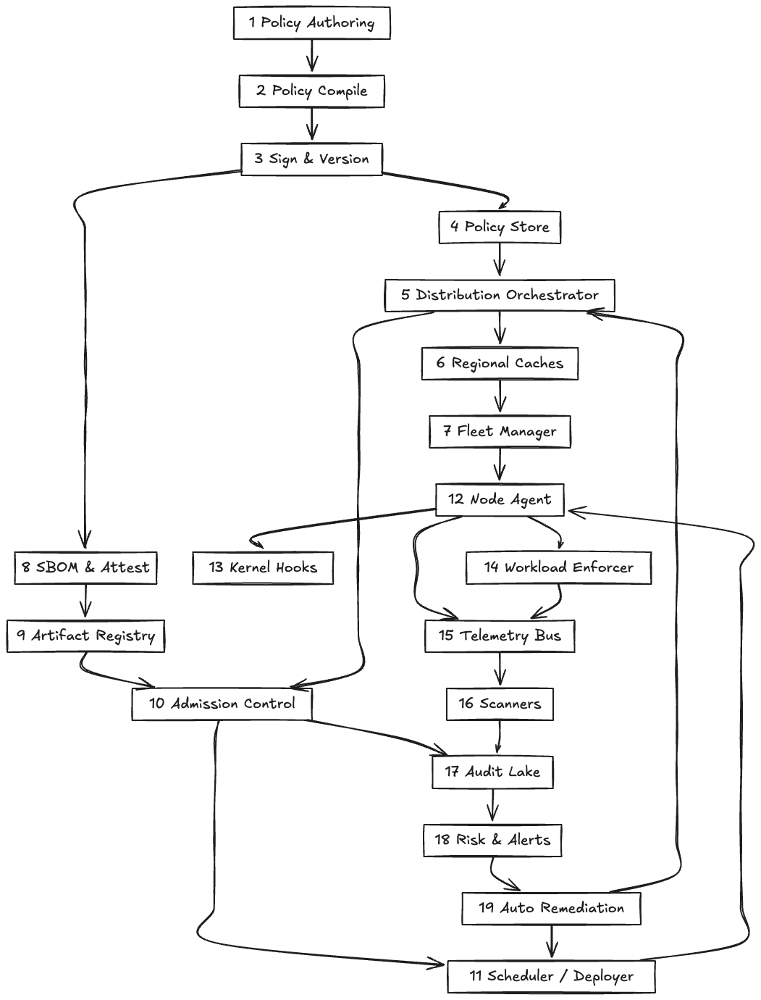
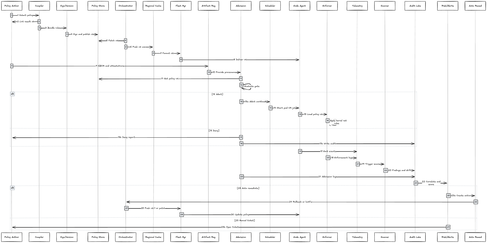

---
# Policy System Design
# Policy System Design

## Architecture Overview

The Policy System is designed to manage and evaluate policies that govern access control and permissions within an application. The architecture is modular, scalable, and supports complex policy definitions.

## Sequence Flow

The sequence flow illustrates how requests are processed through the Policy System, from policy retrieval to evaluation and response.

## Components

1. **Policy Store**  
   A centralized repository where all policies are stored. Supports versioning and auditing.

2. **Policy Parser**  
   Parses policy definitions into an internal representation for evaluation.

3. **Policy Evaluator**  
   Evaluates policies against incoming requests to determine access rights.

4. **Policy Cache**  
   Caches frequently accessed policies to improve performance.

5. **Request Handler**  
   Entry point for incoming access requests; coordinates with other components.

6. **Audit Logger**  
   Logs all policy evaluations and decisions for compliance and debugging.

7. **Admin Console**  
   Interface for administrators to manage policies.

8. **Notification Service**  
   Sends alerts on policy changes or violations.

9. **Policy Validator**  
   Ensures policies are syntactically and semantically correct before deployment.

10. **Metrics Collector**  
    Gathers metrics on policy usage and evaluation latency.

11. **Authentication Module**  
    Verifies the identity of requesters.

12. **Authorization Module**  
    Uses policy evaluation results to grant or deny access.

13. **Policy Version Manager**  
    Handles multiple versions of policies and rollback capabilities.

14. **Policy Importer/Exporter**  
    Supports importing and exporting policies in standard formats.

15. **Rule Engine**  
    Processes individual rules within policies.

16. **Conflict Resolver**  
    Detects and resolves conflicts between policies.

17. **Policy Simulator**  
    Allows testing of policies against hypothetical scenarios.

18. **Backup Service**  
    Periodically backs up policy data for disaster recovery.

19. **API Gateway Integration**  
    Integrates with API gateways to enforce policies at the network edge.

## Flow Summary

- Incoming requests are received by the Request Handler.
- The Authentication Module verifies the requester’s identity.
- The Policy Evaluator retrieves applicable policies from the Policy Cache or Policy Store.
- Policies are parsed and evaluated using the Rule Engine.
- The Conflict Resolver ensures consistent decisions if multiple policies apply.
- Authorization Module enforces the decision.
- Audit Logger records the evaluation and outcome.
- Metrics Collector tracks system performance.
- Notifications are sent if necessary.
- Administrators manage policies via the Admin Console, using tools like the Policy Simulator and Validator.
- Policy versions are managed for safe deployment and rollback.

---

## See Also
- [Rate Limiting: Concepts & Trade-offs](../../components/rate-limiter.md)
- [API Gateway: Concepts & Trade-offs](../../components/api-gateway.md)
- [Idempotency: Concepts & Trade-offs](../../components/idempotency.md)
