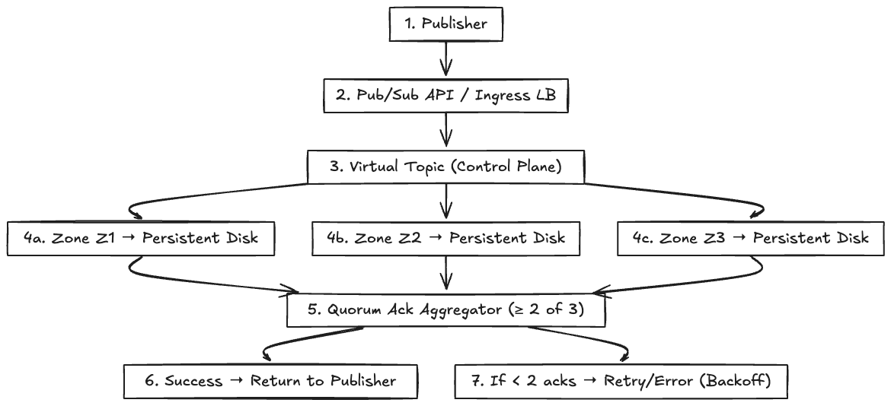
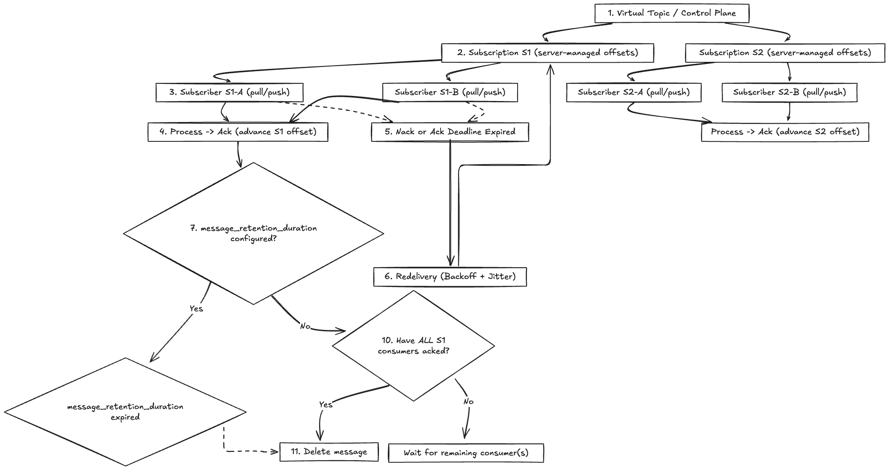
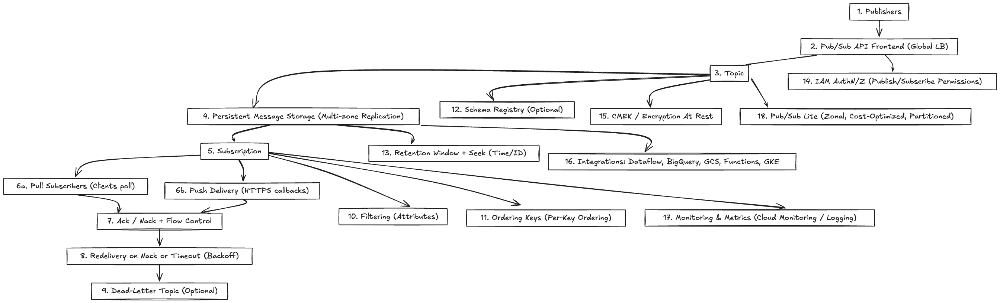

# Pub/Sub System Design

## Overview

Google Cloud Pub/Sub is a globally available **managed publish–subscribe messaging service** that decouples producers and consumers. Publishers send messages to **topics**; subscribers consume from **subscriptions** attached to those topics. The service provides durable, replicated storage, **at-least-once** delivery, **per-key ordering**, filtering, and integrations with the broader Google Cloud ecosystem.

This document outlines a scalable, reliable Pub/Sub architecture and details each component in the end-to-end flow.

## Key Components and Flow

### Producer Flow Components

1. **Publisher**  
   Client application that creates and sends messages into the system.

2. **Pub/Sub API / Ingress LB**  
   Globally distributed entry point that authenticates, authorizes, and forwards publish requests.

3. **Virtual Topic (Control Plane)**  
   Logical topic abstraction that manages metadata, replication, and subscription mappings.

4. **Zone Storage (Persistent Disk)**  
   Each publish is written synchronously to multiple zones with durable storage (persistent disk). A quorum of 2-of-3 acknowledgments is required for a successful write.

5. **Quorum Ack Aggregator**  
   Component that collects acknowledgments from zones and enforces the quorum policy. If at least 2 zones confirm, the publish is considered durable.

6. **Success Response / Retry**  
   Successful quorum responses return success to the publisher. Fewer than 2 acknowledgments trigger retries or error responses.

---

### Consumer Flow Components

1. **Virtual Topic (Control Plane)**  
   Manages subscriptions and server-maintained offsets.

2. **Subscription**  
   Represents a stream of messages to be delivered to one or more subscribers. Each subscription has its own offsets and delivery policy.

3. **Subscriber (Pull/Push)**  
   Application instances consuming messages. Subscribers may pull messages or receive pushes.

4. **Process and Ack**  
   Subscribers process messages and acknowledge them. The ack advances the server-side offset for that subscription.

5. **Failure Path**  
   If a subscriber nacks, fails, or misses the ack deadline, the message is redelivered with exponential backoff and jitter.

6. **Redelivery Loop**  
   Messages remain deliverable until acknowledged or the subscription retention policy removes them.

7. **Retention / Delete Decision**  
   - If `message_retention_duration` is configured, messages may persist after ack for replay.  
   - If not configured, the system checks if all subscribers tied to the subscription have acked. Only then are messages deleted. Otherwise, the message remains until the remaining consumers ack.

## Key Metrics

- **Publish latency** (client → persisted)  
- **End-to-end delivery latency** (publish → consumer ack)  
- **Publish throughput** (messages/sec, bytes/sec)  
- **Subscriber throughput & lag** (msgs/sec, oldest unacked age)  
- **Ack deadline expiration rate** and **redelivery count**  
- **Push delivery success rate** and **non-2xx error rate**  
- **Filter match rate** (delivered / published)  
- **Ordering key stalls** (blocked due to unacked earlier message)  
- **DLQ volume & reprocess success rate**  
- **Seek/replay operations** (volume, duration)

## Architecture Diagram

1. **Publishers**  
   Producer services that create messages and publish them to a topic. Messages typically include a payload and optional **attributes** used for filtering or routing.

2. **Pub/Sub API Frontend (Global LB)**  
   A globally anycasted API surface and load balancer that terminates client connections, authenticates requests, and forwards them into the Pub/Sub control/data plane.

3. **Topic**  
   A named endpoint where publishers send messages. Topics fan-out to one or more **subscriptions**; each subscription gets its own copy of messages.

4. **Persistent Message Storage (Multi-zone Replication)**  
   Durable, replicated storage for published messages. Ensures messages survive zone failures and are available until acknowledged or retention expires.

5. **Subscription**  
   A named consumer attachment to a topic. Encapsulates **delivery type** (pull/push), **ack deadline**, **dead-letter policy**, **filter**, **ordering** settings, and **retention** overrides.

6. **Pull Subscribers (Clients poll)**  
   Consumer applications that call `Pull`/`StreamingPull` to receive messages, process them, and `Ack` when done (or `Nack`/not ack on failure). Clients manage **flow control** (in-flight count/bytes).

7. **Push Delivery (HTTPS callbacks)**  
   Pub/Sub delivers messages via HTTPS to a subscriber endpoint. The endpoint returns a success status to ack, or non-2xx to signal failure (message will be retried).

8. **Ack / Nack + Flow Control**  
   Delivery requires an **ack** before the **ack deadline**. Subscribers may extend deadlines while processing. A `Nack`, non-2xx (push), or deadline expiration triggers redelivery.

9. **Redelivery on Nack or Timeout (Backoff)**  
   Pub/Sub redelivers unacked messages with exponential backoff and jitter. Redelivery continues within retention limits or until a **dead-letter** condition is met.

10. **Dead-Letter Topic (Optional)**  
   A policy can route messages that repeatedly fail (exceed max delivery attempts) into a **DLQ topic** for triage, manual replay, or alternative processing paths.

11. **Filtering (Attributes)**  
   Subscriptions can filter on message attributes to reduce consumer load. Only messages matching the filter are delivered to that subscription.

12. **Ordering Keys (Per-Key Ordering)**  
   When enabled, Pub/Sub preserves **relative order per ordering key**. Publishers set the key; subscribers receive messages for a given key in order (at least once).

13. **Schema Registry (Optional)**  
   Optional schema enforcement (e.g., Avro/Protobuf). Publish requests are validated against the bound schema to reduce downstream failures.

14. **Retention Window + Seek (Time/ID)**  
   Messages are retained for a configurable window even after delivery attempts. **Seek** lets you reposition a subscription by **timestamp** or **snapshot/ID** for replay or backfills.

15. **IAM AuthN/Z (Publish/Subscribe Permissions)**  
   Authentication via service accounts and authorization via IAM roles on topics/subscriptions (e.g., Publisher, Subscriber).

16. **CMEK / Encryption at Rest**  
   Data encrypted at rest by default; optionally use **Customer-Managed Encryption Keys** for compliance and key management needs.

17. **Integrations: Dataflow, BigQuery, GCS, Cloud Functions, GKE**  
   Turnkey hooks into streaming ETL (Dataflow/Beam), analytics (BigQuery streaming), data lake landing (GCS), serverless triggers (Cloud Functions), and microservices (GKE).

18. **Monitoring & Metrics (Cloud Monitoring / Logging)**  
   Built-in metrics (publish/subscribe throughput, backlog size, oldest unacked age, delivery attempts, push error rates) and logs for troubleshooting, SLOs, and alerting.

19. **Pub/Sub Lite (Zonal, Cost-Optimized, Partitioned)**  
   Lower-cost, zonal alternative with explicit **partitions** and capacity management. Suitable when ultra-low cost and predictable throughput trump global HA.
