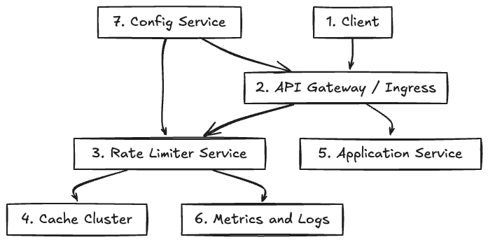

# 🚦 Rate Limiter System Design

## 🧠 Overview

> This document outlines the architecture and data flow of a scalable, distributed rate limiter for APIs. The system restricts the number of requests a client (user, IP, or API key) can make within a fixed time window, ensuring fair usage and protecting backend systems from abuse or overload.

---

## Requirements

**Functional:**
- Limit the number of requests per client in a given time window (e.g., 100 requests per minute)
- Support different tiers of clients with different limits
- Return appropriate error responses (e.g., HTTP 429) when limits are exceeded

**Non-Functional:**
- Low latency, high throughput
- Scalable to millions of clients
- Highly available and fault-tolerant
- Regionally distributed support

---

## 1. API Gateway
> Acts as the first entry point for requests. Performs initial rate limiting checks and integrates with Redis for token counters. Can short-circuit responses if limits are breached.

**Key Technologies:**
- Kong, NGINX, Envoy, AWS API Gateway
- Integration with Redis (or Memcached)

---

## 2. Cache (Redis)
> Stores token buckets or counters for each client. Performs atomic updates using Lua scripts or built-in operations. TTL ensures cleanup of inactive keys.

**Key Technologies:**
- Redis (standalone, clustered, or managed)
- Lua scripting for atomicity

---

## 3. Backend Application
> Executes after the request passes the gateway. Middleware can implement finer-grained or endpoint-specific rate limits. Business Logic handles the main application functionality.

**Key Technologies:**
- Node.js, Python, Go, Java
- Express, FastAPI, Flask, Spring Boot

---

## 🧮 Rate Limiting Algorithms

> A robust rate limiter can use several algorithms, each with trade-offs in accuracy, memory usage, and burst handling:

- **Fixed Window**
  - Divides time into discrete intervals (e.g., 1 minute).
  - All requests in the same window are counted together.
  - Simple to implement but can allow bursts at window boundaries (e.g., 100 requests at 12:00:59 and 100 more at 12:01:00).
  - **Use case:** Simple APIs with low risk of burst abuse.

- **Sliding Window Log**
  - Stores a timestamp for each request in a log.
  - On each request, removes timestamps outside the window and counts the rest.
  - Highly accurate but memory-intensive for high-traffic clients.
  - **Use case:** High-value APIs where precise control is needed and traffic per client is moderate.

- **Sliding Window Counter**
  - Maintains counters for two adjacent windows and interpolates the count based on the current time.
  - Reduces memory usage compared to the log approach, but is less precise.
  - **Use case:** APIs needing a balance between accuracy and efficiency.

- **Leaky Bucket**
  - Requests are added to a bucket and leak out at a fixed rate.
  - Smooths out bursts, but can delay requests if the bucket is full.
  - **Use case:** Smoothing traffic to downstream systems.

- **Token Bucket (Recommended)**
  - Bucket is filled with tokens at a fixed rate up to a maximum.
  - Each request consumes a token; if no tokens remain, the request is rejected.
  - Allows short bursts while enforcing an average rate over time.
  - **Use case:** Most API rate limiting, especially where occasional bursts are acceptable.

**Algorithm Selection Guidance:**
- For most APIs, **Token Bucket** is preferred for its flexibility and burst handling.
- Use **Sliding Window Log** for strict, per-request accuracy.
- Use **Leaky Bucket** to smooth traffic to backend services.

---

## 🔄 Data Flow

1. Client sends request to API Gateway.
2. API Gateway checks Redis for current token or counter.
3. If allowed, request proceeds to the Backend Application.
4. Middleware may apply secondary limits.
5. Business Logic is executed if all checks pass.

---

## ⚙️ Scaling & Resiliency

- Redis is sharded for horizontal scalability.
- Rate limiting logic runs locally at each gateway instance.
- Expiring tokens in Redis prevents stale data buildup.
- Optionally use CDN edge or service mesh (e.g., Envoy) for global distribution.

---

## 🔒 Security Considerations

- Use authenticated identifiers (userID, API key) rather than IP alone.
- Enforce TLS at gateway.
- Obfuscate rate limit headers to prevent probing.
- Monitor and alert on rate limit bypass attempts.

---

## 💡 Extensions

- Self-service dashboards for developers to view their usage.
- Dynamic limit adjustment via configuration service.
- Integration with billing or quota systems.

---

## 🏗️ Architecture Diagram

> 

> You can edit this diagram by uploading the PNG to [Excalidraw](https://excalidraw.com).
