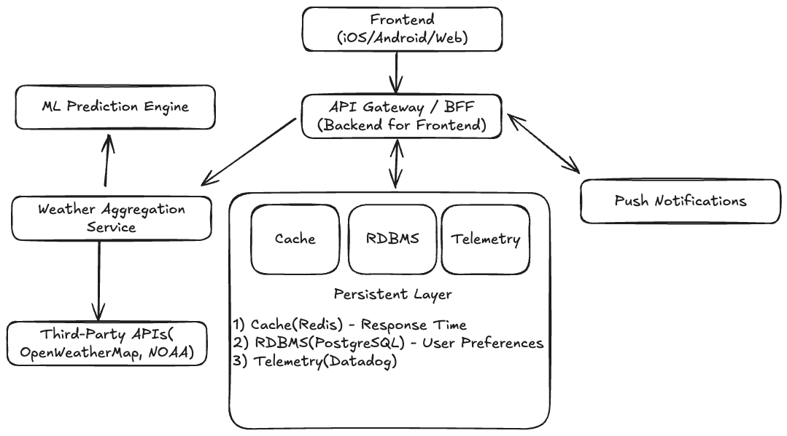

# 🌦️ Weather App System Design

## 🧠 Overview

> This document outlines the architecture and data flow of a scalable, reliable weather app system. It covers requirements, system architecture, scalability, security, and technology choices for each major component.

---

## Requirements

#### Functional
- Show current weather by location (auto-detected or searched)
- Display hourly and daily forecasts
- Show severe weather alerts
- Support multiple saved locations
- Optional: radar map, air quality index, sunrise/sunset, humidity, wind

#### Non-Functional
- Fast response (<500ms for forecast)
- High availability (99.9% uptime)
- Low battery and data usage on mobile
- Scalable (especially on stormy days)

---

## 🚀 Scalability & Performance

> The system uses CDN for static content, proactive caching, and background jobs for data refresh to ensure fast, reliable service even during high demand.

#### Key Technologies
- CDN: Cloudflare, Fastly
- Background Jobs: Celery (Python), Sidekiq (Ruby)
- Caching: Redis

---

## 🔒 Security

> API keys are protected and proxied, all traffic is encrypted, and user data is stored securely. Rate limiting and WAF protect against abuse.

#### Key Technologies
- WAF: Cloudflare WAF, NGINX
- SSL: Let’s Encrypt
- Database: PostgreSQL (encrypted fields)

---

## 🧪 Testing

> Covers unit, integration, and UI tests for reliability.

#### Key Technologies
- Unit: Pytest, Jest, XCTest
- Integration: Postman/Newman, Supertest
- UI: Appium, Cypress, Detox

---

## 🧩 Component Design & Technology Stack

1. **Frontend (iOS/Android/Web)**
> The client handles location permissions, auto-refresh, weather animations, and theming.
   
#### Key Technologies
   - iOS: Swift, SwiftUI
   - Android: Kotlin, Jetpack Compose
   - Web: React, Next.js, TailwindCSS

2. **API Gateway / BFF (Backend for Frontend)**
> Handles authentication, rate limiting, and aggregates data for the frontend.
   
#### Key Technologies
   - Node.js (Express/Fastify)
   - Python (Flask/FastAPI)
   - GraphQL (Apollo Server)

3. **Weather Aggregation Service**
> Normalizes and aggregates third-party weather data, merges/caches responses, and can run ML models.
   
#### Key Technologies
   - Python (Pandas, NumPy)
   - Go (for speed)
   - Redis (caching)
   - PostgreSQL (historical data)

4. **Third-Party APIs**
> Provides weather, radar, and map data.
   
#### Key Technologies
   - REST APIs (OpenWeatherMap, WeatherAPI, NOAA NWS, AerisWeather)
   - Mapbox/RainViewer for radar
   - JSON over HTTP, OAuth (if needed)

5. **Data Storage**
> Stores user preferences, caches frequent data, and tracks analytics.
   
#### Key Technologies
   - PostgreSQL, Firebase Realtime DB/Firestore
   - Redis (TTL-based caching)
   - Datadog, Sentry, Google Analytics

6. **Push Notifications**
> Sends severe weather alerts and rain notifications to users.
   
#### Key Technologies
   - Firebase Cloud Messaging (FCM)
   - Apple Push Notification Service (APNs)
   - Node/Go-based alert service

---

## 💡 Optional Enhancements
- ML-powered predictions
- Home screen widgets
- Offline support
- Voice assistant integration
- Smartwatch app

#### Key Technologies
- ML: scikit-learn, TensorFlow Lite, ONNX
- Widgets: SwiftUI Widgets, Android Glance
- Voice: SiriKit, Google Assistant SDK
- Wearables: WatchKit, Wear OS SDK

---

## 🏗️ Architecture Diagram

> 

> You can edit this diagram by uploading the PNG to [Excalidraw](https://excalidraw.com).

---

## 📝 Summary

> This weather app system is built for performance, reliability, and scale, using modern mobile/web frameworks and a robust backend aggregation layer. Third-party APIs provide data, while caching, ML, and thoughtful UI help create a great user experience.
