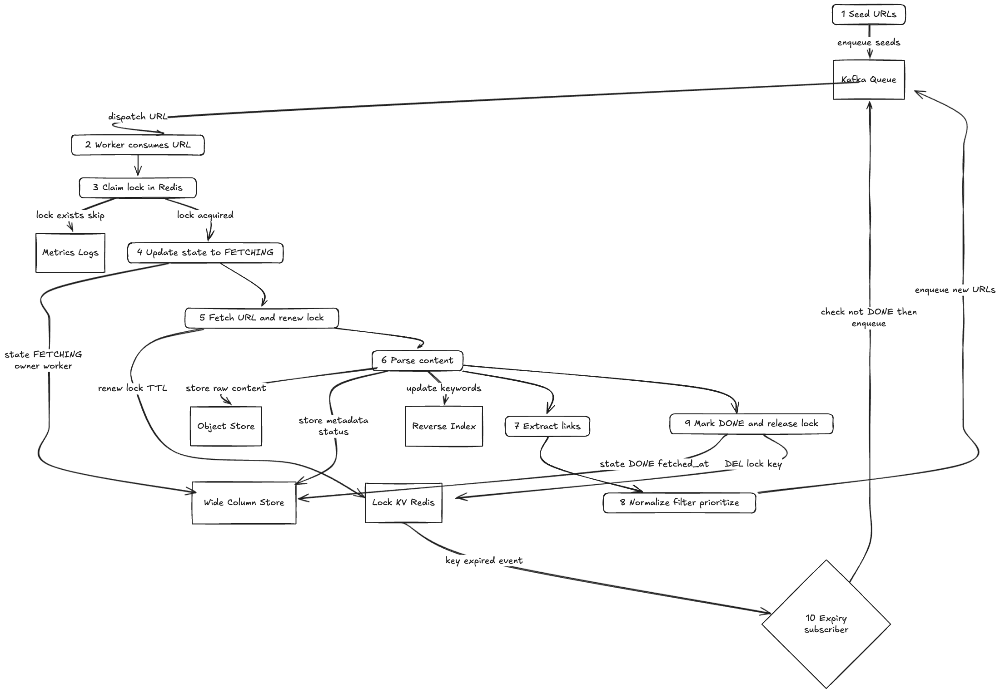

# Web Crawler System Design

## Overview
This document outlines the design of a scalable and resilient web crawler system. The crawler is responsible for fetching web pages, parsing content, extracting relevant data, storing and indexing the information, and handling retries and re-queuing for failed fetches. The system is designed to efficiently crawl the web at scale, maintain data consistency, and provide extensibility for future enhancements.

## Requirements

### Functional Requirements
- Fetch and download web pages from a list of URLs.
- Parse the fetched pages to extract links and relevant content.
- Store the extracted data and index it for fast retrieval.
- Handle retries and re-queue failed URLs.
- Support prioritization of URLs for crawling.
- Provide mechanisms for deduplication to avoid fetching the same URL multiple times.

### Non-Functional Requirements
- Scalability to handle millions of URLs.
- High availability and fault tolerance.
- Efficient use of network and storage resources.
- Security to prevent unauthorized access and mitigate malicious content.
- Extensibility to support new content types and parsing rules.

## Fetching and Lock Flow
The crawler uses a distributed queue to manage URLs to be fetched. Workers poll the queue to retrieve URLs and acquire a lock on each URL to ensure exclusive fetching. The lock prevents multiple workers from fetching the same URL simultaneously.

- **URL Queue:** A distributed, persistent queue stores URLs to be crawled.
- **Locking Mechanism:** Before fetching, a worker obtains a lock on the URL (using a distributed lock service such as ZooKeeper or Redis).
- **Fetching:** The worker downloads the web page content.
- **Lock Release:** After fetching, the lock is released.

If the fetch fails, the URL is re-queued with an incremented retry count.

## Parsing and Extraction
After fetching, the content is parsed to extract useful information:

- **HTML Parsing:** The system uses an HTML parser to extract text content and metadata.
- **Link Extraction:** All hyperlinks are extracted and normalized.
- **Content Filtering:** Extracted data is filtered to remove duplicates and irrelevant content.
- **Data Transformation:** The content is transformed into a structured format suitable for storage.

Extracted links are checked against the deduplication store and, if new, added to the URL queue for crawling.

## Storage and Indexing
The extracted data is stored and indexed for efficient retrieval:

- **Data Storage:** A scalable document store (e.g., Cassandra, MongoDB) stores the structured content.
- **Indexing:** An inverted index (e.g., Elasticsearch) indexes the content for search and analytics.
- **Metadata Storage:** URL metadata, fetch timestamps, and status are stored for monitoring and re-crawling decisions.

## Re-queuing and Retry Logic
To handle transient failures and ensure coverage:

- **Retry Count:** Each URL fetch maintains a retry count.
- **Backoff Strategy:** Exponential backoff is applied between retries.
- **Maximum Retries:** URLs exceeding max retries are marked as failed.
- **Re-queuing:** URLs that are discovered during parsing and not yet crawled are added to the queue.

## Scaling & Resiliency
The system is designed for horizontal scaling and fault tolerance:

- **Distributed Workers:** Multiple worker instances run concurrently.
- **Distributed Locking:** Ensures no duplicate fetches.
- **Queue Partitioning:** URL queue is partitioned to distribute load.
- **Health Monitoring:** Worker health is monitored and unhealthy workers are replaced.
- **Data Replication:** Storage systems replicate data to prevent loss.

## Security Considerations
- **Access Control:** Authentication and authorization for system components.
- **Malicious Content Filtering:** Detect and mitigate harmful content.
- **Rate Limiting:** Respect robots.txt and avoid overloading target servers.
- **Data Privacy:** Handle sensitive data according to compliance requirements.

## Extensions
- **Politeness Policies:** Implement crawl delay and domain-based prioritization.
- **Content Type Support:** Extend parsing for multimedia and dynamic content.
- **Real-time Updates:** Support incremental crawling and real-time indexing.
- **Analytics Dashboard:** Provide insights into crawl progress and data quality.

## Architecture Diagram
>   
