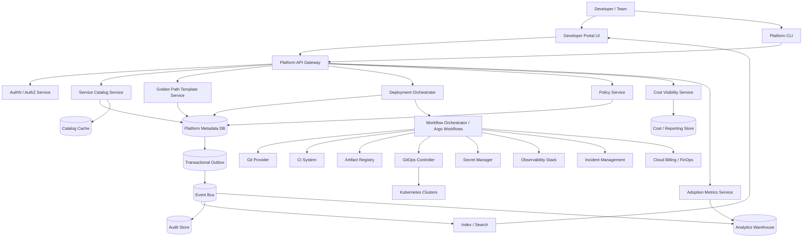
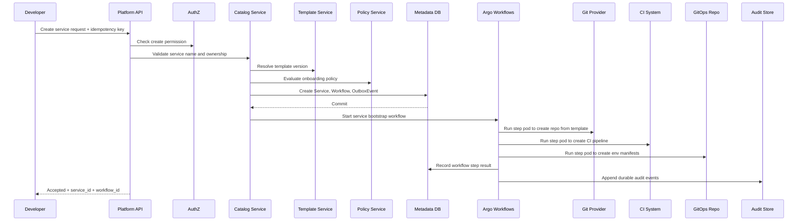
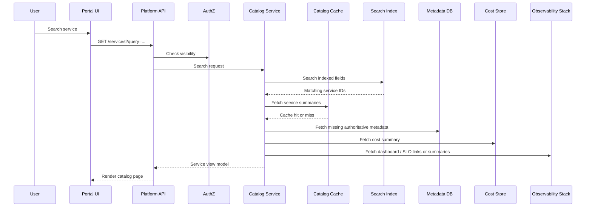
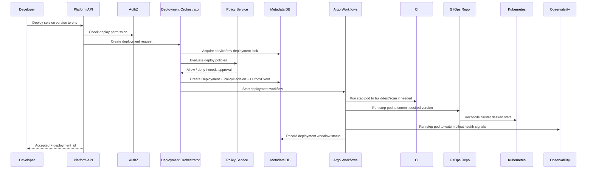
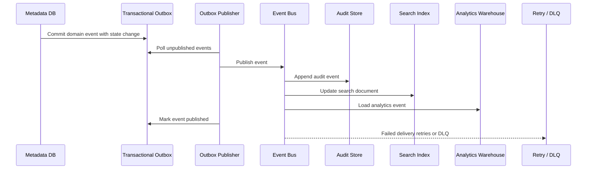

# Internal Developer Platform / Platform-as-a-Product

## System Design Request
Design an Internal Developer Platform / Platform-as-a-Product.

The system should give engineering teams safe self-service capabilities for creating, deploying, observing, and operating services. It should include service catalog, golden paths, CI/CD templates, GitOps deployment, Kubernetes provisioning, policy checks, observability, deployment safety, ownership metadata, cost visibility, and adoption metrics.

Clarify the platform users, service onboarding flow, supported workload types, environments, deployment frequency, approval requirements, security guardrails, rollback strategy, SLO/SLA needs, observability standards, cost attribution, platform APIs, integration points, and how adoption and developer productivity are measured.

The design should balance developer speed with governance, reliability, security, and operational consistency.

---

# 1. Functional Requirements

## Business Motivation

Engineering teams are slowed down by inconsistent service creation, manual infrastructure requests, fragmented deployment pipelines, uneven observability, unclear ownership, and inconsistent policy enforcement. The business wants a platform-as-a-product that improves developer velocity while reducing operational risk.

The platform should provide paved roads for common engineering workflows while still allowing advanced teams to extend or override defaults through controlled mechanisms.

## Users

- Application engineers who create and deploy services.
- Engineering managers who need ownership, reliability, delivery, and cost visibility.
- Platform engineers who operate the platform, golden paths, templates, policies, and integrations.
- Security and compliance teams who define required controls.
- SRE / operations teams who define reliability standards, incident workflows, and observability requirements.
- Finance / leadership teams who need cost attribution and platform adoption metrics.

## In Scope

1. Service onboarding
   - Create a new service from approved golden path templates.
   - Register ownership, runtime, repository, team, Slack channel, pager rotation, and cost center.
   - Generate baseline CI/CD, Kubernetes manifests, observability config, and deployment policy.

2. Service catalog
   - Search and browse services.
   - View owner, lifecycle state, environments, dependencies, SLOs, dashboards, runbooks, deployments, incidents, and cost.

3. Golden paths and templates
   - Support standard templates for APIs, workers, scheduled jobs, and event consumers.
   - Version templates and allow upgrades.
   - Track template adoption and drift from standard patterns.

4. Deployment orchestration
   - Integrate with Git, CI, artifact registry, GitOps, Kubernetes, and deployment safety tools.
   - Support dev, staging, and production environments.
   - Support progressive delivery through canary or blue/green deployments.
   - Support rollback to a prior known-good release.

5. Policy and governance
   - Enforce required metadata, security scans, image provenance, resource limits, secrets policy, environment approval rules, and production deployment rules.
   - Provide blocking and advisory policy decisions.

6. Observability standards
   - Ensure services have logs, metrics, traces, dashboards, alerts, and SLO definitions.
   - Provide platform-level visibility into deployment success, incident rates, and service health.

7. Cost visibility
   - Attribute infrastructure cost by service, team, environment, namespace, and cost center.
   - Show cost trends and basic optimization recommendations.

8. Adoption and developer productivity metrics
   - Track onboarding completion, golden path usage, deployment frequency, lead time, rollback rate, failed deployment rate, MTTR, policy failure rate, and platform self-service adoption.

## Out of Scope

- Building a full source code hosting system.
- Building a full CI engine from scratch.
- Building a Kubernetes control plane from scratch.
- Replacing cloud provider IAM, billing, or native Kubernetes APIs.
- Replacing incident management tools like PagerDuty or Opsgenie.
- Replacing observability backends like Datadog, Grafana, Prometheus, Loki, or OpenTelemetry collectors.
- Deep application-level business logic owned by product teams.
- Runtime ownership of application correctness after deployment.

## Core Product Boundaries

The platform owns the self-service workflow, metadata, policy decisions, orchestration, catalog visibility, deployment coordination, and adoption reporting.

Application teams own application code, service runtime behavior, business logic, service-level SLOs, and incident response for their services.

Platform teams own golden paths, integrations, reliability of the platform, default standards, policy execution, and safe rollback mechanisms.

## Upgrade and DR Boundaries

Platform-owned upgrades include Kubernetes versions, node images, GitOps controllers, ingress, service mesh, shared observability agents, platform APIs, workflow engine, policy engine, and golden path templates.

Application-owned upgrades include application code, application libraries, framework versions, service-specific container images, service-specific Helm/Kustomize values, and application compatibility testing.

Shared upgrades happen when a platform upgrade requires application remediation, such as removing deprecated Kubernetes APIs. In that case, Platform owns the campaign, compatibility rules, deadlines, dashboards, and enforcement. Application teams own service remediation.

The platform should use a graduated forcing mechanism:
Detect → Notify → Assist → Warn → Set Deadline → Enforce → Escalate.

Enforcement can include advisory CI warnings, catalog scorecard degradation, exception requirements, production deployment blocks, or leadership escalation.

DR is platform-enabled but application-validated. Platform owns DR templates, backup/restore patterns, multi-region patterns, failover workflows, readiness dashboards, and policy checks. Application teams own adoption, service-specific runbooks, data correctness, dependency recovery, and proving the service works after restore or failover.
---

# 2. Non-Functional Requirements

## Scale

Assume a large engineering organization.

- 5,000 monthly active internal developers.
- 1,000 engineering teams.
- 10,000 registered services.
- 50,000 repositories integrated with the platform.
- 100 Kubernetes clusters across regions and environments.
- 100,000 namespaces or logical workload environments.
- 5,000 service onboarding or update requests per day.
- 50,000 deployment events per day.
- 500,000 policy evaluations per day.
- 1 billion observability metadata references per month, but observability telemetry itself remains in external systems.
- Read-heavy system: roughly 90% reads / 10% writes for catalog and reporting.
- Deployment and policy workflows are write-heavy during peak business hours.

## Availability

- Platform UI and catalog: 99.9% availability.
- Deployment orchestration APIs: 99.95% availability.
- Policy evaluation APIs used in deployment gates: 99.99% availability or local fallback for non-critical advisory checks.
- GitOps agents continue reconciling desired state even if the platform UI is unavailable.
- RTO: 1 hour for platform control plane recovery.
- RPO: 5 minutes for metadata and workflow state.
- Durable audit and deployment history should have near-zero data loss through transactional writes and outbox/event replay.

## Performance

- Catalog read p95: under 300 ms.
- Search p95: under 500 ms.
- Service creation request p95 API response: under 1 second for request acceptance.
- Full service bootstrap: minutes, async workflow.
- Policy evaluation p95: under 250 ms for common deployment checks.
- Deployment request acceptance p95: under 1 second.
- Deployment completion depends on CI, GitOps reconciliation, cluster scheduling, and rollout strategy.

## Consistency

- Strong consistency required for service ownership metadata, deployment state transitions, policy decisions, audit records, and environment locks.
- Eventual consistency acceptable for search indexes, dashboard links, cost reports, adoption metrics, dependency graphs, and cached catalog views.
- Idempotency required for service creation, deployment requests, webhook ingestion, policy evaluations, GitOps reconciliation updates, and cost ingestion.
- Ordering required per service and per environment for deployment state transitions.
- Global ordering across all services is not required.

## Security

- Authenticate users through enterprise SSO / OIDC.
- Authorize actions through RBAC and ABAC using team, service, environment, role, and risk level.
- Production changes require stricter authorization than dev or staging.
- All privileged platform actions are audited.
- Secrets are never stored directly in the platform metadata database.
- Integrate with enterprise secret managers.
- Enforce tenant or team isolation for namespaces, clusters, cost views, and deployment permissions.
- Support security review for privileged templates, production policy exceptions, and high-risk changes.

## Observability

- Platform services emit metrics, logs, and traces.
- Every request has a correlation ID.
- Every workflow has a workflow ID.
- Every deployment has a deployment ID.
- Every policy decision has a policy evaluation ID.
- All async events are traceable across API, workflow engine, queue, worker, Git, CI, GitOps, Kubernetes, and audit store.

---

# 3. Scale Assumptions and Capacity Estimates

## Traffic Estimates

Assume 5,000 active developers on weekdays.

Catalog reads:

- 5,000 developers x 40 catalog views/day = 200,000 catalog views/day.
- Peak concentrated in business hours.
- Approximate peak: 20 reads/sec average during workday, with bursts up to 200 reads/sec.

Search:

- 5,000 developers x 10 searches/day = 50,000 searches/day.
- Peak: 50 searches/sec.

Deployment events:

- 10,000 services.
- Average 5 deployments/service/month = 50,000 deployments/month.
- For a high-velocity org, assume 50,000 deployment events/day including dev/staging/prod.
- Peak deployment request rate: 50 to 200/sec during release windows.

Policy evaluations:

- Each deployment may trigger 10 policy checks.
- 50,000 deployments/day x 10 = 500,000 policy evaluations/day.
- Peak: 500 to 1,000 policy evaluations/sec during CI bursts.

Webhook ingestion:

- Git, CI, GitOps, Kubernetes, observability, and incident tools emit events.
- 1 million webhook events/day.
- Peak: 1,000 to 5,000 events/sec during incidents, mass deploys, or provider retries.

## Storage Estimates

Service metadata:

- 10,000 services x 100 KB metadata/service = 1 GB.
- Small but high-value relational data.

Deployment history:

- 50,000 deployments/day x 20 KB/deployment record = 1 GB/day.
- 365 days = 365 GB before compression/archival.

Policy evaluations:

- 500,000/day x 5 KB = 2.5 GB/day.
- Store detailed decisions for 90 days, aggregate long-term.

Audit events:

- 2 million/day x 2 KB = 4 GB/day.
- Keep hot for 90 days, archive for 1 to 7 years depending on compliance.

Cost records:

- Daily aggregates by service/team/env/cluster.
- 10,000 services x 3 envs x 365 days x 2 KB = roughly 22 GB/year.

## Capacity Implication

The platform is not dominated by raw data volume. The harder problems are correctness, ownership, workflow durability, authorization, integration reliability, event replay, auditability, and safe rollout behavior across many teams and clusters.

---

# 4. High-Level Architecture



## Major Components

### Developer Portal UI

Primary user interface for service onboarding, catalog search, deployment views, reliability dashboards, scorecards, ownership, cost, and golden path adoption.

### Platform CLI

Developer-friendly interface for automation and local workflows. It calls the same Platform APIs as the UI.

### Platform API Gateway

Single entry point for platform APIs. Handles authentication delegation, request routing, rate limiting, idempotency keys, correlation IDs, and API versioning.

### AuthN / AuthZ Service

Integrates with SSO and enterprise identity. Enforces RBAC / ABAC based on team membership, service ownership, environment, role, and action risk.

### Service Catalog Service

Authoritative owner of service metadata, ownership, lifecycle status, dependencies, SLO links, runbooks, dashboards, repositories, namespaces, and cost center mappings.

### Golden Path Template Service

Owns approved templates for APIs, workers, scheduled jobs, event consumers, libraries, CI/CD pipelines, deployment manifests, and observability defaults.

### Deployment Orchestrator

Owns deployment requests, deployment lifecycle, environment locks, rollout coordination, rollback orchestration, and integration with CI, GitOps, and Kubernetes.

### Policy Service

Evaluates security, reliability, operational, and compliance policies. Policies can be blocking or advisory.

### Workflow Orchestrator / Argo Workflows

Executes durable multi-step workflows like service creation, template upgrade, deployment, rollback, DR testing, and environment provisioning.

In this design, Argo Workflows is the concrete workflow orchestrator. It owns workflow execution, step ordering, retries, timeouts, step outputs, and workflow status. Individual workflow steps run as Kubernetes pods and perform side effects against external systems such as Git, CI, artifact registry, GitOps repositories, Kubernetes, secret manager, observability tools, incident systems, and FinOps APIs.

The platform metadata database still owns authoritative platform state. Argo owns execution state for the workflow run. External systems own the side effects they perform.

### Metadata DB

Relational authoritative store for service metadata, deployment state, ownership, template versions, policy decisions, environment locks, and workflow status.

### Transactional Outbox

Stores durable events in the same transaction as metadata changes. Events are later published to the event bus, audit store, search index, and warehouse.

### Event Bus

Distributes domain events to search indexing, audit logging, analytics, cost attribution, notification systems, and other platform consumers.

### Audit Store

Append-only durable store for privileged actions, policy decisions, ownership changes, production deployments, approvals, rollbacks, and administrative changes.

### Search Index

Optimized for catalog search, ownership lookup, service discovery, dependency exploration, and scorecard filtering.

### Cost / Reporting Store

Stores normalized and aggregated cost data by service, team, namespace, cluster, environment, and cost center.

### Analytics Warehouse

Stores long-term metrics for adoption, developer productivity, reliability trends, deployment trends, policy failures, and cost reporting.

---

# 5. Main Flows

## 5.1 Service Onboarding Write Path

### Goal

A developer creates a new service using an approved golden path.



### Data Created

- Service record.
- Service ownership record.
- Service environment records.
- Template version reference.
- Workflow instance.
- Workflow step records.
- Policy evaluation record.
- Audit records.
- Outbox events.
- Generated repository, CI pipeline, and GitOps manifests.

### State Changes

- Service moves from `REQUESTED` to `BOOTSTRAPPING`.
- Workflow moves from `PENDING` to `RUNNING`.
- Individual provisioning steps move from `PENDING` to `RUNNING` to `SUCCEEDED` or `FAILED`.

### Ownership

- Catalog Service owns service metadata.
- Template Service owns template definitions and template versions.
- Policy Service owns policy decisions.
- Argo Workflows owns workflow execution state, step retries, timeouts, and workflow status.
- Git owns repository contents.
- CI system owns pipeline execution.
- GitOps repo owns desired deployment manifests.
- Kubernetes owns live runtime state.
- Audit Store owns immutable audit records.

---

## 5.2 Catalog Read Path

### Goal

A user searches for a service and views ownership, health, deployments, cost, dashboards, and runbooks.



### Data Created

- Optional access log.
- Optional search analytics event.
- Optional cache entry.

### State Changes

- No authoritative service state changes.
- Derived read models and analytics may update asynchronously.

### Ownership

- Metadata DB is authoritative for service metadata.
- Search Index is derived.
- Catalog Cache is derived.
- Observability Stack owns metrics/logs/traces.
- Cost Store owns cost aggregates.

---

## 5.3 Deployment Write Path

### Goal

A developer deploys a service to an environment safely.



### Data Created

- Deployment request.
- Deployment state record.
- Environment lock.
- Policy evaluation record.
- Approval record, if required.
- Workflow record.
- GitOps commit.
- Rollout health observations.
- Audit events.
- Outbox events.

### State Changes

- Deployment moves through lifecycle states.
- Environment lock moves from available to locked, then released.
- Desired state changes in GitOps repo.
- Live state changes in Kubernetes after reconciliation.

### Ownership

- Deployment Orchestrator owns deployment lifecycle state.
- Metadata DB stores authoritative deployment state.
- Argo Workflows owns deployment workflow execution state, step retries, timeouts, and workflow status.
- GitOps repo owns desired runtime state.
- Kubernetes owns actual runtime state.
- Observability stack owns health signals.
- Policy Service owns policy decisions.

---

## 5.4 Async Event Processing Path

### Goal

Propagate metadata, deployment, policy, and audit events reliably to downstream systems.



### Data Created

- Outbox event.
- Published event.
- Audit event.
- Search document update.
- Warehouse event row.
- DLQ record if delivery fails repeatedly.

### State Changes

- Outbox event changes from `PENDING` to `PUBLISHED` or `FAILED`.
- Search and warehouse views eventually reflect authoritative metadata.

### Ownership

- Metadata DB and Outbox are authoritative for whether an event should exist.
- Event Bus owns delivery fanout.
- Audit Store owns immutable audit history.
- Search Index and Warehouse are derived.
- DLQ owns failed delivery records until repaired.

---

# 6. Data Model

Do not over-index on schema detail in the interview. Focus on core entities, relationships, ownership, and authority.

## Core Entities

### Team

Represents an engineering team.

Key fields:

- team_id
- name
- manager
- cost_center
- slack_channel
- pager_rotation

Owner: Catalog Service.

### User

Represents a human user from enterprise identity.

Key fields:

- user_id
- email
- display_name
- identity_provider_id

Owner: Identity provider is authoritative. Platform caches only minimal profile data.

### Service

Represents an onboarded application or workload.

Key fields:

- service_id
- name
- description
- owning_team_id
- repository_id
- lifecycle_state
- template_id
- template_version
- criticality
- cost_center
- created_at
- updated_at

Owner: Catalog Service.

### ServiceEnvironment

Represents a service in dev, staging, production, or other runtime environments.

Key fields:

- service_environment_id
- service_id
- environment
- namespace
- cluster_id
- region
- desired_runtime_config
- slo_id
- deployment_policy_id

Owner: Catalog Service for metadata. GitOps owns desired manifests. Kubernetes owns live runtime state.

### Template

Represents a golden path template.

Key fields:

- template_id
- name
- workload_type
- current_version
- owner_team_id
- status

Owner: Template Service.

### TemplateVersion

Represents an immutable version of a template.

Key fields:

- template_version_id
- template_id
- version
- repo_path
- parameters_schema
- default_policies
- created_at

Owner: Template Service.

### Deployment

Represents an attempted rollout of a service version to an environment.

Key fields:

- deployment_id
- service_id
- environment
- artifact_ref
- git_sha
- requested_by
- state
- rollout_strategy
- started_at
- completed_at
- rollback_of_deployment_id

Owner: Deployment Orchestrator.

### Policy

Represents a policy definition.

Key fields:

- policy_id
- name
- category
- severity
- mode: blocking/advisory
- version
- owner_team_id

Owner: Policy Service.

### PolicyEvaluation

Represents the result of applying policies to a request.

Key fields:

- policy_evaluation_id
- request_type
- request_id
- policy_id
- decision
- reason
- evaluated_at

Owner: Policy Service.

### WorkflowInstance

Represents a durable workflow.

Key fields:

- workflow_id
- workflow_type
- resource_type
- resource_id
- state
- started_at
- completed_at

Owner: Argo Workflows for execution state. Platform Metadata DB stores the platform-facing workflow reference and status summary.

### WorkflowStep

Represents a step within a durable workflow.

Key fields:

- workflow_step_id
- workflow_id
- step_name
- state
- retry_count
- last_error

Owner: Argo Workflows for step execution state. Platform Metadata DB stores step result summaries needed for audit, catalog visibility, and recovery.

### OutboxEvent

Represents a durable event created in the same transaction as an authoritative state change.

Key fields:

- outbox_event_id
- aggregate_type
- aggregate_id
- event_type
- payload
- status
- created_at
- published_at
- retry_count

Owner: Metadata DB transaction owner. Publisher only changes publish status.

### AuditEvent

Represents an immutable record of privileged or meaningful platform activity.

Key fields:

- audit_event_id
- actor
- action
- resource_type
- resource_id
- decision
- before_state
- after_state
- correlation_id
- created_at

Owner: Audit Store.

### CostAllocation

Represents cost attributed to service/team/environment.

Key fields:

- cost_allocation_id
- service_id
- team_id
- environment
- cluster_id
- date
- compute_cost
- storage_cost
- network_cost
- shared_cost

Owner: Cost Visibility Service. Cloud provider billing is source of truth for raw cost.

## Relationships

- Team owns many Services.
- Service has many ServiceEnvironments.
- Service references one TemplateVersion at creation and may later upgrade.
- ServiceEnvironment has many Deployments.
- Deployment has many PolicyEvaluations.
- WorkflowInstance may operate on Service, Deployment, TemplateUpgrade, or EnvironmentProvisioning.
- WorkflowInstance has many WorkflowSteps.
- Authoritative state changes create OutboxEvents.
- OutboxEvents produce AuditEvents, Search updates, and Warehouse events.
- CostAllocation maps to Service, Team, Environment, Cluster, and CostCenter.

---

# 7. Ownership and Authority

This is a mandatory section in the interview. Use it to prevent vague architecture.

## Authoritative State

| State | Authoritative Owner | Notes |
|---|---|---|
| Service metadata | Catalog Service + Metadata DB | Name, owner, lifecycle, criticality, repo, cost center |
| Team membership | Identity / HR system | Platform caches read-only team membership |
| Golden path templates | Template Service | Template versions are immutable |
| Deployment lifecycle | Deployment Orchestrator + Metadata DB | Tracks requested, approved, running, succeeded, failed, rolled back |
| Desired runtime state | GitOps repository | Kubernetes desired manifests live here |
| Actual runtime state | Kubernetes | Pods, deployments, services, jobs, live health |
| Policy definitions | Policy Service | Versioned rules and severity |
| Policy decisions | Policy Service + Metadata DB | Durable decision for each request |
| Workflow execution | Argo Workflows | Step execution, retries, timeouts, workflow run status |
| Audit trail | Audit Store | Append-only history |
| Search results | Search Index | Derived from catalog and event stream |
| Cost reports | Cost Store | Derived from cloud billing and platform metadata |
| Observability telemetry | Observability Stack | Metrics, logs, traces, SLO burn |
| Adoption metrics | Analytics Warehouse | Derived from platform events |

## Cached State

- Catalog service summaries.
- User display names and team mappings.
- Search results.
- Template metadata.
- Policy bundles for fast evaluation.
- Cost summaries.

For every cache:

- Cache key should include tenant/org, resource type, resource ID, and version where relevant.
- TTL should be short for security-sensitive data.
- Authorization decisions should not rely only on stale cache.
- Metadata DB remains authoritative.

## Derived State

- Search documents.
- Scorecards.
- Adoption dashboards.
- Cost dashboards.
- Dependency graphs.
- Reliability reports.
- Service health summaries.

Derived state can be rebuilt from authoritative metadata, outbox events, audit records, external billing data, and observability systems.

## Advisory State

- Service recommendations.
- Cost optimization suggestions.
- Template upgrade suggestions.
- Reliability scorecards.
- Developer productivity insights.

Advisory state should never block production changes unless converted into explicit policy.

---

# 8. State Model / Lifecycle

## 8.1 Service Lifecycle

```text
REQUESTED
  -> BOOTSTRAPPING
  -> ACTIVE
  -> DEPRECATED
  -> ARCHIVED
```

### REQUESTED

Created after a valid service onboarding request is accepted.

- Caused by: developer submitting service creation.
- Performed by: Catalog Service.
- Validated by: AuthZ, Template Service, Policy Service.

### BOOTSTRAPPING

The platform is creating repository, CI pipeline, GitOps manifests, observability defaults, and environment records.

- Caused by: service creation workflow start.
- Performed by: Argo Workflows through workflow step pods.
- Validated by: workflow step success and external system confirmations.

### ACTIVE

Service is ready for development and deployment.

- Caused by: successful bootstrap workflow.
- Performed by: Catalog Service after workflow success.
- Validated by: required integrations exist and baseline policies passed.

### DEPRECATED

Service is still visible but should not receive new feature work.

- Caused by: owner action or lifecycle policy.
- Performed by: Catalog Service.
- Validated by: owner authorization and dependency review.

### ARCHIVED

Service is no longer active but retained for audit, historical cost, and dependency records.

- Caused by: decommission workflow completion.
- Performed by: Catalog Service and Argo Workflows.
- Validated by: no active production runtime, dependencies resolved, audit retained.

---

## 8.2 Deployment Lifecycle

```text
REQUESTED
  -> POLICY_CHECKING
  -> WAITING_FOR_APPROVAL
  -> APPROVED
  -> RUNNING
  -> VERIFYING
  -> SUCCEEDED
  -> FAILED
  -> ROLLING_BACK
  -> ROLLED_BACK
```

### REQUESTED

Deployment request accepted.

- Caused by: API or CLI deployment request.
- Performed by: Deployment Orchestrator.
- Validated by: service exists, environment exists, idempotency key not already completed.

### POLICY_CHECKING

Policies are evaluated.

- Caused by: deployment request creation.
- Performed by: Policy Service.
- Validated by: current policy bundle and service metadata.

### WAITING_FOR_APPROVAL

High-risk deployment requires human approval.

- Caused by: policy result requiring approval.
- Performed by: Deployment Orchestrator.
- Validated by: authorized approver and approval rules.

### APPROVED

Deployment is allowed to proceed.

- Caused by: policy allow or human approval.
- Performed by: Deployment Orchestrator.
- Validated by: policy decision and approval record.

### RUNNING

CI, GitOps, and rollout are in progress.

- Caused by: workflow execution.
- Performed by: Argo Workflows through workflow step pods.
In this design, workflow steps are Argo Workflow steps. Each step runs as a Kubernetes pod that executes a bounded action such as creating a repository, updating a GitOps manifest, triggering CI, checking rollout health, running a scanner, or publishing DR evidence.
- Validated by: CI success, GitOps commit, Kubernetes rollout progress.

### VERIFYING

Platform checks health after rollout.

- Caused by: rollout reaching expected desired state.
- Performed by: Deployment Orchestrator and observability integration.
- Validated by: SLO burn, error rate, latency, pod health, canary metrics.

### SUCCEEDED

Deployment completed successfully.

- Caused by: verification success.
- Performed by: Deployment Orchestrator.
- Validated by: rollout health thresholds.

### FAILED

Deployment failed before completion.

- Caused by: CI failure, policy denial, GitOps failure, Kubernetes rollout failure, timeout, or health check failure.
- Performed by: Deployment Orchestrator.
- Validated by: failure signal from authoritative subsystem.

### ROLLING_BACK

Rollback is in progress.

- Caused by: automatic or manual rollback trigger.
- Performed by: Deployment Orchestrator.
- Validated by: previous known-good release exists.

### ROLLED_BACK

Rollback completed.

- Caused by: GitOps and Kubernetes converged to previous version.
- Performed by: Deployment Orchestrator.
- Validated by: rollout health and desired state match.

---

## 8.3 Workflow Step Lifecycle

```text
PENDING
  -> RUNNING
  -> SUCCEEDED
  -> RETRYING
  -> FAILED
  -> COMPENSATING
  -> COMPENSATED
```

### PENDING

Step is defined but not started.

### RUNNING

Worker is executing the step.

### SUCCEEDED

Step completed and external side effect is confirmed.

### RETRYING

Step failed with a retryable error.

### FAILED

Step failed and exceeded retry policy or hit a non-retryable error.

### COMPENSATING

Workflow is undoing or neutralizing prior side effects.

### COMPENSATED

Compensation finished. Manual repair may still be required depending on the external system.

## Step Validation Rules

- Each step must be idempotent.
- Each external side effect must have a deterministic external key.
- Each step must record enough state in Argo outputs and platform metadata to retry safely.
- A retry must check whether the external side effect already happened before creating another one.
- Compensation must be explicit for side effects like repo creation, namespace creation, or GitOps commits.

---

## 8.4 Template Lifecycle

```text
DRAFT
  -> REVIEWING
  -> APPROVED
  -> ACTIVE
  -> DEPRECATED
  -> RETIRED
```

Templates are versioned and immutable after approval. Services reference a specific template version. Upgrades are explicit workflows, not silent mutations.

---

# 9. Failure Modes

## 9.1 Argo Workflow Step Pod Fails During Service Bootstrap

### Detection

- Argo marks the workflow step pod as failed.
- Workflow step exceeds timeout or retry limit.
- Service remains in `BOOTSTRAPPING` longer than expected.
- Argo workflow status and platform workflow summary diverge.

### Recovery

- Argo retries the failed step according to retry policy.
- The step checks external systems before repeating side effects.
- If retries are exhausted, the workflow moves to failed and the platform marks the service bootstrap as failed or remediation-required.

### Retry Safety

Use deterministic external IDs:

- repo name
- pipeline ID
- namespace name
- GitOps path
- service_id
- workflow_name
- workflow_step_name

### Authoritative State

Argo Workflows owns workflow execution state. Platform Metadata DB owns service lifecycle state. External systems own whether side effects actually occurred.

### State Repair

A reconciliation workflow compares platform metadata with Git, CI, GitOps, and Kubernetes. It either resumes the workflow, marks the service as failed, or opens a manual remediation task.

---

## 9.2 Lost Event After Metadata Commit

### Detection

- Outbox event remains `PENDING` too long.
- Publisher lag alert fires.
- Search or audit reconciliation detects missing event.

### Recovery

- Outbox publisher republishes pending events.
- Events are idempotent by outbox_event_id.
- Consumers deduplicate event IDs.

### Retry Safety

Safe because the authoritative state and outbox event were committed together.

### Authoritative State

Metadata DB and Transactional Outbox are authoritative.

### State Repair

Missing search, warehouse, or audit records are rebuilt only from durable transition records and outbox events. If no durable transition or outbox record exists, the system must not invent an audit event from a best-effort log line.

---

## 9.3 Duplicate Deployment Request

### Detection

- Same idempotency key for same actor, service, environment, and artifact.
- Existing deployment already in terminal or active state.

### Recovery

- Return existing deployment_id and current state.
- Do not create a duplicate deployment.

### Retry Safety

Client retries are safe because create requests require idempotency keys.

### Authoritative State

Deployment Orchestrator and Metadata DB.

### State Repair

If duplicates were created by a bug, environment lock and deployment ordering are used to identify the valid active deployment. Incorrect duplicate records are marked superseded, not deleted.

---

## 9.4 Policy Service Unavailable

### Detection

- Policy API error rate and latency alerts.
- Deployment gates timing out.
- CI checks failing due to policy unavailability.

### Recovery

- For production blocking policies, fail closed or require manual break-glass approval.
- For advisory policies, fail open with warning and audit record.
- Use cached signed policy bundles for local evaluation where safe.

### Retry Safety

Policy evaluations are idempotent by request_id, policy_version, and input hash.

### Authoritative State

Policy Service owns policy decisions. Cached bundles are only a fallback for evaluation, not the source of truth for policy definitions.

### State Repair

Re-evaluate policy decisions after recovery and flag deployments that proceeded under degraded mode.

---

## 9.5 GitOps Controller Down

### Detection

- GitOps reconciliation lag increases.
- Desired state commit exists but cluster state does not converge.
- Deployment remains `RUNNING` or `VERIFYING` past timeout.

### Recovery

- Deployment Orchestrator pauses or times out deployment.
- GitOps controller resumes reconciliation when healthy.
- Manual intervention may be required for production releases.

### Retry Safety

Do not repeatedly create new desired-state commits unless the desired artifact or config changes. Reconcile the same desired commit.

### Authoritative State

GitOps repo owns desired state. Kubernetes owns actual state. Deployment Orchestrator owns deployment lifecycle.

### State Repair

Compare desired GitOps commit to Kubernetes live state and update deployment status accordingly.

---

## 9.6 Kubernetes Cluster Outage

### Detection

- Cluster API unreachable.
- Node/pod health missing.
- GitOps cannot sync.
- Observability heartbeat missing.

### Recovery

- Mark cluster degraded.
- Block or reroute deployments to the affected cluster.
- Existing workloads may continue if control plane is down but nodes are healthy.
- Regional failover depends on application architecture, not only the platform.

### Retry Safety

Retry read/status checks. Do not blindly retry destructive operations.

### Authoritative State

Kubernetes owns actual runtime state when reachable. During outage, last observed state is stale and must be labeled as stale.

### State Repair

After recovery, reconcile GitOps desired state with Kubernetes actual state and repair deployment records.

---

## 9.7 Cache Miss Storm

### Detection

- Cache hit rate drops sharply.
- Metadata DB read QPS spikes.
- Catalog latency increases.

### Recovery

- Use request coalescing for hot keys.
- Apply rate limits on expensive catalog reads.
- Warm cache for critical services.
- Serve stale cache for non-security-sensitive views.

### Retry Safety

Reads can retry, but avoid synchronized retry storms with backoff and jitter.

### Authoritative State

Metadata DB remains authoritative.

### State Repair

No repair needed unless cache contains incorrect data. Invalidate affected keys and rebuild from DB.

---

## 9.8 Metadata DB Outage

### Detection

- DB connection failures.
- Elevated API errors.
- Argo workflow steps cannot persist platform-facing workflow summaries or authoritative service/deployment state.

### Recovery

- Read-only degraded mode for cached catalog views.
- Block new service creation and production deployment state transitions.
- Argo workflow steps pause before unsafe side effects if they cannot persist required platform state.
- Fail over to replica if supported.

### Retry Safety

Retry DB operations with bounded backoff. Workers must not perform external side effects unless state transition is durable.

### Authoritative State

Metadata DB is authoritative for platform state.

### State Repair

After recovery, reconcile in-flight Argo workflows, platform workflow summaries, outbox status, GitOps commits, and Kubernetes actual state.

---

## 9.9 Audit Store Outage

### Detection

- Audit consumer delivery failures.
- DLQ growth.
- Audit write latency or error alerts.

### Recovery

- Continue committing authoritative state and outbox events.
- Buffer audit events through event bus and DLQ.
- Replay from durable outbox when audit store recovers.

### Retry Safety

Audit writes are idempotent by audit_event_id or outbox_event_id.

### Authoritative State

Audit Store owns immutable audit history, but missing audit records can only be recovered from durable transition records and outbox events.

### State Repair

Replay outbox events into the audit store. Do not reconstruct audit history from incomplete application logs unless clearly marked as best-effort forensic reconstruction.

---

# 10. Tradeoffs and Alternatives

## Build vs Buy

### Option A: Build portal and orchestration, buy integrations

Use existing Git, CI, GitOps, Kubernetes, observability, incident, identity, and billing systems.

Pros:

- Faster delivery.
- Lower operational burden.
- Lets platform focus on developer experience and governance.

Cons:

- Integration complexity.
- External systems have different reliability and data models.
- Vendor limits can shape platform behavior.

Decision:

Prefer this option. The platform should not rebuild mature infrastructure systems.

## SQL vs NoSQL for Metadata

### SQL

Pros:

- Strong consistency.
- Transactions.
- Clear relationships.
- Good fit for ownership, deployment state, policy decisions, and workflows.

Cons:

- Requires careful scaling and indexing.
- Complex graph-like dependency queries may need derived stores.

Decision:

Use relational DB for authoritative metadata. Use search index and warehouse for derived query patterns.

## Synchronous vs Asynchronous Workflows

### Synchronous

Pros:

- Simple user mental model.
- Immediate result.

Cons:

- Bad fit for repo creation, CI, GitOps, cluster provisioning, and external APIs.
- Fragile under retries and provider latency.

### Asynchronous

Pros:

- Durable retries.
- Better failure handling.
- Better user visibility into progress.

Cons:

- More complex lifecycle and state management.

Decision:

Accept requests synchronously, execute side effects asynchronously through workflow engine.

## Strong vs Eventual Consistency

Strong consistency is required for deployment state, service ownership, environment locks, policy decisions, and audit-producing transitions.

Eventual consistency is acceptable for search, cost, dashboards, adoption metrics, and scorecards.

Decision:

Use strong consistency for control decisions. Use eventual consistency for read-optimized views.

## Centralized Platform vs Federated Team Ownership

### Centralized

Pros:

- Consistent governance.
- Easier reporting.
- Easier security control.

Cons:

- Can become bottleneck.
- May not support specialized teams well.

### Federated with paved roads

Pros:

- Teams retain ownership.
- Platform defines standards and self-service workflows.
- Exceptions can be governed.

Cons:

- Requires strong policy and metadata discipline.

Decision:

Use federated ownership with centralized standards, policy, and visibility.

## Blocking vs Advisory Policies

Blocking policies prevent unsafe production changes. Advisory policies educate teams without stopping delivery.

Decision:

Use blocking policies only for high-risk controls like auth, secrets, image provenance, critical vulnerabilities, production approval, missing owner, and unsafe rollout. Use advisory policies for optimization and maturity recommendations.

## GitOps vs Direct Kubernetes Mutation

### GitOps

Pros:

- Durable desired state.
- Reviewable change history.
- Easier rollback.
- Better auditability.

Cons:

- Reconciliation delay.
- Requires careful status mapping.

Decision:

Use GitOps for production and shared environments. Direct mutation may be allowed for ephemeral dev environments if governed.

---

# 11. Observability

## Technical Metrics

API metrics:

- Request rate.
- Error rate.
- p50/p95/p99 latency.
- Rate limit count.
- AuthZ denial count.

Workflow metrics:

- Workflow started/completed/failed count.
- Step failure rate.
- Retry count.
- Compensation count.
- Workflow duration.
- Stuck workflow count.

Deployment metrics:

- Deployment request rate.
- Deployment success rate.
- Deployment failure rate.
- Rollback rate.
- Time to deploy.
- Time in each deployment state.
- Canary failure rate.

Policy metrics:

- Policy evaluation latency.
- Policy allow/deny/advisory counts.
- Policy timeout count.
- Break-glass usage.
- Most frequently failed policies.

Integration metrics:

- Git API latency/error rate.
- CI trigger latency/error rate.
- GitOps reconciliation lag.
- Kubernetes API latency/error rate.
- Secret manager latency/error rate.

## Business Metrics

- Monthly active platform users.
- Percentage of services onboarded to catalog.
- Percentage of services using golden paths.
- Percentage of services meeting required scorecard standards.
- Developer onboarding time for a new service.
- Deployment frequency by team/service.
- Lead time from merge to production.
- Self-service completion rate.
- Manual ticket reduction.
- Platform NPS or developer satisfaction.

## Operational Metrics

- Queue depth.
- Queue age.
- DLQ growth.
- Outbox publisher lag.
- Event consumer lag.
- Cache hit rate.
- Metadata DB CPU, memory, connections, lock waits, replication lag.
- Search indexing lag.
- Warehouse ingestion lag.
- Cost ingestion lag.

## Logs

Required structured fields:

- correlation_id
- workflow_id
- deployment_id
- service_id
- team_id
- actor
- action
- environment
- policy_evaluation_id
- external_system
- error_code

## Traces

Trace across:

- Portal / CLI.
- Platform API.
- Catalog Service.
- Policy Service.
- Deployment Orchestrator.
- Workflow Engine.
- Workers.
- Git / CI / GitOps / Kubernetes integrations.

## Alerts

Page on:

- Deployment orchestration API down.
- Metadata DB unavailable.
- Outbox lag above threshold.
- Workflow stuck rate above threshold.
- Production deployment failure spike.
- Policy service unavailable for blocking checks.
- Audit pipeline unable to recover.

Ticket or notify on:

- Search indexing lag.
- Cost ingestion delay.
- Advisory policy failure trends.
- Template drift growth.
- Cache hit rate degradation.

---

# 12. Cost

## Major Cost Drivers

1. Kubernetes control plane and workload clusters.
2. CI compute.
3. Observability telemetry volume.
4. Long-term audit and deployment history retention.
5. Search and analytics infrastructure.
6. Network egress between clusters, regions, and observability systems.
7. Platform workers and workflow execution.

## Compute Cost

- Platform APIs can scale horizontally.
- Argo Workflow controller capacity and workflow pod concurrency need to be managed carefully.
- Workflow templates should separate task types because Git, CI, Kubernetes, cost ingestion, scanning, and DR tests have different latency, rate-limit, and cost patterns.
- Expensive workflows should use concurrency limits, backoff, and quotas.

## Storage Cost

- Metadata DB is relatively small but critical.
- Audit, deployment history, policy evaluations, logs, and warehouse records grow quickly.
- Use hot/warm/cold retention tiers.
- Keep detailed policy evaluations hot for 90 days and aggregate long-term.

## Network Cost

- Cross-region control plane calls should be minimized.
- Prefer regional workers for regional clusters.
- Avoid pulling high-volume observability data into the platform. Store references, summaries, and links instead.

## Observability Cost

- Do not duplicate raw metrics/logs/traces into the platform.
- Use OpenTelemetry standards and external backends.
- Sample high-volume traces.
- Retain platform traces longer for failed workflows and production deployments.

## Cost Attribution

Costs should be attributed by:

- service_id
- team_id
- environment
- namespace
- cluster
- region
- cost_center
- workload_type

## Cost Optimizations

- Start with observability volume controls because telemetry can become the largest hidden cost.
- Add default resource requests/limits in golden paths.
- Detect idle namespaces and unused preview environments.
- Recommend rightsizing based on utilization.
- Archive old audit and deployment detail to cheaper storage.
- Index carefully: catalog, deployment, policy, audit, and cost tables need targeted indexes for common access patterns, but excessive indexes increase write cost, storage cost, and migration risk.

## Biggest Cost Driver

The biggest cost driver is usually not the platform control plane itself. It is the workload infrastructure and observability data generated by all onboarded services.

The first optimization should be standardizing resource defaults, cost attribution, and telemetry controls through golden paths.

---

# 13. APIs and Integration Contracts

## Service Onboarding API

```http
POST /services
Idempotency-Key: <key>
```

Request:

```json
{
  "name": "payments-api",
  "owning_team_id": "team-123",
  "template_id": "spring-api",
  "template_version": "2.4.1",
  "workload_type": "api",
  "criticality": "tier-1",
  "environments": ["dev", "staging", "prod"],
  "cost_center": "fintech-platform"
}
```

Response:

```json
{
  "service_id": "svc-123",
  "workflow_id": "wf-456",
  "state": "BOOTSTRAPPING"
}
```

## Deployment API

```http
POST /services/{service_id}/deployments
Idempotency-Key: <key>
```

Request:

```json
{
  "environment": "prod",
  "artifact_ref": "registry/app/payments-api:1.2.3",
  "git_sha": "abc123",
  "rollout_strategy": "canary",
  "requested_by": "user-123"
}
```

Response:

```json
{
  "deployment_id": "dep-123",
  "state": "POLICY_CHECKING"
}
```

## Policy Evaluation API

```http
POST /policy/evaluate
```

Request:

```json
{
  "request_type": "deployment",
  "request_id": "dep-123",
  "service_id": "svc-123",
  "environment": "prod",
  "artifact_ref": "registry/app/payments-api:1.2.3",
  "actor": "user-123"
}
```

Response:

```json
{
  "policy_evaluation_id": "pe-123",
  "decision": "requires_approval",
  "blocking_failures": [],
  "advisory_warnings": ["missing_recent_load_test"],
  "required_approver_role": "service_owner"
}
```

## Event Contract

```json
{
  "event_id": "evt-123",
  "event_type": "DeploymentSucceeded",
  "aggregate_type": "Deployment",
  "aggregate_id": "dep-123",
  "service_id": "svc-123",
  "team_id": "team-123",
  "occurred_at": "2026-06-04T12:00:00Z",
  "correlation_id": "corr-123",
  "payload": {
    "environment": "prod",
    "artifact_ref": "registry/app/payments-api:1.2.3",
    "previous_artifact_ref": "registry/app/payments-api:1.2.2"
  }
}
```

Event rules:

- Events are immutable.
- Consumers deduplicate by event_id.
- Events include aggregate type and aggregate ID.
- Events should not contain secrets.
- Event schema changes are versioned.

---

# 14. Interview Talking Points

## Strong Opening

I would frame this as a control-plane platform. The platform should not replace Git, CI, Kubernetes, observability, or cloud billing. It should provide a self-service product layer over those systems with strong ownership metadata, safe workflow orchestration, policy enforcement, auditability, and clear developer experience metrics.

## Key Design Principles

- Metadata and workflow state must be authoritative and durable.
- External side effects should be executed through durable Argo workflows and must be idempotent.
- GitOps should own desired runtime state.
- Kubernetes should own actual runtime state.
- Search, scorecards, cost dashboards, and adoption metrics are derived views.
- Blocking policy should be reserved for high-risk controls.
- The platform should optimize for paved-road adoption, not central team bottlenecks.

## What to Emphasize for Senior EM / Director Level

- Platform-as-a-product means adoption, usability, support model, golden path maturity, and feedback loops matter as much as architecture.
- The platform must reduce toil without hiding ownership from application teams.
- Governance should be built into workflows instead of handled through manual review tickets.
- Operational maturity depends on lifecycle, state ownership, failure recovery, and auditability.
- Cost visibility must connect infrastructure spend to service ownership.

## Common Interview Traps

Avoid saying only:

- “Use Backstage.”
- “Use a cache.”
- “Use a queue.”
- “Use Kubernetes.”
- “Use GitOps.”

Instead explain:

- What state is created.
- Who owns the state.
- What is authoritative.
- What is cached or derived.
- What happens if an event is lost.
- Why retries are safe.
- How the state is repaired.

---

# 15. Condensed 5-Minute Version

## Problem

Build an internal developer platform that lets teams safely create, deploy, observe, and operate services through self-service golden paths.

## Scope

In scope: service catalog, golden paths, onboarding, deployment orchestration, policy checks, GitOps integration, observability standards, cost visibility, adoption metrics.

Out of scope: building Git, CI, Kubernetes, observability, cloud billing, or application business logic.

## NFRs

- 5,000 developers, 10,000 services, 100 clusters.
- 50,000 deployments/day.
- 500,000 policy evaluations/day.
- 99.9% portal, 99.95% orchestration, 99.99% policy gate target.
- Strong consistency for metadata, deployment state, policy decisions, audit transitions.
- Eventual consistency for search, cost, scorecards, and analytics.
- SSO, RBAC/ABAC, auditability, no secrets stored in metadata DB.

## Architecture

Developer Portal / CLI -> Platform API -> Catalog, Template, Policy, Deployment Orchestrator, Cost, Metrics.

Metadata DB is authoritative. Argo Workflows executes async workflow steps as Kubernetes pods. GitOps owns desired runtime state. Kubernetes owns actual runtime state. Outbox publishes events to audit, search, and warehouse.

## Key Flows

1. Service onboarding creates service metadata, resolves template, evaluates policy, starts async workflow, creates repo, CI, GitOps manifests, dashboards, and audit records.
2. Deployment creates deployment record, locks environment, evaluates policy, optionally waits for approval, updates GitOps desired state, watches Kubernetes rollout, verifies health, and records success or rollback.
3. Async events use transactional outbox so audit, search, and analytics can be replayed safely.

## Ownership

Catalog owns service metadata. Template Service owns templates. Deployment Orchestrator owns deployment state. Policy Service owns policy decisions. GitOps owns desired state. Kubernetes owns actual state. Audit Store owns immutable audit. Search and warehouse are derived.

## Failure Handling

Argo step failure: retry failed workflow step using idempotent external IDs.
Lost event: replay from outbox.
Duplicate request: idempotency key returns existing resource.
Policy outage: fail closed for production blocking checks, fail open for advisory checks.
GitOps outage: desired state remains in Git, deployment waits or times out.
DB outage: read-only degraded mode, pause unsafe side effects.

## Cost

Biggest cost is workload infrastructure and observability telemetry, not the platform APIs. First optimize resource defaults, telemetry controls, idle environments, and cost attribution through golden paths.